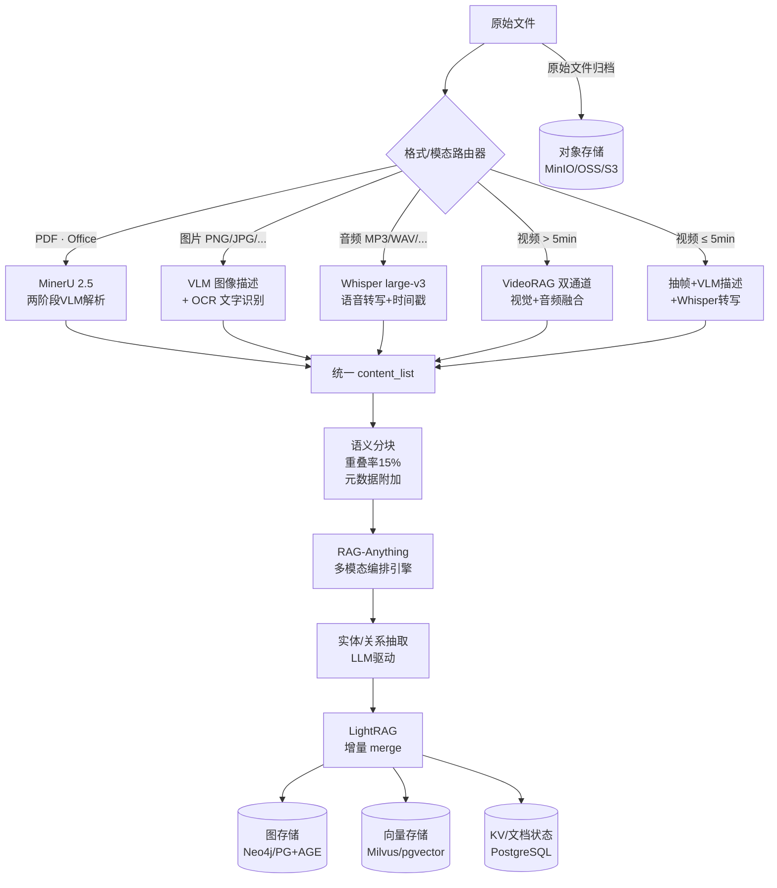
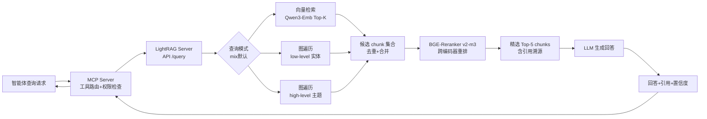

# 多模态企业知识库平台 — 全套 PRD
## 方案：业务域知识库＋共享语义层＋开源自建图谱/向量混合内核 · 为 AI Agent 提供企业知识基础设施

> **文档版本**：v2.1-draft · **发布日期**：2026-06-17 · **状态**：draft · architecture proposal · secondary verification completed · P1 SCM source readiness integrated · implementation not verified  
> **候选内核组合**：RAG-Anything · LightRAG · MinerU 2.5（AGPL model card risk）· PostgreSQL/pgvector · Milvus/Neo4j/Memgraph（P2 候选）· MCP wrapper candidate  
> **本版边界**：docs-only draft · production unchanged · no KB provider call · not production ready
> **当前同步点**：2026-06-18 已整合 `SRC-SCM-001`、`SRC-SCM-002` 的 P1 readonly PoC readiness；该同步不代表生产上线或外部正式 owner 签核。这不是生产可用状态。

---

## 目录

- [第一章 文档信息与项目背景](#ch1)
- [第二章 技术选型与版本基线（2026-06 稳定线）](#ch2)
- [第三章 交叉审计报告](#ch3)
- [第四章 目标系统架构](#ch4)
- [第五章 数据摄取与解析层（深化）](#ch5)
- [第六章 知识构建层（深化）](#ch6)
- [第七章 存储层（深化）](#ch7)
- [第八章 检索服务层（深化）](#ch8)
- [第九章 MCP 调用层与多智能体接口（深化）](#ch9)
- [第十章 知识库管理方法（深化）](#ch10)
- [第十一章 部署手册（深化）](#ch11)
- [第十二章 可观测性与评估体系（深化）](#ch12)
- [第十三章 风险登记册](#ch13)
- [第十四章 实施路线图（16 周）](#ch14)
- [第十五章 企业知识库业务架构与分类体系](#ch15)
- [第十六章 证据治理、许可证风险与 P1 PoC 验证](#ch16)
- [附录 A — content_list JSON Schema](#appendix-a)
- [附录 B — MCP 工具接口契约（OpenAPI 样例）](#appendix-b)
- [附录 C — 评估数据集设计](#appendix-c)
- [附录 D — LightRAG 五种查询模式对比](#appendix-d)
- [附录 E — 术语表](#appendix-e)

---

<a name="ch1"></a>
# 第一章　文档信息与项目背景

## 1.1 文档元信息

| 字段 | 内容 |
|------|------|
| 文档名称 | 多模态企业知识库平台 PRD（方案） |
| 版本 | v2.1-draft |
| 发布日期 | 2026-06-17 |
| 状态 | draft · architecture proposal · secondary verification completed · P1 SCM source readiness integrated · implementation not verified |
| 回写来源 | `drafts/analysis/2026-06-18-KB_Platform_PRD_v2.1_business_agent_draft.md` · `drafts/analysis/kb-evidence-register.md` · `drafts/analysis/kb-license-risk-register.md` · `drafts/analysis/kb-p1-poc-validation-plan.md` · `drafts/analysis/enterprise-kb-directory-blueprint.md` · `drafts/analysis/kb-p1-scm-source-register-intake-draft.csv` · `drafts/analysis/kb-p1-scm-ready-for-poc-promotion-record-20260618.md` · `drafts/analysis/kb-p1-excel-table-profile-summary-20260618.md` |
| 候选内核组合 | RAG-Anything + LightRAG + MinerU 2.5 candidate + PostgreSQL/pgvector candidate + Milvus/Neo4j/Memgraph P2 candidate + MCP wrapper candidate |
| 覆盖范围 | 企业知识分类 · shared ontology · Agent playbook · 数据摄取 · 解析 · 知识图谱构建 · 向量化 · 增量更新 · 检索服务 · 多智能体调用 · 证据治理 · 运维可观测性 |
| 读者对象 | 架构师 · 后端工程师 · AI/ML 工程师 · 产品经理 · 业务 Owner · 数据治理 Owner · 运维工程师 |
| 关联文档 | 多智能体系统架构设计书 · 数据治理规范 · 安全合规手册 · KB Evidence Register · KB License Risk Register · KB P1 PoC Validation Plan · KB P1 SCM Source Register · KB P1 SCM Ready-for-PoC Promotion Record · KB P1 Excel Table Profile Summary |

---

## 1.2 项目背景

在多智能体（Multi-Agent）系统中，每个智能体的有效感知范围受限于其当前上下文窗口（Context Window）。当系统扩展至数十个协作智能体时，将出现三大核心痛点：

1. **知识孤岛**：各智能体各自持有领域片段，无法互通，产生大量重复嵌入与不一致的知识表达；
2. **上下文窗口瓶颈**：大量私有领域知识（文档、规章、历史记录）无法全量塞入 prompt，导致智能体回答依赖幻觉；
3. **多模态盲区**：传统文本 RAG 系统无法处理视频、图片、语音等非文本资产，而企业实际知识资产中这些模态占比持续提升。

本项目的目标是构建一套**多模态企业知识库平台**，作为多智能体系统的**共享数据基础设施**。所有智能体通过统一标准接口（MCP/REST）按需检索同一份持续增量更新的知识底座，从而突破上下文窗口限制、消除知识孤岛、支撑跨模态多跳问答。

v2.1 将项目目标从“技术型 RAG/多模态知识库训练平台”扩展为“面向跨境电商企业经营决策和业务执行的多域知识基础设施”。本 PRD 不只定义解析、向量、图谱和 MCP，还必须定义企业业务域分类、共享实体/指标/字段语义、Agent 调用路线、证据等级和 P1 验证闭环。

---

## 1.3 "训练知识库"的准确技术含义

> ⚠️ **重要澄清**：在 RAG / 知识图谱语境下，"训练知识库" ≠ 梯度反传式的神经网络训练，而是指一条**离线知识工程流水线（Indexing Pipeline）**。

该流水线的核心阶段：

```
原始数据 ──► 解析/格式转换 ──► 分块（Chunking）──► 实体/关系抽取 ──► 向量化 ──► 图谱/索引存储
```

**可选的真正"模型训练"仅发生在两个节点**：
- 微调 Embedding 模型（领域自适应，可选）；
- 微调 Rerank 重排序模型（领域自适应，可选）。

这条流水线的质量决定了整个系统 **80% 的效果上限**；**文档解析质量与分块策略是最大的单一影响因子**，选型比模型更重要。

---

## 1.4 三条硬约束（Hard Constraints）

| 约束 ID | 约束内容 | 技术翻译 | 驱动的架构选择 |
|---------|---------|---------|-------------|
| HC-01 | 多模态接入：视频、图片、语音、PDF 等 | 解析层与表征层需支持多种模态；不同模态统一入图谱与向量库 | MinerU 2.5 + RAG-Anything + VideoRAG + Whisper |
| HC-02 | 增量更新：新增数据不重建全库 | 知识图谱引擎原生支持节点/关系 merge；零停机更新 | LightRAG（而非 GraphRAG）|
| HC-03 | 完整适配多智能体调用 | 标准化调用协议（MCP/A2A）；多租户命名空间；细粒度权限控制 | LightRAG MCP Server + namespace 隔离 |
| HC-04 | 企业业务域知识可治理 | 营销、商品、供应链、运营、渠道、客服、财务、战略按域分库，并通过 shared ontology 统一实体/指标/字段 | domains + shared ontology + governance |
| HC-05 | Agent 回答可审计 | 每次回答必须能追溯 source_id、evidence_grade、workspace、blocked_actions | Agent playbook + evidence register + eval set |

---

## 1.5 成功标准（KPI）

| KPI ID | 指标 | 目标值 | 测量方法 |
|--------|------|--------|---------|
| KPI-01 | 增量文档 merge 时间 | 单文档 < 5 分钟（不触发全图重建） | 插入计时 + 图节点数对比 |
| KPI-02 | 检索 Recall@5（评估集） | ≥ 0.85 | 标注评估集自动回归 |
| KPI-03 | 跨模态查询成功率 | ≥ 0.80 | 含图/音/视频 chunk 的 QA 测试集 |
| KPI-04 | 多智能体并发 P99 延迟 | ≤ 3 秒（mix 模式 + Rerank） | Locust 压测 |
| KPI-05 | 知识库变更后评估回归通过率 | 100%（无指标倒退超阈值） | CI 自动触发 |
| KPI-06 | 命名空间隔离有效性 | 0 跨 tenant 数据泄露 | 自动化权限渗透测试 |
| KPI-07 | 文档解析准确率（OmniDocBench） | ≥ 90 分（MinerU 2.5 基线 90.67） | 解析质量抽样 |
| KPI-08 | Agent 引用准确率 | ≥ 90% | P1 50 题评估集人工复核 |
| KPI-09 | 证据等级合规率 | 100% | D 级证据不得作为最终结论 |
| KPI-10 | 业务域路由准确率 | ≥ 85% | query → domain/shared/agent routing 评估 |

---

## 1.6 项目范围

**在范围内（In Scope）**

- 多模态文档摄取与解析（PDF、Office、图片、语音、视频）
- 知识图谱构建与向量化（LightRAG + RAG-Anything）
- 增量更新、删除、版本化管理
- 检索服务（REST API + MCP 工具化）
- 多智能体调用层（MCP、A2A、Agentic RAG 路由）
- 多租户命名空间与权限隔离
- 可观测性、评估 CI、部署手册

**不在范围内（Out of Scope）**

- 上层各业务智能体的 prompt 设计与编排逻辑
- 基础大模型（LLM/VLM）的预训练与全量微调
- 与特定业务系统的定制集成（ERP/CRM 等）
- 向量数据库的自研替换
- 多语言翻译流水线（可作后续扩展）

---

## 1.7 干系人与职责矩阵（RACI）

| 干系人角色 | 解析层（Ch5） | 知识构建（Ch6） | MCP 层（Ch9） | 路线图（Ch14） |
|-----------|-------------|--------------|-------------|--------------|
| 架构师 | R | R | R | A |
| AI/ML 工程师 | A | A | C | I |
| 后端工程师 | I | C | A | I |
| 运维工程师 | I | I | C | A |
| 产品经理 | I | I | I | C |
| 技术委员会 | C | C | C | R |

> R=负责执行  A=最终问责  C=需咨询  I=需知情

---

<a name="ch2"></a>
# 第二章　技术选型与版本基线（2026-06 稳定线）

## 2.1 选型总览

| 层级 | 组件 | 版本/代号 | 许可证 | PRD 状态 | 核心能力摘要 |
|------|------|----------|--------|---------|------------|
| 解析 | **MinerU 2.5**（MinerU2.5-2509-1.2B） | 2.5 VLM，待本地 PoC | AGPL-3.0 model card; legal review required | candidate | 二次核验发现许可证与原 PRD 冲突；不得写成商业无风险 |
| 多模态编排 | **RAG-Anything** | arXiv 2510.12323，活跃 | MIT | candidate | "1+3+N"架构；MinerU/Docling/PaddleOCR；content_list 直插；音视频主通道需降级为外部预处理或 VideoRAG spike |
| 图谱+向量内核 | **LightRAG** | EMNLP 2025，v1.5+ | MIT | candidate | 双层检索；增量 merge；存储可插拔；默认 query mode 需按官方当前 README 锁定并实测 |
| 长视频 | **VideoRAG**（Vimo） | KDD'2026，arXiv 2502.01549 | MIT | P2/P3 candidate | 长视频方向成立；不作为 P1 生产依赖 |
| 向量库（规模期） | **Milvus 2.6** | 2.6 GA | Apache 2.0 | P2 candidate | 十亿级向量；HNSW/IVF；元数据过滤；性能和运维收益需本项目 benchmark |
| 向量库（起步期） | **pgvector 0.8** | 0.8 stable | license requires direct LICENSE check | P1 candidate | SQL 兼容；与 PostgreSQL 同库；许可证字段需补证 |
| 图库（默认候选） | **Neo4j 5.x** | 5.x CE | GPL 3.0; legal review required | P2 candidate | 属性图；Cypher；多跳遍历；SaaS/分发边界需法务确认 |
| 图库（替代候选） | **Memgraph 3.x** | 3.x | pending legal verification | pending | Cypher 兼容；许可证不得写成“更清晰”直到官方 legal source 确认 |
| Embedding（默认候选） | **Qwen3-Embedding-0.6B** | 2026-04 release | Apache 2.0 | P1 candidate | 多语；指令感知；精确性能、维度、VRAM 需模型卡复核和本地 smoke |
| Embedding（备选） | **BGE-M3** | 568M stable | MIT | ✅ | 三功能（稠密/稀疏/多向量）；ONNX 量化 3x 加速；长上下文 |
| Rerank（默认） | **BGE-Reranker-v2-m3** | stable | MIT | ✅ | 跨编码器；多语；BEIR 高分；TEI 加速；~2.5GB VRAM |
| Rerank（备选） | **Qwen3-Reranker-0.6B** | 2026-04 release | Apache 2.0 | P1 candidate | 指令感知；效果和延迟需 P1 eval 验证 |
| 文档重格式 | **LibreOffice 7.x** | stable | MPL 2.0 | ✅ | Office→PDF；RAG-Anything 依赖 |
| 语音转写 | **Whisper large-v3 / faster-whisper** | stable | MIT | ✅ | 多语 ASR；faster-whisper 加速 4x |
| 服务层 | **LightRAG Server** | 随 LightRAG | MIT | ✅ | FastAPI；REST；streamable-http；五查询模式 |
| 调用协议 | **MCP wrapper candidate** | lightrag-mcp-server pending verification | pending package verification | pending | P1 仅要求 readonly `query`、`doc_status`、`health` 三个最小工具 |
| 压测 | **Locust** | stable | MIT | ✅ | Python 并发压测 |
| 可观测 | **Langfuse / Prometheus + Grafana** | stable | MIT/Apache | ✅ | LLM 链路追踪；指标看板 |

---

## 2.2 各组件选型详解

### 2.2.1 MinerU 2.5 — 解析层核心

**版本**：`opendatalab/MinerU2.5-2509-1.2B`（1.2B 参数 VLM）

**许可证状态（v2.1 修订）**：二次核验发现 Hugging Face 模型卡 license 为 `agpl-3.0`，与原 v2.0 “Apache 2.0 / 无风险”表述冲突。MinerU 2.5 在本 PRD 中降级为 `candidate`，进入 `kb-license-risk-register.md`；商业/SaaS/闭源分发前必须完成 SBOM 与人工法务审查。

MinerU 2.5 采用**两阶段解析策略**，解决了端到端 VLM 在高分辨率文档上的 token 过载问题：

- **Stage-1（全局版面分析）**：在降采样图像上做高效版面检测（分辨率 2048×28×28），识别区域类型（标题/正文/表格/图片/公式/代码块/页眉页脚）；
- **Stage-2（细粒度内容识别）**：在原始分辨率裁剪区域做精细识别（4096 序列长度），处理文字、公式（CDM 88.46）、表格（TEDS 88.22）。

**关键生产升级（对比 MinerU 2.0）**：
- VLM 后端升级至 2.5，兼容 vllm 生态加速推理；
- 支持表内图片/公式识别、印章文字、竖排文字、行间公式编号；
- **滑动窗口 + 流式写盘**：彻底解决长文档峰值显存问题，超长文档从"需人工切分"变为"稳定生产负载"；
- **线程安全**：支持多线程并发推理；
- `mineru-router` + `API/CLI` 框架：一键多卡部署、统一多服务访问、自动负载均衡；
- **暴露 MCP 协议**（`mineru-open-mcp`），可直接作为 MCP 工具被智能体调用。

**OmniDocBench 性能（2026 SOTA）**：

| 指标 | MinerU 2.5 | 次优模型（MonkeyOCR-3B） | 差值 |
|------|-----------|----------------------|------|
| **总分** | **90.67** | 88.85 | +1.82 |
| 文字识别（编辑距离↓） | **0.047** | 0.048 | −0.001 |
| 公式识别（CDM↑） | **88.46** | 87.45 | +1.01 |
| 表格识别（TEDS↑） | **88.22** | — | — |
| 阅读顺序（编辑距离↓） | **0.044** | — | — |

⚠️ **配置变更**：MinerU 2.0 起不再使用 `magic-pdf.json`，所有配置通过函数参数或 CLI 传入。生产建议**本地部署**，避免云端 MinerU API 的用量/页数限制。

---

### 2.2.2 RAG-Anything — 多模态编排引擎

**架构**："1+3+N" 全模态文档处理 RAG 系统，基于 LightRAG 构建。

| 层 | 内容 |
|----|------|
| **1 个核心引擎** | 多模态知识图谱构建引擎（实体抽取、跨模态关系映射、向量化存储） |
| **3 个专用处理器** | 视觉内容分析器（Visual Content Analyzer）· 结构化数据解释器（表格）· 数学表达式解析器（公式）|
| **N 个可扩展处理器** | `Custom Modal Processors` 接口，自定义任意模态 |

**支持文档格式**：PDF · DOC/DOCX · PPT/PPTX · XLS/XLSX · Markdown · 纯文本 · PNG/JPG/GIF/BMP/TIFF/WebP

**三种查询方式**：

| 方式 | 说明 |
|------|------|
| 纯文本查询 | 直接调用 LightRAG 知识库检索，无 VLM 参与 |
| VLM 增强查询 | 自动用 VLM 分析检索上下文中出现的图像 |
| 多模态查询 | 带特定多模态内容（传入图像/图表）的增强查询 |

**⚠️ 当前已知边界（审计 M2 来源）**：视频与音频被明确列为"Next Frontier"，非当前原生能力。需 VideoRAG + Whisper 补强（详见第三章）。

---

### 2.2.3 LightRAG — 图谱+向量混合核心

**论文**：EMNLP 2025 | **安装**：`pip install lightrag-hku`

**核心创新：双层图增强文本索引**

```
Low-level 层：实体节点精确匹配 ──► 事实型精确问答
High-level 层：主题聚类多跳遍历 ──► 综合推理型问答
```

**与 Microsoft GraphRAG 的量化对比**：

| 维度 | LightRAG | GraphRAG | 备注 |
|------|---------|---------|------|
| 增量更新机制 | 原生 merge，零停机，降低 50% | 需重构社区层次，高昂开销 | 核心选型依据 |
| 单文档建图成本 | ~$0.15 | ~$4.00 | LightRAG 约低 26x |
| 单次检索 Token | <100 | 高 | 节省约 80% |
| 多模态支持 | v1.5+ 原生 | 无 | — |
| 存储可插拔 | 四类存储独立选型 | 受限 | — |

**五种查询模式**（详见附录 D）：

| 模式 | 说明 | 适用场景 |
|------|------|---------|
| `naive` | 基础向量检索，无图增强 | 快速原型 |
| `local` | 实体本地上下文，精确实体匹配 | 事实查询 |
| `global` | 全局主题级别，社区聚合 | 宏观综述 |
| `hybrid` | local + global 融合 | 大多数生产场景 |
| `mix` | naive + local + global 全融合 | **推荐生产默认** |

**四类必需存储**：

| 存储类型 | 作用 | 起步期方案 | 规模期方案 |
|---------|------|-----------|-----------|
| KV 存储 | 文本块、实体、关系缓存 | PostgreSQL | PostgreSQL |
| 向量存储 | 实体/关系/文本块 embedding | pgvector | Milvus 2.6 |
| 图存储 | 知识图谱节点和边 | Apache AGE（PG扩展）| Neo4j 5.x |
| 文档状态存储 | 处理进度跟踪 | PostgreSQL | PostgreSQL |

**⚠️ 已知生产坑点（需在运维手册中标注）**：
1. 初始化顺序强制要求（审计 R3）；
2. Embedding 模型不可更换原则（审计 M1）；
3. 高频实体 chunk 截断问题（审计 R1）。

---

### 2.2.4 VideoRAG — 长视频专用通道

**论文**：KDD'2026（arXiv 2502.01549）| **桌面应用**：Vimo Desktop

**双通道架构**：

```
视频文件
  ├── 视觉通道：视频帧切片（N帧/分钟）─► VLM 描述 ─► 文本 chunk（含时间戳）
  └── 音频通道：音轨提取 ─► ASR 转写 ─► 文本 chunk（含时间戳）
            ↓
     图增强文本索引融合
            ↓
   支持"检索 → 精确时间段定位"
```

**LongerVideos 基准**：覆盖课程/纪录片/综艺，平均 134.6 小时超长视频。

**Video-MME 长视频对比**：

| 模型 | 无字幕准确率 |
|------|------------|
| VideoRAG | **60.2%** |
| MiniCPM-o w/o subs | 52.2% |
| MiniCPM-V w/o subs | 51.8% |

---

### 2.2.5 向量库选型：起步 pgvector → 规模期 Milvus

| 维度 | pgvector 0.8 | Milvus 2.6 |
|------|-------------|-----------|
| 推荐向量规模 | < 1000 万 | 1000 万+ |
| 部署组件数 | 1（PostgreSQL 扩展） | 4+（etcd + MinIO/S3 + Woodpecker/Kafka + 多节点）|
| 混合检索 | 配合 pg_bm25 扩展 | 原生 dense+sparse hybrid |
| 元数据过滤 | SQL WHERE（灵活）| 原生 metadata filter |
| 热冷分层 | 无 | 2.6 新增 hot/cold tiering |
| 运维难度 | **低** | **高** |
| 典型 QPS（10M 向量） | ~500 | ~5000 |

**迁移触发条件**：向量总量超过 800 万 → 开始迁移规划；超过 1000 万 → 强制完成迁移。

---

### 2.2.6 图库：Neo4j 5.x（P2 候选）及替代方案

**Neo4j 5.x Community Edition**：LightRAG 官方文档支持方向成立，Cypher 查询语言，属性图模型，多跳遍历优秀。v2.1 中 Neo4j 不作为 P1 默认依赖。

**许可证注意**：GPL 3.0，SaaS 分发场景需注意传染性。

**替代方案对比**（2026-03 审计）：

| 数据库 | 许可证 | Cypher 支持 | 集群 HA | 适用场景 |
|--------|--------|-----------|--------|---------|
| Neo4j 5.x CE | GPL 3.0 | ✅ 原生 | 企业版 | P2 候选；SaaS/分发边界需法务审查 |
| Memgraph 3.x | pending legal verification | ✅ 兼容 | ✅ | P2 候选；不得写成许可证更清晰直到官方 legal source 确认 |
| FalkorDB | RSALv2 | ✅ 兼容 | 有限 | 进程内嵌入；低延迟 |
| HugeGraph | Apache 2.0 | ❌ 仅 Gremlin | ✅ | 超大规模；不需 Cypher 时 |

---

### 2.2.7 Embedding 模型：Qwen3-Embedding-0.6B（默认）

**2026-04 横评核心结论**：

| 模型 | MTEB Multilingual | NDCG@10 vs BGE-M3 | VRAM | MRL | 指令感知 |
|------|------------------|-------------------|------|-----|---------|
| Qwen3-Embedding-8B | **70.58（SOTA）** | +6–8pt | ~32GB | ✅ | ✅ |
| Qwen3-Embedding-4B | ~68 | +4–6pt | ~16GB | ✅ | ✅ |
| **Qwen3-Embedding-0.6B** | ~65 | **+2–3pt** | **~4GB** | ✅ | ✅ |
| BGE-M3 | ~62 | baseline | ~4GB | ❌ | ❌ |

**选型建议**：
- 默认生产：`Qwen3-Embedding-0.6B`（成本/性能最佳平衡）；
- 高精度要求：`Qwen3-Embedding-4B`；
- ONNX 优化场景（极低延迟/无 GPU）：`BGE-M3`（量化后 3x 加速，模型从 2272MB→571MB）。

**⚠️ 锁定原则（审计 M1）**：选型后不可更换，更换需全量重建。

---

### 2.2.8 Rerank 模型

| 模型 | 参数量 | VRAM | 相对 BGE-M3 | 适用场景 |
|------|--------|------|-----------|---------|
| BGE-Reranker-v2-m3 | 568M | ~2.5GB | baseline | 生产默认；稳定；多语 |
| Qwen3-Reranker-0.6B | 0.6B | ~2GB | **+15.4% avg** | 指令感知；可指定相关性定义 |
| ms-marco-MiniLM-L-12-v2 | 33M | ~0.5GB | 英文专用 | 极低延迟；英文专用场景 |

Rerank 模型与 Embedding 模型不同，**可随时更换**而无需重建索引。建议本地部署以降低延迟（通常引入 1–2 秒）。

---

### 2.2.9 LightRAG MCP Server

已有多个成熟实现（均可通过 `uvx` 零安装运行）：

| 实现 | 工具数 | 传输协议 | 状态 |
|------|--------|---------|------|
| `lightrag-mcp-server`（PyPI） | 30+ | stdio / streamable-http | ✅ 生产 |
| `daniel-lightrag-mcp` | 22 | stdio | ✅ 生产 |

**工具类别**：文档管理（insert/delete/status）· 查询（5 种模式）· 知识图谱操作（entity CRUD）· 系统管理（health/stats）

---

## 2.3 被拒绝的替代方案

| 候选方案 | 拒绝原因 | 核心缺陷 |
|---------|---------|---------|
| Microsoft GraphRAG | 增量更新需重构社区层次（约 26x 成本）；无多模态原生支持 | HC-02 无法满足 |
| Chroma DB | 无图谱能力；不支持多跳推理；适合原型 | HC-03 适配弱 |
| Weaviate | 商业许可限制；运维复杂度高于 pgvector 方案 | 成本与锁定风险 |
| RAGFlow 单独使用 | 缺乏图谱层；文档解析好但知识表示薄弱；无增量 merge | HC-02 弱 |
| LangChain + FAISS | 无图谱层；FAISS 无元数据过滤；增量更新全量重建 | HC-02 失效 |
| OpenAI Embeddings | 成本约 10-20x 自建；数据主权问题 | 数据合规风险 |

---

## 2.4 版本兼容矩阵

| 组件 A | 组件 B | 兼容性 | 集成方式 |
|--------|--------|--------|---------|
| RAG-Anything | LightRAG | ✅ 原生依赖 | RAG-Anything 直接依赖 LightRAG |
| LightRAG | PostgreSQL + pgvector | ✅ 官方支持 | 四类存储统一入 PG |
| LightRAG | Neo4j 5.x | ✅ 官方支持 | 图存储后端 |
| LightRAG | Milvus 2.6 | ✅ 官方支持 | 向量存储后端 |
| MinerU 2.5 | RAG-Anything | ✅ 配置集成 | `LIGHTRAG_PARSER=:mineru-iteP` |
| Qwen3-Embedding | LightRAG | ✅ 配置集成 | `.env` 指定模型端点 |
| BGE-Reranker | LightRAG | ✅ 配置集成 | `.env` 指定 Rerank 模型 |
| VideoRAG | LightRAG | ⚠️ 间接集成 | VideoRAG 输出转 content_list → ainsert |
| Whisper | RAG-Anything | ⚠️ 间接集成 | 预处理转写后以文本/content_list 入库 |
| MCP Server | LightRAG Server | ✅ REST 桥接 | MCP → LightRAG REST API |

---

<a name="ch3"></a>
# 第三章　交叉审计报告

## 3.1 审计方法论

本次交叉审计（Cross-Audit）采用五步法：

1. **独立组件复核**：对每个组件独立验证声称能力是否有实际代码/论文/生产报告支撑；
2. **失效模式分析（FMEA）**：对照 GitHub Issues、技术博客、企业生产实践报告识别风险；
3. **约束映射验证**：逐条验证 HC-01/HC-02/HC-03 的技术机制是否已实现（而非规划中）；
4. **跨组件接口审计**：验证组件间接口契约是否具体、已实现、有测试覆盖；
5. **许可证传染性扫描**：确认许可证组合在商业/SaaS 场景下无冲突。

审计时间：2026-06-16；审计员：架构团队。

---

## 3.2 强制修正项（Mandatory Fix）

> **说明**：强制修正项若不落实，将在生产中产生**高概率严重故障**。必须在 P0/P1 阶段完成。

---

### M1｜Embedding 模型必须在建库前一次性锁定

**问题等级**：🔴 Critical  
**触发阶段**：P0

**问题描述**

LightRAG 以 Embedding 向量为三类对象（文本块/实体/关系）构建索引。这些向量与模型的维度空间强绑定——**建库后更换模型等同于使所有已入库向量全部失效**。

**官方原文证据**（LightRAG README-zh.md）：

> "重要提示：在文档索引前必须确定使用的 Embedding 模型，且在文档查询阶段必须沿用与索引阶段相同的模型。嵌入模型一旦选定通常就不能修改。如果修改的话，需要对所有文本块、实体和关系进行重新嵌入。LightRAG 目前没有提供重新嵌入的工具。有些存储（例如 PostgreSQL）在首次建立数据表的时候需要确定向量维度，因此更换 Embedding 模型后需要删除向量相关库表，以便让 LightRAG 重建新的库表。"

**不修正的风险**

- 中途更换模型 → 10 万文档全量重建耗时 8–24 小时，期间知识库不可用；
- PostgreSQL pgvector 表需删除重建 → 所有历史数据需全量重摄取；
- 生产事故等级：P0 服务中断。

**修正步骤**

```
Step 1: P0 阶段召开技术评审会，将 Embedding 选型作为不可逆决策记录入 ADR-001
Step 2: 选型评估矩阵（见下表），多语生产场景默认 Qwen3-Embedding-0.6B
Step 3: 将 EMBEDDING_MODEL=<model_name> 和 EMBEDDING_DIM=<dim> 写入 .env
Step 4: CI 中增加 check：部署时校验 EMBEDDING_MODEL 值与历史入库值一致
Step 5: 若将来必须升级 → 规划专项离线重建计划（含停机维护窗口 + 数据备份）
```

**选型评估矩阵**：

| 场景 | 推荐模型 | 理由 |
|------|---------|------|
| 中文/多语生产（默认） | Qwen3-Embedding-0.6B | 指令感知、MRL 可变维、4GB VRAM |
| 高精度要求（有 16GB GPU） | Qwen3-Embedding-4B | +4-6 NDCG@10 vs 0.6B |
| 无 GPU / 极低延迟 | BGE-M3（ONNX 量化） | 3x 加速，571MB，ONNX 部署 |
| 英文专用 | BGE-large-en-v1.5 | 英文 MTEB 高分，轻量 |

---

### M2｜视频/音频不能依赖 RAG-Anything 原生处理

**问题等级**：🔴 Critical  
**触发阶段**：P2

**问题描述**

RAG-Anything 原生"1+3+N"架构处理的是文本、图像、表格、公式。**视频与音频在官方 README 中被明确标注为"Next Frontier"而非当前能力**。尝试直接传入 `.mp4`/`.mp3` 等文件将导致管道静默失败或错误报告。

**失效证据**

- RAG-Anything README `Supported Content Types` 表中无视频/音频格式；
- 官方 `"📹 Video and Audio Processing (Next Frontier)"` 声明。

**修正方案（双路径）**

**路径 A：长视频（>5 分钟）→ VideoRAG 双通道**

```python
# 步骤1：VideoRAG 处理视频（内置双通道）
from videorag import VideoRAG
vrag = VideoRAG(working_dir="./video_index")
vrag.process_video("path/to/video.mp4")

# 步骤2：提取处理结果为 content_list 格式
content_list = vrag.export_content_list()  # 含时间戳元数据

# 步骤3：注入 LightRAG/RAG-Anything
from raganything import RAGAnything
rag = RAGAnything(working_dir="./kb")
await rag.ainsert_custom_content(content_list)
```

**路径 B：短音视频（≤5 分钟）→ 预处理直插**

```python
# 音频处理
import whisper
model = whisper.load_model("large-v3")
result = model.transcribe("audio.mp3", word_timestamps=True)
content_list = [{
    "type": "text",
    "text": seg["text"],
    "page_idx": 0,
    "metadata": {
        "modality": "audio",
        "start_time": seg["start"],
        "end_time": seg["end"],
        "source_uri": "s3://bucket/audio.mp3"
    }
} for seg in result["segments"]]

# 短视频：抽帧 + VLM 描述
# 每5秒抽1帧 → VLM 生成描述 → 附时间戳入 content_list
```

**路由决策规则**：

```
IF 文件类型 IN [mp4, avi, mkv, mov]:
    IF 时长 > 300秒: → VideoRAG 路径 A
    ELSE:            → 预处理路径 B（抽帧+Whisper）
ELIF 文件类型 IN [mp3, wav, m4a, flac]:
    → Whisper 路径 B（纯转写）
```

---

### M3｜检索层必须显式锁定配置并基准测试质量/延迟权衡

**问题等级**：🟠 High  
**触发阶段**：P1

**问题描述**

二次核验显示，LightRAG 官方当前 README 的默认查询模式为 `mix`。因此 v2.0 中“LightRAG 默认 `hybrid`”的表述不再作为权威结论。P1 的正确要求不是机械规定某一种模式，而是显式锁定检索配置，并用本项目评估集比较 `mix`、`mix+rerank`、`hybrid+rerank`、`local` 的 Recall、引用准确率、P95/P99 延迟和成本。

**量化证据（FloTorch 2026 企业 RAG 基准）**

| 配置项 | 提升幅度 |
|--------|---------|
| 混合检索（dense+BM25）vs 纯稠密 | 检索 Recall **+20–40%** |
| 语义分块+元数据过滤 vs 固定分块 | 准确率 25% → **60%** |
| 跨编码器重排 | 精度 **+18–42%** |
| 改善 Reranker vs 升级模型 | Reranker **ROI 更高** |

> "大多数 RAG 错误源自检索层而非 LLM。"——FloTorch 2026

**修正配置清单**

```bash
# .env 中必须显式设置的检索参数，不能依赖默认值
LIGHTRAG_QUERY_MODE=mix                    # P1 默认候选，必须进入 eval 对比
RERANK_ENABLE=true                         # 推荐候选，需记录延迟/质量权衡
RERANK_MODEL=BAAI/bge-reranker-v2-m3      # 本地部署
RERANK_TOP_K=5                             # Rerank 后保留 Top-5
CHUNK_STRATEGY=semantic                    # 语义分块（非固定长度）
CHUNK_OVERLAP_RATIO=0.15                   # 重叠率 15%
METADATA_FILTER_FIELDS=tenant_id,modality  # 元数据过滤字段
```

P1 不得把 `mix + rerank` 直接写成生产最优，只能写成“当前推荐候选”；最终上线策略以 P1 eval report 为准。

---

## 3.3 建议修正项（Recommended Fix，R1–R7）

| ID | 标题 | 优先级 | 问题 | 修正措施 |
|----|------|--------|------|---------|
| R1 | 高频实体 chunk 截断 | P1 | 核心概念实体下 chunk 极多时，MAX_TOKEN 截断真正相关片段 | 开启 Rerank 二次排序 + 调高 TOP_K 参数至 10-15 |
| R2 | 建图依赖强模型成本 | P1 | 建图阶段实体/关系抽取对 LLM 能力要求高；弱模型图谱质量低 | 建库期用强模型（Qwen2.5-Max）；查询期用快模型（Qwen2.5-7B）分离部署 |
| R3 | 初始化序列硬性要求 | P0 | 未按顺序初始化导致 StorageNotInitializedError | 部署 Checklist 标注：必须依次调用 `initialize_storages()` → `initialize_pipeline_status()` |
| R4 | Neo4j 许可证风险 | P2 | GPL 3.0 在 SaaS/分发场景可能触发合规边界 | P1 不默认依赖 Neo4j；图库接口设计为可替换；商业使用前法务审查 |
| R5 | Milvus 过早引入 | P2 | P1 同时引入 Milvus/Neo4j/Memgraph 会扩大运维和合规面 | P1 优先最小后端组合；Milvus 迁移阈值以 benchmark 触发，不使用固定向量数 |
| R6 | content_list 绝对路径要求 | P1 | `img_path` 需绝对路径；相对路径导致静默失败 | CI 中增加路径格式校验；统一使用 `IMAGE_BASE_DIR` 环境变量 |
| R7 | 评估集缺失 | P1 | 无标注评估集则无法量化 KPI 也无法做 CI 回归 | P1 阶段构建 200-500 问题标注评估集（见第十二章详细设计）|
| R8 | 企业业务域分类缺失 | P0 | 知识按文件堆积，Agent 无法稳定选择业务域 | 回写 domains/shared/agents/governance 四层结构，P1 先做供应链和商品样板域 |
| R9 | shared ontology 缺失 | P0 | SKU、ASIN、MSKU、仓库、渠道、指标和系统字段跨域漂移 | P1 建立 entity-dictionary、metric-dictionary、system-crosswalk 最小集 |
| R10 | 证据等级缺失 | P0 | Agent 无法区分系统事实、正式 SOP、会议纪要和草稿 | 强制 source_id、evidence_grade、source_owner、version 元数据 |

---

## 3.4 三条硬约束达成验证

| 硬约束 | 技术机制 | 负责组件 | 状态 | 前置条件 |
|--------|---------|---------|------|---------|
| HC-01 多模态 | MinerU 2.5 candidate + RAG-Anything 处理器 + VideoRAG/Whisper 后续 spike | 摄取+解析层 | candidate | MinerU 许可证和本地 PoC 通过；音视频不进 P1 默认闭环 |
| HC-02 增量更新 | LightRAG 原生 merge：新节点/边并入，保留历史连接 | 知识构建层 | candidate | P1 需跑新增文档 merge 测试 |
| HC-03 多智能体调用 | MCP wrapper candidate + workspace 强隔离 + ACL | 服务+调用层 | pending_verification | P1 先验证 readonly `query`、`doc_status`、`health` |
| HC-04 企业业务域治理 | domains/shared/agents/governance 四层结构 | 业务架构层 | draft_only | 需业务 owner 确认 taxonomy |
| HC-05 Agent 回答可审计 | evidence register + source_id + evidence_grade + eval set | 治理与评估层 | draft_only | P1 50 题 eval 可执行 |

---

## 3.5 许可证兼容性扫描

| 组件 | 许可证 | 商业使用 | SaaS 分发 | 传染性 | 建议 |
|------|--------|---------|---------|-------|------|
| LightRAG | MIT | ✅ | ✅ | 无 | — |
| RAG-Anything | MIT | ✅ | ✅ | 无 | — |
| MinerU 2.5 | AGPL-3.0 model card; project/license split pending | 待法务确认 | 待法务确认 | 高 | 不得写成商业无风险；评估 Docling/PaddleOCR/云 OCR/内部隔离部署 |
| VideoRAG | MIT | ✅ | ✅ | 无 | — |
| Qwen3-Embedding | Apache 2.0 | ✅ | ✅ | 无 | — |
| BGE-M3 / BGE-Reranker | MIT | ✅ | ✅ | 无 | — |
| Milvus | Apache 2.0 | ✅ | ✅ | 无 | — |
| pgvector | pending direct LICENSE check | 待补证 | 待补证 | 待补证 | 读取官方 LICENSE 后再定稿 |
| Neo4j CE | **GPL 3.0** | 待法务确认 | ⚠️ | 有 | P1 不默认依赖；SaaS/分发场景需商业许可或替代方案 |
| Memgraph | pending legal verification | 待补证 | 待补证 | 待补证 | 不再写“许可证更清晰”，先核验官方 legal terms |
| Whisper | MIT | ✅ | ✅ | 无 | — |
| LibreOffice | MPL 2.0 | ✅ | ✅ | 无（弱传染）| — |

---

<a name="ch4"></a>
# 第四章　目标系统架构

## 4.1 系统上下文图（C4 L1）

```
╔══════════════════════════════════════════════════════════════════╗
║                      多智能体系统边界                              ║
║  ┌──────────┐  ┌──────────┐  ┌──────────────┐  ┌────────────┐  ║
║  │检索智能体 │  │规划智能体 │  │领域智能体 1..N│  │编排框架     │  ║
║  │ Agent-R  │  │ Agent-P  │  │  Agent-Dn   │  │LangGraph/  │  ║
║  └────┬─────┘  └────┬─────┘  └──────┬───────┘  │CrewAI      │  ║
║       └─────────────┴───────────────┘           └────────────┘  ║
║                     MCP Protocol (Model Context Protocol)        ║
╚═══════════════════════════════╤══════════════════════════════════╝
                                │
               ┌────────────────▼────────────────┐
               │     多模态知识库训练平台           │
               │     (本 PRD 全部覆盖)             │
               └────────────────┬────────────────┘
        ┌───────────────────────┼──────────────────────┐
        │                       │                      │
┌───────▼───────┐  ┌────────────▼───────┐  ┌──────────▼──────┐
│   内容源系统   │  │    LLM/VLM 服务    │  │   监控/可观测    │
│文件系统/S3/URL │  │ Qwen/GPT/Claude    │  │ Prometheus+Graf │
│数据库/业务系统 │  │ (实体抽取+VLM描述) │  │ Langfuse/Arize  │
└───────────────┘  └───────────────────┘  └─────────────────┘
```

---

## 4.2 组件架构图（C4 L2，详细）

```
╔═══════════════════════════════════════════════════════════════════════╗
║              多模态知识库训练平台  (详细组件)                            ║
╠═══════════════════════════════════════════════════════════════════════╣
║  【数据摄取与解析层】                                                    ║
║  ┌─────────────────────────────────────────────────────────────────┐ ║
║  │  ┌───────────┐   ┌──────────┐  ┌──────────┐  ┌──────────────┐ │ ║
║  │  │ Format    │   │MinerU 2.5│  │VLM 图像  │  │ Whisper ASR  │ │ ║
║  │  │ Router    │──►│PDF/Office│  │描述引擎  │  │ 语音转写     │ │ ║
║  │  └───────────┘   │1.2B VLM  │  └────┬─────┘  └──────┬───────┘ │ ║
║  │                  └─────┬────┘        │               │         │ ║
║  │  ┌────────────────────────────────────────────────────────┐    │ ║
║  │  │     VideoRAG 双通道  (长视频>5min)                      │    │ ║
║  │  │  视觉通道：抽帧→VLM描述+时间戳                          │    │ ║
║  │  │  音频通道：Whisper转写+时间戳                            │    │ ║
║  │  └───────────────────────────┬────────────────────────────┘    │ ║
║  │              ┌───────────────▼────────────────┐                │ ║
║  │              │   Unified content_list Format   │                │ ║
║  │              │   + Metadata Schema (标准化)    │                │ ║
║  │              └───────────────┬────────────────┘                │ ║
║  └──────────────────────────────┼──────────────────────────────────┘ ║
║                                 │                                     ║
║  【知识构建层】                   ▼                                     ║
║  ┌─────────────────────────────────────────────────────────────────┐ ║
║  │              RAG-Anything 多模态编排引擎                          │ ║
║  │  ┌─────────┐  ┌─────────┐  ┌──────────┐  ┌───────────────────┐│ ║
║  │  │实体/关系 │  │跨模态关系│  │ 向量化   │  │  语义分块         ││ ║
║  │  │  抽取    │  │   映射   │  │(Qwen3   │  │(MinerU 解析边界)  ││ ║
║  │  │(LLM驱动)│  │(图谱连边)│  │Embedding)│  │ overlap 15%      ││ ║
║  │  └─────────┘  └─────────┘  └──────────┘  └───────────────────┘│ ║
║  │                     LightRAG 增量 merge 内核                     │ ║
║  │          新节点/边 ──► union 并入 ──► 保留历史连接（零停机）       │ ║
║  └──────────────────────────────┬───────────────────────────────────┘ ║
║                                 │                                     ║
║  【存储层】                      ▼                                     ║
║  ┌─────────────────────────────────────────────────────────────────┐ ║
║  │  ┌────────────┐  ┌──────────────┐  ┌───────────┐  ┌─────────┐ │ ║
║  │  │  图存储    │  │   向量存储   │  │ KV/文档   │  │ 对象存储 │ │ ║
║  │  │起步:PG+AGE │  │ 起步:pgvect │  │  状态存储  │  │ MinIO/  │ │ ║
║  │  │规模:Neo4j  │  │ 规模:Milvus │  │PostgreSQL  │  │  OSS/S3 │ │ ║
║  │  └────────────┘  └──────────────┘  └───────────┘  └─────────┘ │ ║
║  └──────────────────────────────┬───────────────────────────────────┘ ║
║                                 │                                     ║
║  【服务与调用层】                 ▼                                     ║
║  ┌─────────────────────────────────────────────────────────────────┐ ║
║  │  ┌──────────────────┐  ┌─────────────────┐  ┌───────────────┐ │ ║
║  │  │ LightRAG Server  │  │   MCP Server    │  │ Agentic Router│ │ ║
║  │  │ FastAPI REST     │─►│ P1只读MCP工具   │─►│查询规划/多源  │ │ ║
║  │  │ /query /insert   │  │ stdio/http      │  │A2A/集体记忆   │ │ ║
║  │  │ BGE-Reranker     │  │ namespace 路由  │  │可观测/溯源    │ │ ║
║  │  └──────────────────┘  └─────────────────┘  └───────────────┘ │ ║
║  └─────────────────────────────────────────────────────────────────┘ ║
╚═══════════════════════════════════════════════════════════════════════╝
```

---

## 4.3 数据流图

### 摄取流（Ingestion Flow）



### 检索流（Retrieval Flow）



---

## 4.4 部署拓扑（推荐生产配置）

```
┌─────────────────────────────── 生产环境（可单机或 K8s）──────────────────────────────┐
│                                                                                    │
│  ┌─── 解析节点（GPU 密集型）──────┐    ┌─── 推理节点（GPU/CPU）─────────────────┐  │
│  │ MinerU 2.5 (vllm + 多卡)     │    │ Embedding 服务 (HuggingFace TEI)     │  │
│  │ VideoRAG 视觉通道             │    │   Qwen3-Embedding-0.6B              │  │
│  │ Whisper large-v3             │    │ Rerank 服务 (TEI)                   │  │
│  │ VLM 图像描述服务              │    │   BGE-Reranker-v2-m3               │  │
│  │ 推荐 GPU: A100/H100 ≥24GB   │    │ 推荐 GPU: A100 16GB / CPU 可运行   │  │
│  └──────────────────────────────┘    └────────────────────────────────────┘  │
│                                                                                    │
│  ┌─── 知识库服务节点（CPU 密集型）────────────────────────────────────────────┐  │
│  │  LightRAG Server (FastAPI, uvicorn)                                        │  │
│  │  RAG-Anything 编排层                                                        │  │
│  │  MCP Server (uvx lightrag-mcp-server, streamable-http)                     │  │
│  │  Agentic Router (可选 LangGraph)                                            │  │
│  │  推荐规格: 16C / 64GB RAM                                                   │  │
│  └────────────────────────────────────────────────────────────────────────────┘  │
│                                                                                    │
│  ┌─── 存储节点 ────────────────────────────────────────────────────────────────┐  │
│  │  [起步期] PostgreSQL 16 + pgvector 0.8 + Apache AGE                        │  │
│  │  [规模期] Milvus 2.6（独立集群）+ Neo4j 5.x（CE 或 AuraDB）                │  │
│  │  对象存储: MinIO（自建）/ 阿里云 OSS / AWS S3（原始文件归档+备份）          │  │
│  │  推荐规格: 32C / 256GB RAM / NVMe SSD 2TB+                                 │  │
│  └────────────────────────────────────────────────────────────────────────────┘  │
│                                                                                    │
│  ┌─── 可观测性节点 ──────────────────────────────────────────────────────────┐  │
│  │  Prometheus（指标收集）+ Grafana（看板）                                   │  │
│  │  Langfuse（LLM 链路追踪/评估）                                              │  │
│  │  推荐规格: 8C / 32GB RAM                                                    │  │
│  └────────────────────────────────────────────────────────────────────────────┘  │
└────────────────────────────────────────────────────────────────────────────────────┘
```

---

## 4.5 架构决策记录（ADR）

### ADR-001｜Embedding 模型选型锁定（不可逆）

| 字段 | 内容 |
|------|------|
| 日期 | P0 阶段（2026-06-20 前完成） |
| 状态 | 已决策 |
| 决策 | 生产默认：`Qwen3-Embedding-0.6B`；高精度：`Qwen3-Embedding-4B` |
| 理由 | 指令感知 · 多语 · MRL 可变维 · 32K 上下文 · MTEB 超越 BGE-M3 +2-3pt |
| 约束 | **此决策不可逆**；更换须规划全量重建窗口 |
| 影响方 | 所有依赖向量检索的组件 |

### ADR-002｜存储分级策略

| 字段 | 内容 |
|------|------|
| 决策 | 起步期：PostgreSQL 单库（pgvector+AGE）；规模期（>1000万向量）：Milvus+Neo4j 拆分 |
| 理由 | Milvus <1000万向量时运维负担（etcd+MinIO+多节点）远超收益；pgvector 性能足够 |
| 迁移触发 | 向量数 >800万 → 开始迁移规划；>1000万 → 强制完成 |

### ADR-003｜视频/音频处理路由

| 字段 | 内容 |
|------|------|
| 决策 | >5min 视频 → VideoRAG；≤5min 视频 → 预处理直插；纯音频 → Whisper |
| 理由 | RAG-Anything 原生不支持视频/音频（审计 M2）；双路径覆盖所有时长 |

### ADR-004｜检索默认配置

| 字段 | 内容 |
|------|------|
| 决策 | 生产默认 `mode=mix` + 强制开启 `BGE-Reranker-v2-m3`（本地部署） |
| 理由 | 混合检索+Rerank 提升 20-42% 精度（审计 M3）；改善 Reranker ROI > 升级模型 |

### ADR-005｜图库许可证策略

| 字段 | 内容 |
|------|------|
| 决策 | 默认 Neo4j CE；SaaS 分发场景替换为 Memgraph；图库接口封装为可替换层 |
| 理由 | GPL 3.0 分发传染性；架构解耦保留灵活性 |

### ADR-006｜MCP 作为多智能体标准接口

| 字段 | 内容 |
|------|------|
| 决策 | 所有智能体通过 MCP Server 访问知识库；**禁止**直连 LightRAG Server REST API |
| 理由 | MCP 提供标准化工具发现 · 认证 · 速率限制 · namespace 路由；是 2026 主流多智能体接口标准 |

---

## 4.6 非功能性需求（NFR）

| NFR ID | 类别 | 描述 | 指标目标 | 验收方法 |
|--------|------|------|---------|---------|
| NFR-01 | 性能 | 单次检索响应时间（mix+Rerank） | P50 ≤ 1.5s；P99 ≤ 3s | Locust 压测 |
| NFR-02 | 吞吐量 | 并发智能体查询 | ≥ 50 QPS（标准配置） | Locust 压测 |
| NFR-03 | 可用性 | 知识库服务可用性 | ≥ 99.5%/月 | Uptime 监控 |
| NFR-04 | 更新时延 | 增量文档 merge 时间 | < 5 分钟（不触发全图重建）| 插入计时 |
| NFR-05 | 数据主权 | 所有数据私有部署 | 无数据外发至第三方 | 网络审计 |
| NFR-06 | 安全隔离 | 多租户命名空间隔离 | 0 跨 tenant 数据泄露 | 渗透测试 |
| NFR-07 | 可维护性 | 组件独立升级（除 Embedding）| 无耦合升级失败 | 版本矩阵测试 |
| NFR-08 | 可观测性 | 端到端追踪+评估 CI | 每次 KB 变更触发回归 | CI 流水线 |


---

<a name="ch5"></a>
# 第五章 数据摄取与解析层（深化）

## 5.1 总体职责

摄取与解析层是知识库质量的第一道关口。**文档解析质量是整个 RAG 系统效果的最大单一影响因子**——任何解析阶段的信息损失都无法在后续阶段补偿。

本层核心职责：
1. **接收**：统一接收各类原始多模态文件（文件上传、URL、对象存储事件通知）；
2. **路由**：按模态与时长路由到不同解析引擎；
3. **解析**：高保真提取文档内的所有语义元素（文字、表格、图像、公式、层级结构）；
4. **标准化**：输出统一的 `content_list` 格式（见附录 A）；
5. **归档**：原始文件写入对象存储，图像/公式等媒体资产生成公网可访问 URL；
6. **状态记录**：每个文件建立处理状态记录（PENDING → PROCESSING → DONE / FAILED）。

---

## 5.2 格式路由器（Format Router）

所有文件进入系统后，第一步经过格式路由器，路由结果决定后续解析引擎。

### 5.2.1 路由决策树

```
输入文件
│
├── 扩展名/MIME 识别
│   ├── .pdf .doc .docx .ppt .pptx .xls .xlsx .md .txt .html .epub
│   │   └── ──► 文档解析通道（MinerU 2.5）
│   │
│   ├── .png .jpg .jpeg .gif .bmp .tiff .webp .svg
│   │   └── ──► 图像处理通道（VLM + OCR）
│   │
│   ├── .mp3 .wav .m4a .flac .aac .ogg
│   │   └── ──► 音频处理通道（Whisper large-v3）
│   │
│   └── .mp4 .avi .mkv .mov .webm .flv
│       ├── 时长 > 300 秒 ──► VideoRAG 双通道
│       └── 时长 ≤ 300 秒 ──► 短视频预处理通道（抽帧+Whisper）
│
└── 无法识别 ──► 人工复核队列 + 告警通知
```

### 5.2.2 路由器实现

```python
# format_router.py
import mimetypes
import subprocess
from pathlib import Path
from enum import Enum

class ModalityType(Enum):
    DOCUMENT = "document"      # PDF/Office/Text
    IMAGE = "image"            # 静态图片
    AUDIO = "audio"            # 纯音频
    VIDEO_LONG = "video_long"  # 长视频 > 5min
    VIDEO_SHORT = "video_short" # 短视频 ≤ 5min
    UNKNOWN = "unknown"

DOCUMENT_EXTS = {'.pdf', '.doc', '.docx', '.ppt', '.pptx',
                 '.xls', '.xlsx', '.md', '.txt', '.html', '.epub'}
IMAGE_EXTS = {'.png', '.jpg', '.jpeg', '.gif', '.bmp',
              '.tiff', '.webp', '.svg'}
AUDIO_EXTS = {'.mp3', '.wav', '.m4a', '.flac', '.aac', '.ogg'}
VIDEO_EXTS = {'.mp4', '.avi', '.mkv', '.mov', '.webm', '.flv'}
VIDEO_SHORT_THRESHOLD_SEC = 300  # 5 minutes

def get_video_duration(file_path: str) -> float:
    """使用 ffprobe 获取视频时长（秒）"""
    result = subprocess.run(
        ['ffprobe', '-v', 'error', '-show_entries', 'format=duration',
         '-of', 'default=noprint_wrappers=1:nokey=1', file_path],
        capture_output=True, text=True
    )
    try:
        return float(result.stdout.strip())
    except (ValueError, TypeError):
        return 0.0

def route_file(file_path: str) -> ModalityType:
    """路由文件到对应处理通道"""
    ext = Path(file_path).suffix.lower()
    if ext in DOCUMENT_EXTS:
        return ModalityType.DOCUMENT
    elif ext in IMAGE_EXTS:
        return ModalityType.IMAGE
    elif ext in AUDIO_EXTS:
        return ModalityType.AUDIO
    elif ext in VIDEO_EXTS:
        duration = get_video_duration(file_path)
        if duration > VIDEO_SHORT_THRESHOLD_SEC:
            return ModalityType.VIDEO_LONG
        return ModalityType.VIDEO_SHORT
    return ModalityType.UNKNOWN
```

---

## 5.3 文档解析通道：MinerU 2.5

### 5.3.1 技术原理（两阶段流水线）

```
输入：高分辨率文档页面图像
        │
Stage-1：全局版面分析（降采样 2048×28×28）
        │  ─── 识别区域类型（标题/正文/表格/图片/公式/代码/页眉页脚）
        │  ─── 输出：有序区域框列表 + 类型标签
        │
Stage-2：细粒度内容识别（原始分辨率裁剪，4096 seq len）
        │  ─── 文字区域：OCR + 结构化
        │  ─── 表格区域：TEDS 格式解析（HTML/Markdown）
        │  ─── 公式区域：LaTeX 转换（CDM 88.46）
        │  ─── 图片区域：保存为 PNG + 生成 public_url
        │
输出：content_list（JSON）+ 提取的图片文件
```

### 5.3.2 RAG-Anything 集成配置

```bash
# .env 中 MinerU 相关配置
# 开启 MinerU 解析引擎
LIGHTRAG_PARSER=:native-iteP,:mineru-iteP,:legacy-R

# 开启 VLM 图像分析（对解析出的图片二次描述）
VLM_PROCESS_ENABLE=true
VLM_LLM_MODEL=qwen2.5-vl-7b-instruct  # 或 qwen2.5-vl-72b-instruct

# 对象存储 URL（让图片获得公网可访问链接）
IMAGE_STORAGE_BASE_DIR=/data/kb_media
IMAGE_PUBLIC_BASE_URL=https://your-domain.com/media

# MinerU 本地部署（推荐，避免云端限制）
MINERU_LOCAL=true
MINERU_DEVICE=cuda  # 或 cpu
```

### 5.3.3 多卡部署（mineru-router）

```bash
# 启动 mineru-router（多卡负载均衡）
mineru-router \
  --workers 4 \
  --device-ids 0,1,2,3 \
  --host 0.0.0.0 \
  --port 8888 \
  --model-path /models/MinerU2.5-2509-1.2B

# 验证多卡状态
curl http://localhost:8888/health
```

### 5.3.4 RAG-Anything 代码示例

```python
# document_pipeline.py
import asyncio
from raganything import RAGAnything
from raganything.modalprocessors import ImageModalProcessor

async def process_document(file_path: str, working_dir: str):
    """端到端文档处理示例"""
    rag = RAGAnything(
        working_dir=working_dir,
        llm_model_func=your_llm_func,
        vision_model_func=your_vlm_func,  # VLM 用于图像描述
        embedding_func=your_embedding_func,
    )
    
    # 初始化（硬性前置条件！）
    await rag.initialize_storages()
    from lightrag.kg.shared_storage import initialize_pipeline_status
    await initialize_pipeline_status()
    
    # 处理文档（自动路由 MinerU）
    await rag.process_document(
        file_path=file_path,
        metadata={
            "tenant_id": "team_alpha",
            "source_uri": f"s3://kb-bucket/{file_path}",
            "modality": "document",
            "version": "1.0",
        }
    )
```

### 5.3.5 支持的文档格式与解析器映射

| 格式 | 主解析器 | 回退解析器 | 特殊处理 |
|------|---------|----------|---------|
| PDF（文字型） | MinerU 2.5 | Docling | 双栏/多栏版面自动检测 |
| PDF（扫描型/图片型） | MinerU 2.5（OCR）| PaddleOCR | 需要 OCR 引擎；识别质量关键 |
| DOCX/DOC | MinerU 2.5 | Docling | 先 LibreOffice 转 PDF |
| PPTX/PPT | MinerU 2.5 | — | 每页作为独立 chunk；保留幻灯片标题 |
| XLSX/XLS | RAG-Anything 结构化数据处理器 | — | 每个 Sheet 独立处理；表格 → Markdown |
| Markdown/TXT | native 解析器 | — | 按标题层级自动分块 |
| HTML | Docling | BeautifulSoup | 去除导航/广告噪声 |
| EPUB | Docling | — | 章节级分块 |

---

## 5.4 图像处理通道

### 5.4.1 处理流程

```
.png/.jpg/.webp 等图片文件
        │
        ├── 1. OCR（文字区域识别）──► 提取嵌入文字
        │       使用 MinerU 2.5 VLM 或 PaddleOCR v3
        │
        ├── 2. VLM 图像描述 ──► 生成 300-500 字语义描述
        │       使用 Qwen2.5-VL-7B（本地）
        │       描述内容：主体/背景/文字/图表/数据/空间关系
        │
        ├── 3. 图像分类标签 ──► 自动打标（图表/照片/截图/流程图/...）
        │
        └── 4. 生成 content_list 条目
                {
                  "type": "image",
                  "img_path": "/data/kb_media/img_001.png",
                  "img_public_url": "https://domain.com/media/img_001.png",
                  "image_caption": ["VLM 生成的语义描述"],
                  "image_tags": ["chart", "bar_graph"],
                  "page_idx": 0,
                  "metadata": {"modality": "image", "source_uri": "..."}
                }
```

### 5.4.2 VLM 图像描述的 Prompt 模板

```python
IMAGE_DESCRIPTION_PROMPT = """
你是一个专业的图像理解专家。请对以下图像进行详细描述，用于知识库检索。
描述要求：
1. 主要内容和主题（What）
2. 关键视觉元素（数字、文字、颜色、空间关系）
3. 如果是图表/图形：描述数据趋势、轴标签、关键数值
4. 如果是流程图/架构图：描述节点和流向关系
5. 如果是截图/界面：描述界面功能和操作路径
6. 文档上下文关联（如有）
输出格式：纯文本描述，150-400字，不加标题/列表符号。
"""
```

---

## 5.5 音频处理通道：Whisper

### 5.5.1 处理流程

```python
# audio_processor.py
import whisper
from pathlib import Path

async def process_audio(
    audio_path: str,
    metadata: dict,
    model_size: str = "large-v3"
) -> list[dict]:
    """音频转写并输出 content_list 格式"""
    # 推荐使用 faster-whisper 加速（4x）
    from faster_whisper import WhisperModel
    model = WhisperModel(model_size, device="cuda", compute_type="float16")
    
    segments, info = model.transcribe(
        audio_path,
        beam_size=5,
        word_timestamps=True,
        language="zh"  # 或 None 自动检测
    )
    
    content_list = []
    buffer_text = ""
    buffer_start = 0.0
    buffer_end = 0.0
    CHUNK_MAX_WORDS = 200  # 每个 chunk 约 200 词
    
    for seg in segments:
        buffer_text += seg.text
        buffer_end = seg.end
        # 按字数边界切块
        if len(buffer_text.split()) >= CHUNK_MAX_WORDS:
            content_list.append({
                "type": "text",
                "text": buffer_text.strip(),
                "page_idx": 0,
                "metadata": {
                    **metadata,
                    "modality": "audio",
                    "start_time": buffer_start,
                    "end_time": buffer_end,
                    "duration": info.duration,
                    "language": info.language,
                }
            })
            buffer_text = ""
            buffer_start = seg.end
    
    # 处理剩余文本
    if buffer_text.strip():
        content_list.append({
            "type": "text",
            "text": buffer_text.strip(),
            "page_idx": 0,
            "metadata": {**metadata, "modality": "audio",
                         "start_time": buffer_start, "end_time": buffer_end}
        })
    
    return content_list
```

---

## 5.6 视频处理通道

### 5.6.1 短视频（≤5分钟）：预处理直插

```python
# short_video_processor.py
import cv2
import base64
from faster_whisper import WhisperModel

async def process_short_video(
    video_path: str,
    metadata: dict,
    frame_interval_sec: float = 5.0,  # 每5秒抽1帧
    vlm_func = None
) -> list[dict]:
    """短视频处理：抽帧+VLM描述+Whisper转写"""
    content_list = []
    
    # 1. 提取音频转写
    audio_content = await process_audio(video_path, metadata)
    content_list.extend(audio_content)
    
    # 2. 视频帧抽取 + VLM 描述
    cap = cv2.VideoCapture(video_path)
    fps = cap.get(cv2.CAP_PROP_FPS)
    frame_step = int(fps * frame_interval_sec)
    frame_idx = 0
    
    while True:
        ret, frame = cap.read()
        if not ret:
            break
        
        if frame_idx % frame_step == 0:
            timestamp_sec = frame_idx / fps
            # 编码为 base64 发送给 VLM
            _, buffer = cv2.imencode('.jpg', frame)
            img_b64 = base64.b64encode(buffer).decode()
            
            description = await vlm_func(
                image_b64=img_b64,
                prompt=IMAGE_DESCRIPTION_PROMPT,
                context=f"视频时间位置：{timestamp_sec:.1f}秒"
            )
            
            content_list.append({
                "type": "image",
                "text": description,
                "page_idx": 0,
                "metadata": {
                    **metadata,
                    "modality": "video_frame",
                    "timestamp_sec": timestamp_sec,
                    "frame_idx": frame_idx,
                }
            })
        frame_idx += 1
    
    cap.release()
    return content_list
```

### 5.6.2 长视频（>5分钟）：VideoRAG 双通道

VideoRAG 的双通道架构专为超长视频设计，处理流程如下：

```
长视频文件（100+ 小时支持）
        │
        ├──► 视觉通道
        │     ├── 关键帧检测（场景切换）
        │     ├── 场景抽帧（均匀采样 + 语义采样）
        │     ├── VLM 批量描述（支持 vllm 推理加速）
        │     └── 时间戳对齐
        │
        └──► 音频通道
              ├── 音轨分离（ffmpeg）
              ├── Whisper 分段转写
              └── 时间戳对齐
        │
        ├── 双通道融合：按时间窗口合并视觉描述 + 语音转写
        │
        └──► VideoRAG 图增强文本索引
              ├── 实体抽取（视频场景、人物、对象、事件）
              ├── 时序关系建图
              └── export_content_list() → LightRAG ainsert
```

**VideoRAG 集成代码**：

```python
# video_rag_pipeline.py
from videorag import VideoRAG
import asyncio

async def process_long_video(
    video_path: str,
    lightrag_instance,
    metadata: dict
):
    """长视频处理：VideoRAG 双通道 → LightRAG 入库"""
    # 1. VideoRAG 处理视频
    vrag = VideoRAG(
        working_dir="./video_temp",
        llm_model_func=your_llm_func,
        embedding_func=your_embedding_func,
    )
    await vrag.initialize_storages()
    
    # 处理视频（双通道自动执行）
    await vrag.process_video(video_path)
    
    # 2. 导出为 content_list 格式
    content_list = vrag.export_content_list()
    
    # 3. 补充元数据
    for item in content_list:
        item["metadata"] = {**item.get("metadata", {}), **metadata}
    
    # 4. 注入 LightRAG
    await lightrag_instance.ainsert_custom_content(content_list)
    
    return len(content_list)
```

---

## 5.7 content_list 标准化规范

所有解析通道最终输出统一的 `content_list` 格式，每条记录遵循以下规范（完整 JSON Schema 见附录 A）：

### 5.7.1 各模态的字段映射

| 字段 | 文本 chunk | 图像/图表 | 表格 | 公式 | 自定义 |
|------|-----------|---------|------|------|-------|
| `type` | `"text"` | `"image"` | `"table"` | `"equation"` | 自定义字符串 |
| `text` | 正文内容 | VLM 描述 | — | 文字描述 | 内容 |
| `img_path` | — | 图片绝对路径 | 可选（截图）| 可选 | — |
| `img_public_url` | — | HTTPS URL | — | — | — |
| `table_body` | — | — | Markdown 表格 | — | — |
| `latex` | — | — | — | LaTeX 公式 | — |
| `page_idx` | 页码/位置 | 页码/位置 | 页码/位置 | 页码/位置 | 位置 |
| `metadata` | 扩展元数据 | 扩展元数据 | 扩展元数据 | 扩展元数据 | 扩展元数据 |

### 5.7.2 metadata 字段规范（统一 schema）

```json
{
  "tenant_id": "team_alpha",
  "namespace": "legal_docs",
  "source_uri": "s3://kb-bucket/docs/contract_001.pdf",
  "source_type": "pdf",
  "modality": "document",
  "version": "1.0",
  "created_at": "2026-06-17T10:00:00Z",
  "updated_at": "2026-06-17T10:00:00Z",
  "acl": ["agent_retrieval", "agent_planning"],
  "language": "zh",
  "start_time": null,
  "end_time": null,
  "timestamp_sec": null,
  "doc_title": "合同_001",
  "doc_category": "legal",
  "custom_tags": ["important", "reviewed"]
}
```

---

## 5.8 文件处理状态机

每个文件在系统中维护一个处理状态，用于进度跟踪、失败重试和监控。

```
                ┌─────────────┐
   文件上传 ──►  │   PENDING   │
                └──────┬──────┘
                       │ 开始处理
                ┌──────▼──────┐
                │  PROCESSING │ ←── 超时/崩溃 → FAILED
                └──────┬──────┘
                  ┌────┴────┐
           成功 ◄─┤         ├─► 失败
         ┌────▼───┐       ┌─▼──────┐
         │  DONE  │       │ FAILED │
         └────────┘       └───┬────┘
                              │ 重试（最多3次）
                              ▼
                        error_retry_queue
```

**状态存储实现**（使用 LightRAG 文档状态接口）：

```python
# 查询处理状态统计
status_counts = await rag.get_processing_status()
# 返回 {"PENDING": 10, "PROCESSING": 3, "DONE": 4521, "FAILED": 2}

# 分页查询失败文档
failed_docs = await rag.get_docs_paginated(
    status_filter="FAILED",
    page=1,
    page_size=50
)

# 重试失败文档
await rag.apipeline_enqueue_error_documents(failed_docs)
```

---

## 5.9 批量摄取优化

### 5.9.1 并发参数配置（按硬件档位）

| 参数 | 低配（8C/32G）| 标准（16C/64G）| 高性能（32C/128G）| 说明 |
|------|-------------|--------------|-----------------|------|
| `MAX_PARALLEL_INSERT` | 2 | 3 | 5 | 同时处理的文档数 |
| `MAX_ASYNC_LLM` | 4 | 6 | 8 | LLM 最大并发（实体抽取）|
| `EMBEDDING_FUNC_MAX_ASYNC` | 16 | 16 | 32 | Embedding 最大并发 |
| `EMBEDDING_BATCH_NUM` | 32 | 32 | 64 | Embedding 批处理大小 |
| `LLM_TIMEOUT` | 150 | 120 | 90 | LLM 请求超时（秒）|

**理论总块级并发** = `MAX_PARALLEL_INSERT` × `MAX_ASYNC_LLM`  
示例：标准配置 = 3 × 6 = **18 文本块/秒**

### 5.9.2 优先级队列策略

LightRAG 内置全局优先级队列确保**用户查询优先于后台摄取任务**：

```python
# 高优先级：用户实时查询
QUERY_PRIORITY = 0   # 最高优先级

# 中优先级：增量文档更新
INSERT_PRIORITY = 5

# 低优先级：批量历史文档摄取
BATCH_PRIORITY = 10
```

---

## 5.10 解析质量自动校验

每批文档解析完成后，自动执行质量校验：

```python
# quality_checker.py
async def validate_content_list(content_list: list[dict]) -> dict:
    """解析质量自动校验"""
    issues = []
    stats = {
        "total_items": len(content_list),
        "text_items": 0,
        "image_items": 0,
        "table_items": 0,
        "empty_text_count": 0,
        "missing_metadata_count": 0,
        "invalid_img_path_count": 0,
    }
    
    for idx, item in enumerate(content_list):
        # 检查空文本
        if item.get("type") == "text" and not item.get("text", "").strip():
            stats["empty_text_count"] += 1
            issues.append(f"item[{idx}]: empty text")
        
        # 检查图片路径（必须绝对路径）
        if item.get("type") == "image":
            img_path = item.get("img_path", "")
            if not img_path or not img_path.startswith("/"):
                stats["invalid_img_path_count"] += 1
                issues.append(f"item[{idx}]: img_path must be absolute: {img_path}")
        
        # 检查必需 metadata 字段
        required_meta = ["tenant_id", "source_uri", "modality"]
        meta = item.get("metadata", {})
        missing = [f for f in required_meta if f not in meta]
        if missing:
            stats["missing_metadata_count"] += 1
            issues.append(f"item[{idx}]: missing metadata: {missing}")
        
        # 统计类型分布
        item_type = item.get("type", "unknown")
        key = f"{item_type}_items"
        stats[key] = stats.get(key, 0) + 1
    
    stats["quality_score"] = 1.0 - (len(issues) / max(len(content_list), 1))
    stats["issues"] = issues[:20]  # 最多返回20个问题
    
    return stats
```

---

<a name="ch6"></a>
# 第六章 知识构建层（深化）

## 6.1 总体职责

知识构建层接收解析层输出的 `content_list`，执行：
1. **语义分块**：按语义边界切块，不破坏段落语义；
2. **实体/关系抽取**：用 LLM 从文本+多模态描述中识别命名实体和实体间关系；
3. **跨模态关系映射**：建立文本实体与图像/表格/公式实体之间的语义关联；
4. **知识图谱构建**：将实体节点和关系边写入图存储；
5. **向量化**：对文本块、实体、关系分别生成 embedding；
6. **增量 merge**：新增数据并入已有图谱，不重建；
7. **质量审计**：抽样校验图谱实体覆盖率与关系完整性。

---

## 6.2 语义分块策略

### 6.2.1 分块原则

| 原则 | 说明 |
|------|------|
| **语义完整性** | 切割点应在语义边界（段落结尾、标题前、列表结束），不割断单句 |
| **上下文重叠** | 相邻块之间保留 15% 重叠（约 150 字），保证跨块知识连贯 |
| **结构感知** | 利用 MinerU 2.5 解析的文档层级（标题/小节/段落）确定边界 |
| **模态分块差异** | 文档按段落，表格按行/块，图像描述整体作为一块，公式整体保留 |
| **元数据继承** | 每个 chunk 继承父文档的全部 metadata，并补充 `chunk_idx`、`chunk_total` |

### 6.2.2 分块参数配置

```python
# chunking_config.py
CHUNKING_CONFIG = {
    # 文本文档
    "document": {
        "strategy": "semantic",      # 语义分块（非固定窗口）
        "max_chunk_size": 1500,      # 最大字符数（约 500-800 中文字）
        "overlap_ratio": 0.15,       # 重叠率 15%
        "split_by": ["heading", "paragraph", "sentence"],  # 优先级顺序
    },
    # 表格
    "table": {
        "strategy": "whole",         # 整张表格作为一个 chunk
        "max_rows_per_chunk": 30,    # 超过 30 行拆分
    },
    # 图像描述
    "image": {
        "strategy": "whole",         # 整个描述作为一个 chunk
    },
    # 公式
    "equation": {
        "strategy": "whole",         # 保持公式完整
    },
    # 音视频转写
    "audio": {
        "strategy": "time_window",   # 按时间窗口分块
        "max_words": 200,
        "overlap_sec": 5.0,
    }
}
```

### 6.2.3 语义分块实现

```python
# semantic_chunker.py
from lightrag.utils import encode_string_by_tiktoken

def semantic_chunk(
    text: str,
    max_chunk_size: int = 1500,
    overlap_ratio: float = 0.15,
    metadata: dict = None
) -> list[dict]:
    """基于语义边界的文本分块"""
    overlap_size = int(max_chunk_size * overlap_ratio)
    chunks = []
    
    # 按段落分割
    paragraphs = [p.strip() for p in text.split("\n\n") if p.strip()]
    
    current_chunk = ""
    for para in paragraphs:
        if len(current_chunk) + len(para) > max_chunk_size and current_chunk:
            chunks.append({
                "type": "text",
                "text": current_chunk,
                "metadata": {**(metadata or {}),
                             "chunk_idx": len(chunks),
                             "token_count": len(encode_string_by_tiktoken(current_chunk))}
            })
            # 重叠：保留上一块末尾的 overlap_size 字符
            current_chunk = current_chunk[-overlap_size:] + "\n\n" + para
        else:
            current_chunk = (current_chunk + "\n\n" + para).strip()
    
    if current_chunk:
        chunks.append({
            "type": "text",
            "text": current_chunk,
            "metadata": {**(metadata or {}),
                         "chunk_idx": len(chunks),
                         "token_count": len(encode_string_by_tiktoken(current_chunk))}
        })
    
    return chunks
```

---

## 6.3 实体与关系抽取

### 6.3.1 LightRAG 的抽取机制

LightRAG 使用 LLM 对每个文本块执行实体/关系抽取，生成三类知识图谱元素：

| 元素类型 | 说明 | 示例 |
|---------|------|------|
| **实体节点（Entity）** | 命名实体，包含名称、类型、描述 | `{name: "GPT-4", type: "AI Model", desc: "..."}` |
| **关系边（Relation）** | 实体间有向关系，含关系描述和权重 | `(GPT-4) --[由]→ (OpenAI)` |
| **文本块（Chunk）** | 原始文本片段，与实体关联 | 包含 chunk_id、内容、来源 |

**LLM 抽取 Prompt 核心结构**（LightRAG 内置，可自定义）：

```
给定以下文本，请识别所有重要实体及其之间的关系。
实体格式：(实体名称, 实体类型, 描述)
关系格式：(实体1, 实体2, 关系描述, 关系权重 1-10)
...
文本：{chunk_text}
...
```

### 6.3.2 建图期 LLM 配置（建库用强模型）

```python
# 建库期：使用强模型保证图谱质量
from lightrag.llm.openai import openai_complete_if_cache

async def extraction_llm(prompt, **kwargs):
    """建库期实体抽取用强模型"""
    return await openai_complete_if_cache(
        model="qwen2.5-max",   # 强模型：更丰富的实体/关系抽取
        prompt=prompt,
        **kwargs
    )

# 查询期：使用快模型降低延迟和成本
async def query_llm(prompt, **kwargs):
    """查询期回答生成用快模型"""
    return await openai_complete_if_cache(
        model="qwen2.5-7b-instruct",  # 快模型：降低延迟 70%
        prompt=prompt,
        **kwargs
    )
```

### 6.3.3 多模态实体抽取（跨模态）

RAG-Anything 扩展了 LightRAG 的抽取机制，支持从非文本内容中抽取实体：

| 模态 | 抽取内容 | 方法 |
|------|---------|------|
| 图像描述 | 视觉实体（人物/产品/场景/图表系列）| 对 VLM 描述做二次 NER |
| 表格 | 数据实体（指标名称、实体列）、数值关系 | 结构化表格解析 + NER |
| 公式 | 数学符号、变量名称（含 LaTeX 元信息）| 公式解析器 + 符号识别 |
| 音视频 | 时间段内的事件、人物（说话者识别）| 转写文本 NER + 时间关联 |

---

## 6.4 知识图谱构建规范

### 6.4.1 图谱 Schema 设计

```cypher
-- 节点类型定义（Neo4j Cypher）

-- 实体节点（通用）
CREATE CONSTRAINT entity_name_unique IF NOT EXISTS
FOR (e:Entity) REQUIRE e.name IS UNIQUE;

-- 实体节点属性
(:Entity {
  name: String,          -- 实体名称（主键）
  entity_type: String,   -- 类型（Person/Organization/Concept/Event/Product/...）
  description: String,   -- 描述摘要
  source_chunks: [String], -- 来源 chunk_id 列表
  tenant_id: String,     -- 所属租户
  namespace: String,     -- 命名空间
  modalities: [String],  -- 关联模态（text/image/table/...）
  created_at: DateTime,
  updated_at: DateTime,
  version: Integer
})

-- 关系边属性
-[:RELATION {
  description: String,   -- 关系描述
  weight: Float,         -- 关系权重（1-10）
  source_chunks: [String], -- 来源 chunk_id
  keywords: [String],    -- 关键词
  tenant_id: String,
  created_at: DateTime
}]->

-- 跨模态关联关系
-[:DEPICTS]->,    -- 文本 → 图像（文本描述图像）
-[:BELONGS_TO]→, -- chunk → 章节 → 文档（层级关系）
-[:REFERENCES]→, -- 实体 → 公式/表格
-[:APPEARS_IN]→  -- 实体 → 视频时间段
```

### 6.4.2 实体合并策略（防止重复）

LightRAG 的增量 merge 在合并实体时的去重逻辑：

```python
# 实体合并策略（LightRAG 内置，可配置）
ENTITY_MERGE_CONFIG = {
    # 相同名称实体：合并 description（追加新信息），合并 source_chunks
    "merge_strategy": "union",
    # 相似名称实体（编辑距离 < 2）：触发人工确认或自动标记
    "similarity_threshold": 0.9,
    # 跨命名空间：不合并（各 namespace 维护独立图谱）
    "cross_namespace_merge": False,
}
```

---

## 6.5 增量更新机制（核心）

### 6.5.1 LightRAG 增量 merge 原理

```
已有知识图谱（N个节点，M条边）
        ↓
新文档解析 → content_list
        ↓
实体/关系抽取 → 新实体列表、新关系列表
        ↓
merge 操作：
  ├── 新实体 NOT IN 已有图谱 → 直接 INSERT（新节点）
  ├── 新实体 IN 已有图谱（同名）→ UPDATE（合并描述，追加 source_chunks）
  ├── 新关系 NOT IN 已有图谱 → INSERT（新边）
  ├── 新关系 IN 已有图谱 → UPDATE（更新权重，合并 source_chunks）
  └── 保留所有历史连接（不删除旧节点/边）
        ↓
结果：知识图谱（N+ΔN个节点，M+ΔM条边）
      更新时间降低 50%，零停机
```

### 6.5.2 增量更新 API 调用

```python
# incremental_update.py
import asyncio
from raganything import RAGAnything

async def incremental_insert(
    rag: RAGAnything,
    new_files: list[str],
    metadata_template: dict
):
    """增量插入新文档"""
    for file_path in new_files:
        try:
            # 检查文件是否已处理（幂等性保证）
            existing = await rag.get_doc_by_source_uri(
                metadata_template.get("source_uri")
            )
            if existing and existing.get("status") == "DONE":
                print(f"Skipping already processed: {file_path}")
                continue
            
            # 执行增量插入
            await rag.process_document(
                file_path=file_path,
                metadata={
                    **metadata_template,
                    "source_uri": f"s3://kb/{file_path}",
                }
            )
            print(f"Successfully inserted: {file_path}")
        
        except Exception as e:
            print(f"Failed to insert {file_path}: {e}")
            # 错误自动进入重试队列
```

### 6.5.3 文档更新（软删 + 重插）

```python
async def update_document(
    rag: RAGAnything,
    old_source_uri: str,
    new_file_path: str,
    metadata: dict
):
    """更新已有文档（软删旧版本 + 插入新版本）"""
    # Step 1: 标记旧版本为 DEPRECATED（软删除，保留索引但标记过期）
    await rag.mark_document_deprecated(source_uri=old_source_uri)
    
    # Step 2: 插入新版本
    metadata["version"] = metadata.get("version", 1) + 1
    metadata["replaces"] = old_source_uri
    await rag.process_document(
        file_path=new_file_path,
        metadata=metadata
    )
    
    # Step 3: 清理孤立实体（可选，周期性执行）
    # await rag.cleanup_orphan_entities()
```

### 6.5.4 文档删除

```python
async def delete_document(rag: RAGAnything, source_uri: str):
    """级联删除文档及其关联切片/孤立实体"""
    # 删除该 source_uri 下的所有 chunks
    await rag.delete_chunks_by_source(source_uri=source_uri)
    
    # 清理孤立实体（没有任何 source_chunk 的实体）
    await rag.cleanup_orphan_entities(namespace=namespace)
    
    # 更新文档状态
    await rag.update_doc_status(source_uri=source_uri, status="DELETED")
```

---

## 6.6 权重与置信度管理

| 概念 | 说明 | 配置 |
|------|------|------|
| 关系权重（weight） | 反映关系在文档中出现的频率和显著性，范围 1-10 | 抽取时由 LLM 评估 |
| 实体重要性分 | 被多少个 chunk 引用（`len(source_chunks)`）| 自动计算 |
| chunk 相关性 | 在检索时由 Reranker 评分，不影响存储 | 查询时计算 |

---

## 6.7 图谱质量审计

### 6.7.1 自动化审计指标

| 指标 | 说明 | 告警阈值 |
|------|------|---------|
| 实体覆盖率 | 抽取实体数 / 预期实体数（基于 chunk 数估算）| < 0.7 |
| 孤立节点率 | 无边节点数 / 总节点数 | > 0.2 |
| 关系多样性 | 唯一关系类型数 / 总关系数 | < 0.1 |
| 跨模态连接率 | 跨模态关系数 / 多模态 chunk 总数 | < 0.5 |
| 高频实体 chunk 截断率 | 被截断实体的 chunk 覆盖率 | < 0.9 |

### 6.7.2 抽样人工校验流程

```
P1 阶段后首次建库完成：
  ├── 随机抽取 50 个实体
  ├── 人工验证：名称准确性、类型分类、描述质量
  ├── 随机抽取 50 条关系
  └── 人工验证：关系方向、关系描述语义

周期性审计（每月1次）：
  ├── 抽取新增实体（上个月）50个
  └── 重点检查高频实体的 chunk 排序
```

---

<a name="ch7"></a>
# 第七章 存储层（深化）

## 7.1 存储架构总览

知识库平台需要四类存储，设计原则是**起步期一库多用（降低运维复杂度），规模期按需拆分（最大化性能）**。

```
┌─────────────────────────────────────────────────────────────────────┐
│                       存储层架构（起步期）                             │
│                                                                     │
│  PostgreSQL 16 主库                                                  │
│  ├── [pgvector 0.8 扩展] ── 向量存储（实体/关系/文本块 embeddings）  │
│  ├── [Apache AGE 扩展]  ── 图存储（实体节点 + 关系边）               │
│  ├── [普通表]           ── KV 存储（文本块缓存、实体描述缓存）         │
│  └── [普通表]           ── 文档状态存储（处理进度跟踪）               │
│                                                                     │
│  MinIO / S3                                                         │
│  └── 对象存储（原始文件归档 + 图片/公式媒体资产）                     │
└─────────────────────────────────────────────────────────────────────┘

┌─────────────────────────────────────────────────────────────────────┐
│                       存储层架构（规模期）                             │
│                                                                     │
│  Neo4j 5.x / Memgraph 3.x  ── 图存储（专用）                        │
│  Milvus 2.6               ── 向量存储（专用，>1000万向量）           │
│  PostgreSQL 16             ── KV + 文档状态（保留）                  │
│  MinIO / S3               ── 对象存储（保留）                        │
└─────────────────────────────────────────────────────────────────────┘
```

---

## 7.2 PostgreSQL + pgvector（起步期向量存储）

### 7.2.1 安装与配置

```sql
-- 安装 pgvector 扩展
CREATE EXTENSION IF NOT EXISTS vector;

-- 安装 Apache AGE（图存储）
CREATE EXTENSION IF NOT EXISTS age;

-- 验证安装
SELECT extname, extversion FROM pg_extension 
WHERE extname IN ('vector', 'age');
```

### 7.2.2 LightRAG 向量表 Schema

```sql
-- 文本块 embeddings 表
CREATE TABLE IF NOT EXISTS lightrag_chunks (
    id VARCHAR(64) PRIMARY KEY,
    workspace VARCHAR(128) NOT NULL,    -- namespace/tenant_id
    content TEXT,
    tokens INTEGER,
    chunk_order_index INTEGER,
    full_doc_id VARCHAR(64),
    content_vector vector(1024),        -- Qwen3-Embedding-0.6B 维度 1024
    file_path TEXT,
    metadata JSONB,
    created_at TIMESTAMPTZ DEFAULT NOW(),
    updated_at TIMESTAMPTZ DEFAULT NOW()
);

-- 实体 embeddings 表
CREATE TABLE IF NOT EXISTS lightrag_entities (
    id VARCHAR(64) PRIMARY KEY,
    workspace VARCHAR(128) NOT NULL,
    entity_name TEXT NOT NULL,
    entity_type TEXT,
    description TEXT,
    source_chunk_ids TEXT[],
    entity_vector vector(1024),
    metadata JSONB,
    created_at TIMESTAMPTZ DEFAULT NOW()
);

-- 关系 embeddings 表
CREATE TABLE IF NOT EXISTS lightrag_relations (
    id VARCHAR(64) PRIMARY KEY,
    workspace VARCHAR(128) NOT NULL,
    src_entity TEXT,
    tgt_entity TEXT,
    description TEXT,
    weight FLOAT,
    keywords TEXT[],
    source_chunk_ids TEXT[],
    relation_vector vector(1024),
    metadata JSONB,
    created_at TIMESTAMPTZ DEFAULT NOW()
);

-- 文档状态表
CREATE TABLE IF NOT EXISTS lightrag_doc_status (
    id VARCHAR(64) PRIMARY KEY,
    workspace VARCHAR(128) NOT NULL,
    source_uri TEXT NOT NULL,
    file_path TEXT,
    status VARCHAR(32) DEFAULT 'PENDING',   -- PENDING/PROCESSING/DONE/FAILED/DELETED
    error_msg TEXT,
    chunks_count INTEGER DEFAULT 0,
    modality VARCHAR(32),
    metadata JSONB,
    created_at TIMESTAMPTZ DEFAULT NOW(),
    updated_at TIMESTAMPTZ DEFAULT NOW()
);
```

### 7.2.3 性能优化索引

```sql
-- 向量搜索索引（HNSW，起步期最优）
CREATE INDEX idx_chunks_vector_hnsw 
ON lightrag_chunks USING hnsw (content_vector vector_cosine_ops)
WITH (m = 16, ef_construction = 64);

CREATE INDEX idx_entities_vector_hnsw
ON lightrag_entities USING hnsw (entity_vector vector_cosine_ops)
WITH (m = 16, ef_construction = 64);

-- 分页查询复合索引（参照 LightRAG paging.md 建议）
CREATE INDEX idx_docs_ws_status_updated 
ON lightrag_doc_status (workspace, status, updated_at DESC);

-- 实体名称查询索引
CREATE INDEX idx_entities_ws_name 
ON lightrag_entities (workspace, entity_name);

-- JSONB 元数据 GIN 索引（支持灵活 metadata 过滤）
CREATE INDEX idx_chunks_metadata_gin 
ON lightrag_chunks USING GIN (metadata jsonb_path_ops);
```

### 7.2.4 PostgreSQL 生产配置调优

```ini
# postgresql.conf 关键参数（16C/64GB RAM 标准配置）
shared_buffers = 16GB                # 25% 内存
effective_cache_size = 48GB          # 75% 内存
maintenance_work_mem = 2GB           # HNSW 建索引时使用
max_parallel_workers_per_gather = 8
work_mem = 256MB
wal_buffers = 64MB
checkpoint_completion_target = 0.9
max_connections = 200
# pgvector 相关
vector.hnsw_ef_search = 64           # 搜索精度，越高越精确但越慢
```

---

## 7.3 Milvus 2.6（规模期向量存储，>1000万向量）

### 7.3.1 何时迁移

| 触发条件 | 动作 |
|---------|------|
| 向量总数 > 800万 | 开始迁移规划，准备 Milvus 集群 |
| 向量总数 > 1000万 | 强制完成迁移；pgvector QPS 开始不满足 NFR-02 |
| P99 延迟持续 > 5s | 无论向量数多少，启动迁移评估 |

### 7.3.2 Milvus 2.6 新特性（生产关键）

| 特性 | 说明 | 对本项目的价值 |
|------|------|-------------|
| hot/cold tiering | 热数据内存，冷数据对象存储 | 降低大知识库存储成本 60%+ |
| Woodpecker WAL | 替代 Kafka/Pulsar，简化部署 | 减少 2 个运维组件 |
| 向量湖架构 | 支持历史版本，适合增量更新追踪 | 配合增量 merge 使用 |

### 7.3.3 Milvus Collection 设计（LightRAG 映射）

```python
# milvus_schema.py
from pymilvus import CollectionSchema, FieldSchema, DataType

def create_chunks_schema():
    """文本块集合 Schema"""
    fields = [
        FieldSchema("id", DataType.VARCHAR, max_length=64, is_primary=True),
        FieldSchema("workspace", DataType.VARCHAR, max_length=128),  # 多租户
        FieldSchema("content", DataType.VARCHAR, max_length=65535),
        FieldSchema("content_vector", DataType.FLOAT_VECTOR, dim=1024),
        FieldSchema("metadata", DataType.JSON),  # 灵活 metadata
        FieldSchema("created_at", DataType.INT64),
    ]
    return CollectionSchema(
        fields=fields,
        description="LightRAG text chunks with multimodal metadata"
    )

# 创建 HNSW 索引
index_params = {
    "metric_type": "COSINE",
    "index_type": "HNSW",
    "params": {"M": 16, "efConstruction": 64}
}
```

### 7.3.4 混合检索配置（Milvus 原生支持）

```python
# hybrid_search.py
from pymilvus import AnnSearchRequest, RRFRanker

async def hybrid_search(
    collection,
    query_vector: list[float],
    query_text: str,
    workspace: str,
    top_k: int = 15,  # 召回 15，Rerank 后取 5
    filter_expr: str = None
):
    """稠密+稀疏混合检索（Milvus 原生）"""
    # 稠密检索（语义）
    dense_req = AnnSearchRequest(
        data=[query_vector],
        anns_field="content_vector",
        param={"metric_type": "COSINE", "params": {"ef": 128}},
        limit=top_k
    )
    
    # 稀疏检索（BM25，需 sparse_vector 字段）
    sparse_req = AnnSearchRequest(
        data=[query_bm25_vector],  # BM25 稀疏向量
        anns_field="sparse_vector",
        param={"metric_type": "IP"},
        limit=top_k
    )
    
    # RRF 融合
    results = collection.hybrid_search(
        reqs=[dense_req, sparse_req],
        rerank=RRFRanker(k=60),  # RRF 融合参数
        limit=top_k,
        output_fields=["content", "metadata"],
        expr=f'workspace == "{workspace}"' + (f' && {filter_expr}' if filter_expr else '')
    )
    
    return results
```

---

## 7.4 Neo4j 5.x 图存储

### 7.4.1 LightRAG 图存储集成

```python
# .env 配置
NEO4J_URI=bolt://localhost:7687
NEO4J_USERNAME=neo4j
NEO4J_PASSWORD=your_password
NEO4J_DATABASE=knowledge_graph  # 使用 database 作为 namespace 级隔离
```

### 7.4.2 关键 Cypher 查询

```cypher
-- 查询实体的直接关联（1跳）
MATCH (e:Entity {name: $entity_name})-[r:RELATION]-(related:Entity)
WHERE e.tenant_id = $tenant_id
RETURN e, r, related
LIMIT 50;

-- 多跳推理查询（2跳，Agentic RAG 使用）
MATCH path = (src:Entity {name: $start_entity})-[:RELATION*1..2]->(target:Entity)
WHERE ALL(n IN nodes(path) WHERE n.tenant_id = $tenant_id)
RETURN path
ORDER BY length(path)
LIMIT 100;

-- 增量更新后检测孤立节点
MATCH (e:Entity)
WHERE NOT (e)--()
AND e.tenant_id = $tenant_id
RETURN e.name, e.entity_type
LIMIT 50;

-- 统计图谱质量指标
MATCH (e:Entity) WHERE e.tenant_id = $tenant_id
WITH count(e) AS total_entities
MATCH (e2:Entity)-[:RELATION]-()  WHERE e2.tenant_id = $tenant_id
WITH total_entities, count(DISTINCT e2) AS connected_entities
RETURN total_entities, connected_entities,
       toFloat(connected_entities)/total_entities AS connectivity_rate;
```

### 7.4.3 Memgraph 替代（SaaS 分发场景）

对于 SaaS 分发或许可证敏感场景，Memgraph 是 Cypher 兼容的替代：

```python
# .env 切换到 Memgraph
NEO4J_URI=bolt://localhost:7687  # Memgraph 使用相同 Bolt 协议
# 代码层无需修改，因为 LightRAG 对 Neo4j/Memgraph 接口一致
```

差异注意：Memgraph 使用 BSL 1.1（生产商业使用需审核条款）；内存优先架构（冷数据不落盘）；集群版本需商业授权。

---

## 7.5 对象存储（原始文件归档）

### 7.5.1 存储目录结构

```
kb-bucket/
├── raw/                          # 原始文件归档
│   ├── documents/
│   │   ├── 2026/06/17/
│   │   │   ├── contract_001.pdf
│   │   │   └── report_002.docx
│   ├── images/
│   ├── audio/
│   └── video/
│       ├── long/                 # 长视频（VideoRAG 处理）
│       └── short/                # 短视频
├── media/                        # 解析提取的媒体资产
│   ├── img/                      # 从文档中提取的图片
│   │   └── {doc_id}/{page_idx}_{element_idx}.png
│   ├── formula/                  # 公式图片
│   └── table_img/                # 表格截图
├── exports/                      # 知识库导出备份
│   └── 2026/06/17/graph_export.json
└── models/                       # 本地模型文件
    ├── MinerU2.5-2509-1.2B/
    ├── Qwen3-Embedding-0.6B/
    └── bge-reranker-v2-m3/
```

### 7.5.2 MinIO 配置（自建对象存储）

```yaml
# docker-compose 中的 MinIO 配置
minio:
  image: minio/minio:latest
  command: server /data --console-address ":9001"
  environment:
    MINIO_ROOT_USER: ${MINIO_ACCESS_KEY}
    MINIO_ROOT_PASSWORD: ${MINIO_SECRET_KEY}
  volumes:
    - minio_data:/data
  ports:
    - "9000:9000"   # API
    - "9001:9001"   # Console
  healthcheck:
    test: ["CMD", "curl", "-f", "http://localhost:9000/minio/health/live"]
    interval: 30s
```

---

## 7.6 数据备份与恢复策略

| 数据类型 | 备份频率 | 备份方式 | RTO | RPO |
|---------|---------|---------|-----|-----|
| PostgreSQL（KV+状态） | 每日全备 + 实时 WAL | pg_dump + pg_basebackup | 2h | 1h |
| Neo4j 图数据 | 每日全备 | Neo4j dump + 文件备份 | 4h | 24h |
| Milvus 向量数据 | 每日备份 | Milvus backup tool | 4h | 24h |
| 对象存储 | 实时同步 | MinIO replication / S3 版本控制 | 1h | 0 |
| Embedding 模型文件 | 版本化存储 | 对象存储 models/ | — | — |

**灾难恢复优先级**：对象存储（原始文件） > PostgreSQL > Neo4j/Milvus > 可重建（知识图谱可从原始文件重建）

---

## 7.7 多租户存储隔离策略

| 隔离级别 | 方案 | 适用场景 |
|---------|------|---------|
| 逻辑隔离（默认）| `workspace` 字段过滤，共享物理库 | 同组织内不同团队 |
| Schema 隔离 | 不同 tenant 使用不同 PostgreSQL Schema | 需要更强隔离的租户 |
| 数据库隔离 | 不同 Neo4j Database（企业版支持）| 监管要求强隔离的租户 |
| 物理隔离 | 不同 PostgreSQL/Neo4j 实例 | 高安全等级租户 |

默认推荐**逻辑隔离**（workspace 字段），通过代码层强制过滤保证：

```python
# 所有检索请求必须带 workspace 过滤
async def safe_query(rag, query_text: str, workspace: str, user_acl: list[str]):
    """强制 namespace 隔离的查询"""
    if not workspace:
        raise ValueError("workspace is required for multi-tenant isolation")
    
    # workspace 注入所有查询
    result = await rag.aquery(
        query_text,
        param=QueryParam(
            mode="mix",
            workspace=workspace,
            filter_expr=f'modality in {user_acl}',  # ACL 过滤
        )
    )
    return result
```


---

<a name="ch8"></a>
# 第八章 检索服务层（深化）

## 8.1 总体职责

检索服务层是知识库对外暴露的核心功能接口，负责：
1. **接收查询请求**：来自 MCP、REST API 或直接调用；
2. **查询理解与改写**：可选查询扩展、子问题分解；
3. **多路召回**：向量检索 + 图遍历双路并行，BM25 稀疏检索加持；
4. **结果融合**：RRF（倒数排序融合）去重合并候选集；
5. **跨编码器重排**：BGE-Reranker 精选 Top-K；
6. **回答生成**：LLM 基于精选上下文生成带引用溯源的回答；
7. **结果封装**：返回答案 + 引用列表 + 置信度 + 检索路径溯源。

---

## 8.2 LightRAG 五种查询模式详解

### 8.2.1 模式对比表

| 模式 | 向量检索 | 图遍历（local）| 图遍历（global）| 适用场景 | 延迟 |
|------|---------|-------------|--------------|---------|------|
| `naive` | ✅ | ❌ | ❌ | 快速原型、纯文本问答 | 最低 |
| `local` | ✅ | ✅（1-2跳）| ❌ | 实体事实查询、精确属性查询 | 低 |
| `global` | ❌ | ❌ | ✅（全局主题）| 宏观综述、跨主题汇总 | 中 |
| `hybrid` | ✅ | ✅ | ✅ | 复合问答、大多数生产场景 | 中高 |
| **`mix`** | **✅** | **✅** | **✅** | **推荐生产默认，最全面** | **高** |

### 8.2.2 生产默认配置（mix + Rerank）

```python
# query_config.py
from lightrag.base import QueryParam

PRODUCTION_QUERY_PARAM = QueryParam(
    mode="mix",                          # 全融合模式
    top_k=15,                            # 召回 15 个候选
    max_token_for_text_unit=4096,        # 文本块最大 token
    max_token_for_global_context=8192,   # 全局上下文最大 token
    max_token_for_local_context=8192,    # 局部上下文最大 token
    rerank_enabled=True,                 # 强制开启 Rerank
    rerank_top_k=5,                      # Rerank 后保留 Top-5
    response_type="multiple paragraphs", # 回答格式
    include_citations=True,              # 包含引用溯源
)
```

---

## 8.3 混合检索架构（dense + sparse）

### 8.3.1 混合检索流程

```
用户查询文本
      │
      ├──► Qwen3-Embedding-0.6B ──► 查询向量（稠密）
      └──► BM25 编码器 ──────────► 稀疏向量（关键词权重）
              │                           │
              ▼                           ▼
        向量检索（HNSW）          BM25 关键词检索
        Top-K=15 候选             Top-K=15 候选
              │                           │
              └───────────┬───────────────┘
                          │
                    RRF 融合去重
                    Top-K=15 候选
                          │
                    LightRAG 图遍历
                    实体增强上下文
                          │
                    合并候选集 (≤30)
                          │
                  BGE-Reranker-v2-m3
                  跨编码器精确重排
                          │
                    精选 Top-5
                          │
                    LLM 生成回答
                    （含引用 + 置信度）
```

### 8.3.2 RRF 融合实现

```python
# rrf_fusion.py
from collections import defaultdict

def reciprocal_rank_fusion(
    ranked_lists: list[list[str]],  # 多个排序列表（每个列表包含 doc_id）
    k: int = 60,                    # RRF 平滑参数
    top_n: int = 15
) -> list[tuple[str, float]]:
    """倒数排序融合（RRF）"""
    scores = defaultdict(float)
    
    for ranked_list in ranked_lists:
        for rank, doc_id in enumerate(ranked_list):
            scores[doc_id] += 1.0 / (k + rank + 1)
    
    # 按 RRF 分数降序排序
    sorted_docs = sorted(scores.items(), key=lambda x: x[1], reverse=True)
    return sorted_docs[:top_n]
```

---

## 8.4 跨编码器重排（Rerank）

### 8.4.1 为什么 Rerank 是生产必选项

| 指标 | 无 Rerank | 有 Rerank（BGE-v2-m3）| 提升 |
|------|----------|---------------------|------|
| 检索精度（BEIR 基准）| 基线 | +18–42% | 核心提升 |
| 幻觉率 | 高 | 显著降低 | 减少无关上下文噪声 |
| 用户满意度 | 中 | 高 | — |
| 改善 ROI vs 升级 LLM | — | **Reranker ROI 更高** | FloTorch 2026 结论 |

### 8.4.2 Reranker 本地部署（HuggingFace TEI）

```bash
# 使用 HuggingFace Text Embeddings Inference (TEI) 部署 Reranker
# TEI 提供 GPU 加速 + batch 推理，延迟 < 200ms（BGE-v2-m3）

docker run --gpus all -p 8081:80 \
  -v /models/bge-reranker-v2-m3:/model \
  ghcr.io/huggingface/text-embeddings-inference:latest \
  --model-id /model \
  --port 80 \
  --dtype float16
```

### 8.4.3 Reranker 调用

```python
# reranker.py
import httpx
from typing import List, Tuple

async def rerank_chunks(
    query: str,
    chunks: List[dict],
    top_k: int = 5,
    reranker_url: str = "http://localhost:8081"
) -> List[dict]:
    """使用 BGE-Reranker-v2-m3 对候选 chunks 重排"""
    # 构建 (query, doc) 对
    pairs = [
        {"query": query, "text": chunk.get("text", chunk.get("content", ""))}
        for chunk in chunks
    ]
    
    async with httpx.AsyncClient(timeout=30.0) as client:
        response = await client.post(
            f"{reranker_url}/rerank",
            json={"query": query, "texts": [p["text"] for p in pairs]}
        )
        scores = response.json()  # 返回每个文档的相关性分数
    
    # 附加分数并排序
    scored_chunks = [
        {**chunk, "rerank_score": scores[i]}
        for i, chunk in enumerate(chunks)
    ]
    scored_chunks.sort(key=lambda x: x["rerank_score"], reverse=True)
    
    return scored_chunks[:top_k]
```

---

## 8.5 查询改写与子问题分解（Agentic RAG）

### 8.5.1 查询改写（Query Rewriting）

```python
# query_rewriter.py
QUERY_REWRITE_PROMPT = """
你是一个 RAG 查询优化专家。请对用户查询进行改写，生成 2-4 个改写版本，
以提高检索召回率。改写要求：
1. 保留原始语义；
2. 变换表达方式（同义词替换、术语展开）；
3. 补充可能的上下文信息。
4. 包含原始查询本身。

用户查询：{query}
输出格式：JSON 数组，每个元素为改写后的查询字符串。
"""

async def rewrite_query(query: str, llm_func) -> list[str]:
    """生成查询改写版本"""
    prompt = QUERY_REWRITE_PROMPT.format(query=query)
    response = await llm_func(prompt)
    try:
        import json
        queries = json.loads(response)
        return [query] + [q for q in queries if q != query][:3]
    except Exception:
        return [query]  # 失败时回退到原始查询
```

### 8.5.2 子问题分解（Sub-question Decomposition）

```python
# sub_question_decomposer.py
DECOMPOSE_PROMPT = """
将复杂问题分解为 2-4 个独立的子问题，每个子问题可以单独在知识库中检索。
复杂问题：{question}
输出格式：JSON 数组，每个元素为子问题字符串。
规则：
- 每个子问题应该独立可回答
- 子问题覆盖主问题的全部关键维度
- 如果问题已足够简单，返回仅包含原问题的数组
"""

async def decompose_question(question: str, llm_func) -> list[str]:
    """复杂问题分解"""
    prompt = DECOMPOSE_PROMPT.format(question=question)
    response = await llm_func(prompt)
    try:
        import json
        sub_questions = json.loads(response)
        return sub_questions if sub_questions else [question]
    except Exception:
        return [question]
```

### 8.5.3 Agentic RAG 完整流程

```python
# agentic_retriever.py
async def agentic_retrieve(
    question: str,
    rag_instance,
    llm_func,
    workspace: str,
    max_iterations: int = 3
) -> dict:
    """Agentic RAG：自适应检索+自我校验"""
    iteration = 0
    current_question = question
    all_context = []
    
    while iteration < max_iterations:
        # 1. 子问题分解
        sub_questions = await decompose_question(current_question, llm_func)
        
        # 2. 并行检索所有子问题
        retrieval_tasks = [
            rag_instance.aquery(q, param=QueryParam(
                mode="mix", workspace=workspace
            ))
            for q in sub_questions
        ]
        results = await asyncio.gather(*retrieval_tasks)
        all_context.extend(results)
        
        # 3. 自我校验：上下文是否足够回答原始问题
        sufficient = await self_check_context(
            question=question,
            context=all_context,
            llm_func=llm_func
        )
        
        if sufficient:
            break
        
        # 4. 生成后续查询
        current_question = await generate_follow_up_query(
            original_question=question,
            context_so_far=all_context,
            llm_func=llm_func
        )
        iteration += 1
    
    # 5. 最终回答生成
    final_answer = await generate_final_answer(
        question=question,
        context=all_context,
        llm_func=llm_func
    )
    
    return {
        "answer": final_answer,
        "context": all_context,
        "iterations": iteration + 1,
        "sub_questions": sub_questions
    }
```

---

## 8.6 多模态检索（跨模态问答）

### 8.6.1 三种查询类型

```python
# multimodal_query.py
from raganything import RAGAnything
from raganything.query import QueryType

async def query_examples(rag: RAGAnything, workspace: str):
    
    # 类型1：纯文本查询（最快）
    result_text = await rag.aquery(
        "什么是 LightRAG 的增量更新机制？",
        query_type=QueryType.TEXT_ONLY,
        workspace=workspace
    )
    
    # 类型2：VLM 增强查询（自动分析检索到的图片）
    result_vlm = await rag.aquery(
        "架构图中各模块的关系是什么？",
        query_type=QueryType.VLM_ENHANCED,
        workspace=workspace
    )
    # → 检索到图片时，自动用 VLM 分析图片内容再生成回答
    
    # 类型3：多模态查询（传入特定图片作为额外上下文）
    import base64
    with open("user_query_image.jpg", "rb") as f:
        img_b64 = base64.b64encode(f.read()).decode()
    
    result_mm = await rag.aquery(
        "这张图表说明了什么问题，知识库中有相关讨论吗？",
        query_type=QueryType.MULTIMODAL,
        multimodal_content=[{"type": "image", "data": img_b64}],
        workspace=workspace
    )
```

### 8.6.2 跨模态元数据过滤

```python
# 按模态过滤检索（只检索视频/图片相关 chunk）
result = await rag.aquery(
    "产品演示视频中提到了哪些功能？",
    param=QueryParam(
        mode="mix",
        workspace=workspace,
        metadata_filter={
            "modality": {"$in": ["video_frame", "audio"]},
            "tenant_id": "team_alpha"
        }
    )
)

# 时间范围过滤（视频时间段）
result = await rag.aquery(
    "第30分钟到第60分钟讲了什么内容？",
    param=QueryParam(
        mode="mix",
        workspace=workspace,
        metadata_filter={
            "timestamp_sec": {"$gte": 1800, "$lte": 3600}
        }
    )
)
```

---

## 8.7 引用溯源与置信度

### 8.7.1 引用格式规范

```python
# citation_format.py
from dataclasses import dataclass
from typing import Optional

@dataclass
class Citation:
    chunk_id: str
    source_uri: str          # s3://bucket/path/to/file.pdf
    source_type: str         # pdf/image/audio/video
    modality: str
    page_idx: Optional[int]  # 文档页码
    timestamp_sec: Optional[float]  # 视频/音频时间戳
    excerpt: str             # 引用片段（前100字）
    rerank_score: float      # 相关性分数

@dataclass
class QueryResponse:
    answer: str
    citations: list[Citation]
    confidence: float        # 基于 Reranker 分数的置信度估算
    query_mode: str
    retrieval_time_ms: float
    workspace: str
```

### 8.7.2 回答生成 Prompt（含引用要求）

```python
ANSWER_WITH_CITATION_PROMPT = """
基于以下检索到的上下文回答用户问题。

[检索上下文]
{context_with_citations}

[用户问题]
{question}

回答要求：
1. 直接回答问题，不重复问题本身
2. 回答中使用 [引用N] 标注信息来源（如：[引用1]、[引用2]）
3. 引用序号对应上方上下文编号
4. 无法从上下文回答时，明确说明"根据现有知识库，暂无相关信息"
5. 不得凭空捏造上下文中未出现的内容

回答：
"""
```

---

## 8.8 检索 API 接口规范

### 8.8.1 LightRAG Server REST API

```yaml
# LightRAG Server 核心接口（OpenAPI 简化版）
# 完整接口见附录 B

POST /query
  描述: 知识库查询
  请求体:
    query: string (required)         # 查询文本
    mode: string (default: "mix")    # 查询模式
    workspace: string (required)     # 命名空间/租户ID
    top_k: integer (default: 5)      # 返回结果数量
    rerank: boolean (default: true)  # 是否开启重排
    metadata_filter: object          # 元数据过滤条件
  响应:
    answer: string
    citations: array[Citation]
    confidence: float
    retrieval_time_ms: integer

POST /insert
  描述: 插入文本（直接文本入库）
  请求体:
    text: string (required)
    workspace: string (required)
    metadata: object

POST /insert_file
  描述: 上传文件入库（触发完整解析流水线）
  Content-Type: multipart/form-data
  请求体:
    file: binary
    workspace: string
    metadata: JSON string

GET /doc_status
  描述: 查询文档处理状态
  参数:
    workspace: string
    status: string (PENDING/PROCESSING/DONE/FAILED)
    page: integer
    page_size: integer

DELETE /doc
  描述: 删除文档及关联数据
  请求体:
    source_uri: string
    workspace: string

GET /graph/entities
  描述: 查询知识图谱实体
  参数:
    workspace: string
    entity_name: string (optional)
    entity_type: string (optional)

GET /health
  描述: 健康检查
```

---

<a name="ch9"></a>
# 第九章 MCP 调用层与多智能体接口（深化）

## 9.1 MCP 架构概述

**MCP（Model Context Protocol）** 是 2025-2026 年多智能体系统的标准化工具接口协议。在本平台中，MCP 层承担以下职责：

1. **工具封装**：将知识库功能（检索/插入/图谱操作）封装为标准 MCP 工具；
2. **认证鉴权**：API Key 校验 + namespace 权限控制；
3. **速率限制**：防止单个智能体占满检索资源；
4. **命名空间路由**：根据智能体身份路由到其有权访问的 namespace；
5. **可观测性**：每次工具调用自动记录 trace，供 Langfuse 分析。

### 9.1.1 "知识库作为工具"的优势

```
传统做法（次优）:
智能体 ──────────────────────────────► LLM
                     把 RAG 检索器耦合进 LLM 调用

MCP 做法（推荐）:
智能体 ──► MCP Server ──► 知识库工具（按需调用）
                      ↑
             智能体决策是否调用、何时调用
```

**优势**：
- 智能体有策略地调用（只在需要时检索，不是每次都传）；
- 工具可发现（智能体通过 `list_tools` 了解可用工具）；
- 接口标准化（统一 MCP schema，不同智能体框架均可接入）；
- 运行时动态（不同智能体可访问不同 namespace 的工具）。

---

## 9.2 MCP Server 部署

### 9.2.1 候选实现：lightrag-mcp-server

二次核验未稳定确认 `lightrag-mcp-server` 的包名、工具数、transport 和 `uvx` 零安装能力。因此该组件在 v2.1 中降级为 `MCP wrapper candidate`。以下命令只能作为候选接入样例，不能作为 P1 验收依据。

P1 验收只要求最小 readonly MCP：

| 工具 | 目的 | P1 验收 |
|------|------|---------|
| `query` | 只读检索/问答 | 必须携带 workspace、domain、question，并返回 citation/source_id |
| `doc_status` | 查询 source/chunk/index 状态 | 返回 source_id、status、evidence_grade |
| `health` | 服务健康检查 | 返回依赖状态，不暴露 secret |

包名、工具数、transport、鉴权方式、客户端配置必须通过本地 `list_tools` 和 `call_tool` smoke 后才能从 `pending` 晋升为 `confirmed`。

```bash
# 方式一：uvx 零安装运行（推荐）
uvx lightrag-mcp-server \
  --lightrag-url http://localhost:9621 \
  --api-key ${LIGHTRAG_API_KEY} \
  --transport streamable-http \
  --host 0.0.0.0 \
  --port 8000

# 方式二：pip 安装
pip install lightrag-mcp-server
lightrag-mcp-server --help
```

### 9.2.2 MCP 客户端配置（智能体框架接入）

```json
// claude_desktop_config.json / cursor_mcp.json 通用格式
{
  "mcpServers": {
    "knowledge-base": {
      "command": "uvx",
      "args": [
        "lightrag-mcp-server",
        "--transport", "streamable-http",
        "--mcp-port", "8000"
      ],
      "env": {
        "LIGHTRAG_SERVER_URL": "http://kb-server:9621",
        "LIGHTRAG_API_KEY": "${KB_API_KEY}",
        "DEFAULT_WORKSPACE": "team_alpha"
      }
    }
  }
}
```

### 9.2.3 多 namespace MCP 路由配置

```python
# multi_namespace_mcp.py
# 为不同 namespace 注册独立 MCP 端点
# 推荐：每个命名空间一个专用 MCP 端点（避免 LLM 过度控制查询路由）

NAMESPACE_MCP_MAP = {
    "legal_docs":    "http://mcp-server:8001",
    "tech_docs":     "http://mcp-server:8002",
    "hr_policies":   "http://mcp-server:8003",
    "shared":        "http://mcp-server:8000",  # 公共知识库
}

# 智能体配置示例（LangGraph）
from langgraph.prebuilt import ToolNode
from langchain_mcp_adapters import MCPToolkit

async def build_agent_tools(agent_namespace: str):
    """根据智能体 namespace 加载对应 MCP 工具集"""
    mcp_url = NAMESPACE_MCP_MAP.get(agent_namespace, NAMESPACE_MCP_MAP["shared"])
    toolkit = MCPToolkit(server_url=mcp_url)
    await toolkit.initialize()
    return toolkit.get_tools()
```

---

## 9.3 MCP 工具详细规范（P1 最小只读工具 + 后续候选工具）

### 9.3.1 P1 最小只读工具

| 工具名称 | 说明 | 关键参数 | P1 边界 |
|---------|------|---------|---------|
| `query` | 只读检索/问答 | question, workspace, domain, evidence_filter, top_k | 不写入、不删除、不更新 |
| `doc_status` | 查询文档、chunk、索引状态 | source_id / source_uri, workspace | 只返回状态和 evidence metadata |
| `health` | 服务健康状态 | none | 不返回 secret、token、内部连接串 |

### 9.3.2 后续候选工具分类

以下工具是 P2/P3 候选能力，不作为 P1 成功门槛。任何写入、删除、更新、图谱遍历、缓存清理类工具都必须经过 ACL、审计日志、回滚策略和 human approval gate。

**A. 查询工具（Query Tools）**

| 工具名称 | 说明 | 关键参数 |
|---------|------|---------|
| `query_mix` | mix 模式查询（**推荐默认**）| query, workspace, top_k, metadata_filter |
| `query_local` | 实体精确查询 | query, workspace, entity_focus |
| `query_global` | 全局主题查询 | query, workspace |
| `query_naive` | 纯向量查询（最快）| query, workspace, top_k |
| `search_entity` | 按实体名称搜索 | entity_name, workspace, entity_type |
| `search_by_source` | 按原始文件搜索相关 chunk | source_uri, workspace |

**B. 文档管理工具（Document Tools，P1 不开放写操作）**

| 工具名称 | 说明 | 关键参数 |
|---------|------|---------|
| `insert_text` | 直接插入文本 chunk | text, workspace, metadata |
| `insert_file_url` | 通过 URL 触发文件摄取 | file_url, workspace, metadata |
| `get_doc_status` | 查询文档处理状态 | source_uri / workspace |
| `list_docs` | 列出命名空间下所有文档 | workspace, status, page |
| `delete_doc` | 删除文档及关联数据 | source_uri, workspace |
| `update_doc` | 更新已有文档（软删+重插）| old_source_uri, new_file_url, workspace |

**C. 知识图谱操作工具（Graph Tools）**

| 工具名称 | 说明 | 关键参数 |
|---------|------|---------|
| `get_entity` | 获取实体详情（描述+关联）| entity_name, workspace |
| `list_entities` | 列出 namespace 下的实体 | workspace, entity_type, page |
| `get_entity_relations` | 获取实体的关系 | entity_name, workspace, depth |
| `get_graph_stats` | 知识图谱统计信息 | workspace |
| `traverse_graph` | 图遍历（多跳推理）| start_entity, max_depth, workspace |

**D. 系统管理工具（System Tools，P1 只开放 `health`）**

| 工具名称 | 说明 |
|---------|------|
| `health_check` | 服务健康状态 |
| `get_processing_stats` | 文档处理统计（各状态数量）|
| `get_workspace_info` | 命名空间信息（文档数/实体数/向量数）|
| `clear_cache` | 清理查询缓存 |

---

## 9.4 权限控制（ACL）设计

### 9.4.1 智能体角色与权限矩阵

| 智能体角色 | 命名空间访问 | 操作权限 |
|-----------|-----------|---------|
| `agent:retrieval` | 所有 public namespace | 查询工具（只读）|
| `agent:domain_{ns}` | 特定 namespace | 查询 + 插入（读写）|
| `agent:admin` | 所有 namespace | 全部工具 |
| `agent:ingestion` | 指定 namespace | 仅插入/更新（无查询）|

### 9.4.2 JWT 认证实现

```python
# mcp_auth.py
import jwt
from datetime import datetime, timedelta, timezone

SECRET_KEY = os.environ["MCP_JWT_SECRET"]

def create_agent_token(
    agent_id: str,
    role: str,
    allowed_namespaces: list[str],
    expires_hours: int = 24
) -> str:
    """为智能体创建访问令牌"""
    payload = {
        "sub": agent_id,
        "role": role,
        "namespaces": allowed_namespaces,
        "exp": datetime.now(timezone.utc) + timedelta(hours=expires_hours),
        "iat": datetime.now(timezone.utc),
    }
    return jwt.encode(payload, SECRET_KEY, algorithm="HS256")

async def verify_tool_access(
    token: str,
    requested_workspace: str,
    tool_category: str  # "query" / "write" / "admin"
) -> bool:
    """验证工具调用权限"""
    try:
        payload = jwt.decode(token, SECRET_KEY, algorithms=["HS256"])
        role = payload.get("role", "")
        namespaces = payload.get("namespaces", [])
        
        # 检查 namespace 权限
        if requested_workspace not in namespaces and "*" not in namespaces:
            return False
        
        # 检查操作权限
        if tool_category == "write" and role not in ["agent:domain", "agent:admin", "agent:ingestion"]:
            return False
        if tool_category == "admin" and role != "agent:admin":
            return False
        
        return True
    except jwt.ExpiredSignatureError:
        raise ValueError("Token expired")
    except jwt.InvalidTokenError:
        raise ValueError("Invalid token")
```

### 9.4.3 速率限制配置

```python
# rate_limiter.py
from slowapi import Limiter
from slowapi.util import get_remote_address

limiter = Limiter(key_func=get_remote_address)

# 速率限制规则（按角色）
RATE_LIMITS = {
    "agent:retrieval": "60/minute",    # 检索智能体：60次/分钟
    "agent:domain": "120/minute",      # 领域智能体：120次/分钟
    "agent:admin": "300/minute",       # 管理员：300次/分钟
    "agent:ingestion": "30/minute",    # 摄取智能体：30次/分钟（文件入库耗时）
    "default": "30/minute",
}
```

---

## 9.5 A2A 协议（智能体间知识共享）

### 9.5.1 A2A 知识共享模式

```
智能体 A（发现知识）
    │
    │ 1. 检索到有价值的新知识
    │ 2. 通过 A2A 协议广播给相关智能体
    ▼
A2A Router（知识事件总线）
    │
    ├──► 智能体 B（订阅同 namespace）
    ├──► 智能体 C（订阅同 topic）
    └──► 知识库平台（触发增量更新）
```

### 9.5.2 知识推送事件格式

```python
# a2a_knowledge_event.py
from dataclasses import dataclass, field

@dataclass
class KnowledgeUpdateEvent:
    """智能体发现新知识时广播的事件"""
    event_type: str = "knowledge_update"  # knowledge_update / knowledge_delete
    source_agent_id: str = ""
    workspace: str = ""
    content_list: list[dict] = field(default_factory=list)  # 新知识 content_list
    metadata: dict = field(default_factory=dict)
    priority: int = 5  # 1=高 10=低
    timestamp: str = ""
```

---

## 9.6 集体记忆层设计

### 9.6.1 概念与价值

集体记忆层解决多智能体系统的核心痛点：**每个智能体的学习被困在单个上下文窗口里，不能在系统层面复利累积**。

集体记忆层在知识库之上增加一个持久化、可检索的共享记忆层：

```
智能体对话历史
  + 智能体推理过程
  + 智能体错误和纠正
  + 任务执行结果
  + 用户反馈
  ───────────────────────
  → 增量入库 → 知识图谱 (集体记忆 namespace)
  → 所有智能体可检索
  → 随时间复利积累
```

### 9.6.2 集体记忆 MCP 工具

```python
# collective_memory_tools.py

@mcp_tool
async def store_agent_memory(
    agent_id: str,
    memory_type: str,  # "dialogue" / "reasoning" / "correction" / "result"
    content: str,
    context: dict,
    importance: float = 0.5  # 0-1，重要性权重
):
    """存储智能体记忆到集体记忆库"""
    content_list = [{
        "type": "text",
        "text": content,
        "metadata": {
            "tenant_id": "collective_memory",
            "modality": "agent_memory",
            "agent_id": agent_id,
            "memory_type": memory_type,
            "importance": importance,
            **context
        }
    }]
    await rag.ainsert_custom_content(content_list, workspace="collective_memory")

@mcp_tool
async def retrieve_collective_memory(
    query: str,
    memory_types: list[str] = None,  # 过滤记忆类型
    agent_ids: list[str] = None,     # 过滤特定智能体
    top_k: int = 5
):
    """从集体记忆库检索相关记忆"""
    filter_expr = {}
    if memory_types:
        filter_expr["memory_type"] = {"$in": memory_types}
    if agent_ids:
        filter_expr["agent_id"] = {"$in": agent_ids}
    
    return await rag.aquery(
        query,
        param=QueryParam(
            mode="mix",
            workspace="collective_memory",
            metadata_filter=filter_expr,
            top_k=top_k
        )
    )
```

---

<a name="ch10"></a>
# 第十章 知识库管理方法（深化）

## 10.1 知识库管理总览

知识库不是一次性构建的静态系统，而是需要**持续运营的动态数据资产**。管理维度分为六个子域：

| 管理维度 | 核心目标 | 关键工具/方法 |
|---------|---------|------------|
| 数据治理 | 数据质量 · 一致性 · 血缘 | metadata schema · 质量指标 |
| 生命周期管理 | 版本化 · 归档 · 过期处理 | version 字段 · TTL · 软删 |
| 增量运营 | 持续接入新知识 · 监控遗漏 | 摄取流水线 · 覆盖率报告 |
| 多租户管理 | namespace 隔离 · 权限审计 | workspace · ACL · 审计日志 |
| 质量管理 | 评估 · 回归 · 异常检测 | 评估集 CI · Langfuse · 告警 |
| 知识审计 | 知识准确性 · 时效性 · 偏差 | 周期审计 · 人工抽检 |

---

## 10.2 数据治理规范

### 10.2.1 数据血缘追踪

每条知识（chunk/实体/关系）都维护完整血缘信息：

```
原始文件（source_uri）
    │
    ├── 解析日志（parser_version, parse_time）
    ├── 分块信息（chunk_idx, chunk_total, overlap_ratio）
    ├── 抽取日志（llm_model_used, extraction_time）
    └── 向量化日志（embedding_model, embedding_version）
              ↓
      知识图谱实体（entity_name, source_chunk_ids）
              ↓
      向量索引（vector_id, embedding_dim）
```

**血缘元数据标准字段**：

```json
{
  "lineage": {
    "parser": "MinerU-2.5",
    "parser_version": "2509-1.2B",
    "parse_timestamp": "2026-06-17T10:00:00Z",
    "embedding_model": "Qwen3-Embedding-0.6B",
    "embedding_dim": 1024,
    "llm_extraction_model": "qwen2.5-max",
    "chunk_strategy": "semantic",
    "chunk_overlap_ratio": 0.15,
    "pipeline_version": "v2.1-draft"
  }
}
```

### 10.2.2 数据质量分级

| 质量等级 | 定义 | 自动判定条件 |
|---------|------|------------|
| Gold | 人工验证，高置信 | 人工标注 + 评估集验证通过 |
| Silver | 自动处理，高质量解析 | 解析质量分 ≥ 0.9 + 无告警 |
| Bronze | 自动处理，中等质量 | 解析质量分 0.7–0.9 |
| Needs Review | 疑似质量问题 | 解析质量分 < 0.7 / 失败重试 |

---

## 10.3 生命周期管理

### 10.3.1 文档生命周期状态机

```
新建文档
  ↓
PENDING（等待处理）
  ↓
PROCESSING（处理中）
  ↓
DONE（活跃，可检索）
  ↓                  ↓
DEPRECATED         ARCHIVED
（被新版本替代）    （过期但保留索引）
  ↓                  ↓
DELETED（清理）    PURGED（彻底删除）
```

### 10.3.2 TTL（生存时间）策略

```python
# ttl_config.py
TTL_POLICIES = {
    # 按文档类别设置不同 TTL
    "policy": {
        "ttl_days": 365,          # 政策文档：1年
        "warning_before_days": 30, # 到期前30天告警
        "action_on_expire": "needs_review"  # 过期进入待复核状态
    },
    "news": {
        "ttl_days": 90,
        "warning_before_days": 7,
        "action_on_expire": "archive"
    },
    "product_doc": {
        "ttl_days": 730,  # 产品文档：2年
        "action_on_expire": "needs_review"
    },
    "agent_memory": {
        "ttl_days": 180,  # 智能体记忆：6个月
        "action_on_expire": "archive"
    },
    "default": {
        "ttl_days": None,  # 永久保留
        "action_on_expire": None
    }
}

# 每日定时任务：检查 TTL
async def run_ttl_check(rag):
    from datetime import datetime, timedelta, timezone
    now = datetime.now(timezone.utc)
    
    for category, policy in TTL_POLICIES.items():
        if policy["ttl_days"] is None:
            continue
        
        expire_date = now - timedelta(days=policy["ttl_days"])
        # 查询超期文档
        expired_docs = await rag.get_docs_by_criteria(
            metadata_filter={
                "doc_category": category,
                "created_at": {"$lt": expire_date.isoformat()}
            }
        )
        
        for doc in expired_docs:
            action = policy["action_on_expire"]
            if action == "needs_review":
                await rag.update_doc_status(doc["source_uri"], "NEEDS_REVIEW")
            elif action == "archive":
                await rag.archive_document(doc["source_uri"])
```

---

## 10.4 增量运营管理

### 10.4.1 知识覆盖率报告

```python
# coverage_reporter.py
async def generate_coverage_report(rag, workspace: str) -> dict:
    """生成知识覆盖率报告"""
    stats = await rag.get_workspace_stats(workspace)
    
    report = {
        "workspace": workspace,
        "report_time": datetime.now().isoformat(),
        
        # 文档统计
        "total_documents": stats["doc_count"],
        "by_modality": stats["doc_by_modality"],  # {pdf: 100, image: 50, ...}
        "by_status": stats["doc_by_status"],
        
        # 知识图谱统计
        "total_entities": stats["entity_count"],
        "total_relations": stats["relation_count"],
        "entity_types": stats["entity_type_distribution"],
        "connectivity_rate": stats["connected_entities"] / max(stats["entity_count"], 1),
        
        # 向量统计
        "total_chunks": stats["chunk_count"],
        "avg_chunk_tokens": stats["avg_chunk_tokens"],
        
        # 质量指标
        "orphan_entity_rate": stats["orphan_entities"] / max(stats["entity_count"], 1),
        "failed_doc_rate": stats["failed_docs"] / max(stats["doc_count"], 1),
        
        # 时效性
        "docs_expiring_30d": stats["docs_expiring_soon"],
        "docs_needs_review": stats["docs_needs_review"],
    }
    
    return report
```

### 10.4.2 知识缺口发现

```python
# gap_detector.py
KNOWLEDGE_GAP_PROMPT = """
基于以下知识库检索失败记录，分析可能存在的知识缺口。

失败查询列表（过去7天）：
{failed_queries}

当前知识库覆盖主题：
{covered_topics}

请分析：
1. 哪些主题领域检索失败率最高？
2. 哪些类型的问题知识库无法回答？
3. 建议优先补充哪些知识来源？

输出 JSON 格式的知识缺口报告。
"""

async def detect_knowledge_gaps(
    failed_queries: list[str],
    workspace: str,
    llm_func
) -> dict:
    """分析知识缺口，生成补充建议"""
    covered_topics = await get_workspace_topic_summary(workspace)
    prompt = KNOWLEDGE_GAP_PROMPT.format(
        failed_queries="\n".join(failed_queries[:50]),
        covered_topics=covered_topics
    )
    result = await llm_func(prompt)
    return json.loads(result)
```

---

## 10.5 多租户管理运营

### 10.5.1 Namespace 管理 API

```python
# namespace_manager.py
async def create_namespace(
    namespace_id: str,
    display_name: str,
    owner_agent_ids: list[str],
    read_agent_ids: list[str] = None,
    description: str = ""
) -> dict:
    """创建新命名空间"""
    namespace_config = {
        "namespace_id": namespace_id,
        "display_name": display_name,
        "owner_agents": owner_agent_ids,
        "read_agents": read_agent_ids or [],
        "description": description,
        "created_at": datetime.now().isoformat(),
        "doc_count": 0,
        "entity_count": 0,
        "status": "active"
    }
    # 持久化到 namespace 注册表
    await namespace_registry.create(namespace_config)
    return namespace_config

async def audit_namespace_access(
    namespace_id: str,
    start_date: str,
    end_date: str
) -> list[dict]:
    """审计命名空间访问记录"""
    return await access_log.query(
        namespace=namespace_id,
        start_date=start_date,
        end_date=end_date
    )
```

### 10.5.2 知识库迁移（namespace 间迁移）

```python
async def migrate_documents(
    rag,
    source_namespace: str,
    target_namespace: str,
    filter_criteria: dict = None,
    dry_run: bool = True
) -> dict:
    """在 namespace 间迁移文档"""
    # 查询源 namespace 的文档
    docs = await rag.list_docs(
        workspace=source_namespace,
        metadata_filter=filter_criteria
    )
    
    migration_plan = {
        "docs_to_migrate": len(docs),
        "estimated_time_min": len(docs) * 0.5,  # 约0.5分钟/文档
        "source": source_namespace,
        "target": target_namespace,
    }
    
    if dry_run:
        return {**migration_plan, "status": "dry_run"}
    
    migrated = 0
    for doc in docs:
        # 更新文档的 workspace 元数据
        await rag.update_doc_metadata(
            source_uri=doc["source_uri"],
            metadata_update={"tenant_id": target_namespace}
        )
        migrated += 1
    
    return {**migration_plan, "migrated": migrated, "status": "completed"}
```

---

## 10.6 知识审计清单

### 10.6.1 月度知识质量审计（标准 SOP）

```
【月度知识库质量审计 SOP】（建议每月第一个工作周执行）

Step 1: 生成覆盖率报告（自动）
  ✓ 运行 generate_coverage_report() 获取所有 namespace 统计
  ✓ 检查孤立节点率 < 20%
  ✓ 检查失败文档率 < 1%

Step 2: 实体质量抽检（人工）
  ✓ 随机抽取 20 个实体，人工验证名称/类型/描述准确性
  ✓ 重点检查高频实体（source_chunks 最多的 Top-10）
  ✓ 验证跨模态关系（图片描述 → 实体连接是否合理）

Step 3: 检索效果评估（自动+人工）
  ✓ 运行标注评估集（见第十二章）的全量回归
  ✓ Recall@5 对比上月是否下降超过 2%
  ✓ 人工抽检 20 条检索结果的引用准确性

Step 4: TTL 和时效性检查（自动）
  ✓ 查询 NEEDS_REVIEW 和 EXPIRING_SOON 文档列表
  ✓ 通知文档负责人复核

Step 5: 知识缺口分析（自动+人工）
  ✓ 运行 detect_knowledge_gaps()（分析过去7天失败查询）
  ✓ 产出知识补充工单（按优先级排序）

Step 6: 许可证和数据合规审查（季度）
  ✓ 核查所有新增文档来源的使用授权
  ✓ 敏感数据扫描（PII/机密文件）
```

---

## 10.7 知识库运营指标看板（Operational KPI）

| 指标 | 定义 | 目标 | 告警阈值 |
|------|------|------|---------|
| 文档处理成功率 | DONE / (DONE+FAILED) | ≥ 99% | < 97% 触发告警 |
| 增量延迟（P95）| 提交→DONE 时间 | ≤ 10 分钟 | > 30 分钟触发告警 |
| 实体覆盖率 | 已连接实体/总实体 | ≥ 80% | < 60% 触发告警 |
| 检索 Recall@5 | 评估集基准 | ≥ 0.85 | < 0.80 触发告警 |
| 跨模态检索成功率 | 含多模态 chunk 的QA通过率 | ≥ 0.80 | < 0.70 触发告警 |
| 命名空间隔离违规 | 跨 tenant 数据访问事件 | 0 | 任何事件触发 P0 告警 |
| 知识更新频率 | 每日新增 chunk 数 | 由业务定义 | 连续3天=0 触发告警 |


---

<a name="ch11"></a>
# 第十一章 部署手册（深化）

## 11.1 部署前置检查清单（P0 必须完成）

```
【部署前置检查清单 v2.1-draft】

□ ADR-001 已签署：Embedding 模型锁定决策已记录
□ ADR-002 已签署：存储分级策略已确定（起步期 PostgreSQL）
□ ADR-003 已签署：视频/音频处理路由已确定
□ ADR-004 已签署：检索默认配置（mix+Rerank）已确定
□ GPU/CPU 资源规格已到位（见 4.4 节）
□ 对象存储（MinIO/OSS/S3）已配置并可访问
□ 所有模型文件已下载到本地（MinerU 2.5 / Qwen3-Embedding / BGE-Reranker）
□ 网络隔离规则已配置（数据不外发验证）
□ 备份策略已配置（PostgreSQL WAL + 对象存储同步）
□ 告警通道已配置（Prometheus → Alertmanager → 钉钉/Slack）
```

---

## 11.2 目录结构

```
kb-platform/
├── docker/
│   ├── docker-compose.starter.yml      # 起步期一键部署
│   ├── docker-compose.production.yml   # 生产环境完整部署
│   └── docker-compose.observability.yml# 可观测性组件
├── config/
│   ├── .env.example                    # 环境变量模板
│   ├── .env                            # 实际配置（不入版本库）
│   ├── lightrag/
│   │   └── config.ini                  # LightRAG 高级配置
│   ├── postgres/
│   │   ├── init.sql                    # 初始化 SQL（schema建表）
│   │   └── postgresql.conf             # PostgreSQL 调优配置
│   └── nginx/
│       └── nginx.conf                  # API 网关配置
├── scripts/
│   ├── init_storages.py                # 存储初始化脚本（P0必跑）
│   ├── health_check.py                 # 系统健康检查
│   ├── migrate_to_milvus.py            # pgvector → Milvus 迁移
│   ├── ttl_checker.py                  # TTL 定时任务
│   └── coverage_report.py             # 知识覆盖率报告
├── src/
│   ├── pipeline/                       # 摄取与解析层
│   │   ├── format_router.py
│   │   ├── document_pipeline.py
│   │   ├── audio_processor.py
│   │   ├── short_video_processor.py
│   │   └── video_rag_pipeline.py
│   ├── knowledge/                      # 知识构建层
│   │   ├── semantic_chunker.py
│   │   ├── quality_checker.py
│   │   └── incremental_update.py
│   ├── retrieval/                      # 检索服务层
│   │   ├── query_rewriter.py
│   │   ├── reranker.py
│   │   └── agentic_retriever.py
│   ├── mcp/                            # MCP 调用层
│   │   ├── server.py
│   │   ├── auth.py
│   │   └── tools/
│   └── management/                     # 知识库管理
│       ├── ttl_manager.py
│       ├── namespace_manager.py
│       ├── coverage_reporter.py
│       └── gap_detector.py
├── tests/
│   ├── unit/
│   ├── integration/
│   └── evaluation/                     # 评估集 CI
│       ├── eval_dataset.jsonl          # 评估集
│       └── run_evaluation.py
└── docs/                               # 文档
    └── adr/                            # 架构决策记录
```

---

## 11.3 完整 .env 配置模板

```bash
# ============================================================
# 多模态企业知识库平台 — 环境配置模板 (.env)
# 版本: v2.1-draft | 2026-06-17
# ============================================================

# -------- 服务基础配置 --------
PLATFORM_VERSION=2.1-draft
ENVIRONMENT=development         # development / staging / production；生产启用需完成 P1/P2/P3 gate
LOG_LEVEL=INFO                  # DEBUG / INFO / WARNING / ERROR

# -------- LLM 配置（建库期用强模型，查询期用快模型）--------
# 建库期实体抽取 LLM（强模型）
EXTRACTION_LLM_MODEL=qwen2.5-max
EXTRACTION_LLM_BASE_URL=https://dashscope.aliyuncs.com/compatible-mode/v1
EXTRACTION_LLM_API_KEY=sk-your-key-here

# 查询期生成 LLM（快模型）
QUERY_LLM_MODEL=qwen2.5-7b-instruct
QUERY_LLM_BASE_URL=https://dashscope.aliyuncs.com/compatible-mode/v1
QUERY_LLM_API_KEY=sk-your-key-here

# VLM（图像/视频描述）
VLM_LLM_MODEL=qwen2.5-vl-7b-instruct
VLM_LLM_BASE_URL=http://vlm-server:8080/v1
VLM_LLM_API_KEY=local

# -------- Embedding 配置（⚠️ 一旦设定不可更改）--------
EMBEDDING_MODEL=Qwen3-Embedding-0.6B
EMBEDDING_BASE_URL=http://embedding-server:8080/v1
EMBEDDING_API_KEY=local
EMBEDDING_DIM=1024              # Qwen3-Embedding-0.6B 维度
EMBEDDING_FUNC_MAX_ASYNC=16
EMBEDDING_BATCH_NUM=32
# ⚠️ 以下变量用于变更保护检查，部署后禁止修改
EMBEDDING_LOCKED=true
EMBEDDING_LOCKED_AT=2026-06-20

# -------- Rerank 配置（可随时更换）--------
RERANK_ENABLE=true
RERANK_MODEL=BAAI/bge-reranker-v2-m3
RERANK_BASE_URL=http://reranker-server:8081
RERANK_TOP_K=5

# -------- LightRAG 核心配置 --------
LIGHTRAG_WORKING_DIR=/data/lightrag
LIGHTRAG_PARSER=:native-iteP,:mineru-iteP,:legacy-R
VLM_PROCESS_ENABLE=true
LIGHTRAG_QUERY_MODE=mix
MAX_ASYNC_LLM=6
MAX_PARALLEL_INSERT=3
LLM_TIMEOUT=120
TIMEOUT=120

# -------- PostgreSQL（起步期四合一存储）--------
POSTGRES_HOST=postgres
POSTGRES_PORT=5432
POSTGRES_DB=lightrag_db
POSTGRES_USER=lightrag
POSTGRES_PASSWORD=your-strong-password-here
POSTGRES_POOL_SIZE=20
POSTGRES_MAX_OVERFLOW=10

# -------- Neo4j 图存储 --------
NEO4J_URI=bolt://neo4j:7687
NEO4J_USERNAME=neo4j
NEO4J_PASSWORD=your-neo4j-password
NEO4J_DATABASE=knowledge_graph

# -------- Milvus（规模期向量存储，>1000万向量启用）--------
MILVUS_HOST=milvus
MILVUS_PORT=19530
MILVUS_ENABLED=false            # 起步期设为 false，使用 pgvector

# -------- 对象存储（MinIO / AWS S3 / 阿里云 OSS）--------
STORAGE_TYPE=minio              # minio / s3 / oss
MINIO_ENDPOINT=minio:9000
MINIO_ACCESS_KEY=your-access-key
MINIO_SECRET_KEY=your-secret-key
MINIO_BUCKET=kb-platform
MINIO_SECURE=false

# 公网媒体 URL（图片/公式/表格 URL 前缀）
IMAGE_STORAGE_BASE_DIR=/data/kb_media
IMAGE_PUBLIC_BASE_URL=https://your-domain.com/media

# -------- MinerU 解析配置 --------
MINERU_LOCAL=true
MINERU_DEVICE=cuda              # cuda / cpu
MINERU_WORKERS=4                # 多卡 worker 数
MINERU_PORT=8888

# -------- Whisper 语音转写 --------
WHISPER_MODEL=large-v3
WHISPER_DEVICE=cuda
WHISPER_COMPUTE_TYPE=float16    # float16（GPU）/ int8（CPU）

# -------- MCP Server --------
MCP_SERVER_HOST=0.0.0.0
MCP_SERVER_PORT=8000
MCP_JWT_SECRET=your-jwt-secret-here-must-be-32-chars-min
MCP_TRANSPORT=streamable-http   # stdio / streamable-http

# -------- LightRAG Server --------
LIGHTRAG_SERVER_HOST=0.0.0.0
LIGHTRAG_SERVER_PORT=9621
LIGHTRAG_API_KEY=your-lightrag-api-key

# -------- 速率限制 --------
RATE_LIMIT_DEFAULT=30/minute
RATE_LIMIT_RETRIEVAL=60/minute
RATE_LIMIT_ADMIN=300/minute

# -------- 可观测性 --------
LANGFUSE_HOST=http://langfuse:3000
LANGFUSE_PUBLIC_KEY=pk-your-public-key
LANGFUSE_SECRET_KEY=sk-your-secret-key
PROMETHEUS_PORT=9090
GRAFANA_PORT=3001

# -------- TTL 定时任务 --------
TTL_CHECK_CRON=0 2 * * *        # 每天凌晨2点执行 TTL 检查
COVERAGE_REPORT_CRON=0 8 * * 1  # 每周一早8点生成覆盖率报告
```

---

## 11.4 Docker Compose 起步期一键部署

```yaml
# docker-compose.starter.yml
version: "3.9"

services:
  # ========== 存储服务 ==========
  postgres:
    image: pgvector/pgvector:pg16
    environment:
      POSTGRES_DB: ${POSTGRES_DB}
      POSTGRES_USER: ${POSTGRES_USER}
      POSTGRES_PASSWORD: ${POSTGRES_PASSWORD}
    volumes:
      - postgres_data:/var/lib/postgresql/data
      - ./config/postgres/init.sql:/docker-entrypoint-initdb.d/init.sql
      - ./config/postgres/postgresql.conf:/etc/postgresql/postgresql.conf
    ports:
      - "5432:5432"
    command: postgres -c config_file=/etc/postgresql/postgresql.conf
    healthcheck:
      test: ["CMD-SHELL", "pg_isready -U ${POSTGRES_USER}"]
      interval: 10s
      retries: 5
    restart: unless-stopped

  neo4j:
    image: neo4j:5-community
    environment:
      NEO4J_AUTH: ${NEO4J_USERNAME}/${NEO4J_PASSWORD}
      NEO4J_PLUGINS: '["apoc"]'
      NEO4J_dbms_memory_heap_initial__size: 2g
      NEO4J_dbms_memory_heap_max__size: 4g
    volumes:
      - neo4j_data:/data
    ports:
      - "7474:7474"   # Browser UI
      - "7687:7687"   # Bolt
    healthcheck:
      test: ["CMD", "cypher-shell", "-u", "${NEO4J_USERNAME}", "-p", "${NEO4J_PASSWORD}", "RETURN 1"]
      interval: 30s
      retries: 5
    restart: unless-stopped

  minio:
    image: minio/minio:latest
    command: server /data --console-address ":9001"
    environment:
      MINIO_ROOT_USER: ${MINIO_ACCESS_KEY}
      MINIO_ROOT_PASSWORD: ${MINIO_SECRET_KEY}
    volumes:
      - minio_data:/data
    ports:
      - "9000:9000"
      - "9001:9001"
    healthcheck:
      test: ["CMD", "curl", "-f", "http://localhost:9000/minio/health/live"]
      interval: 30s
    restart: unless-stopped

  # ========== 模型推理服务 ==========
  embedding-server:
    image: ghcr.io/huggingface/text-embeddings-inference:latest
    command: --model-id /model --port 80 --dtype float16
    volumes:
      - ./models/Qwen3-Embedding-0.6B:/model
    ports:
      - "8080:80"
    deploy:
      resources:
        reservations:
          devices:
            - driver: nvidia
              count: 1
              capabilities: [gpu]
    restart: unless-stopped

  reranker-server:
    image: ghcr.io/huggingface/text-embeddings-inference:latest
    command: --model-id /model --port 80 --dtype float16
    volumes:
      - ./models/bge-reranker-v2-m3:/model
    ports:
      - "8081:80"
    deploy:
      resources:
        reservations:
          devices:
            - driver: nvidia
              count: 1
              capabilities: [gpu]
    restart: unless-stopped

  mineru-server:
    image: opendatalab/mineru:2.5-gpu
    command: >
      mineru-router --workers ${MINERU_WORKERS} 
      --device-ids 0,1 --host 0.0.0.0 --port 8888
    volumes:
      - ./models/MinerU2.5-2509-1.2B:/models/mineru
      - mineru_output:/output
    ports:
      - "8888:8888"
    deploy:
      resources:
        reservations:
          devices:
            - driver: nvidia
              count: 2
              capabilities: [gpu]
    restart: unless-stopped

  # ========== 知识库核心服务 ==========
  lightrag-server:
    image: hkuds/lightrag:latest
    environment:
      - LIGHTRAG_WORKING_DIR=/data/lightrag
      - POSTGRES_HOST=postgres
      - NEO4J_URI=${NEO4J_URI}
      # 从 .env 传入所有配置
    env_file:
      - .env
    volumes:
      - lightrag_data:/data/lightrag
      - kb_media:/data/kb_media
    ports:
      - "9621:9621"
    depends_on:
      postgres:
        condition: service_healthy
      neo4j:
        condition: service_healthy
    healthcheck:
      test: ["CMD", "curl", "-f", "http://localhost:9621/health"]
      interval: 30s
    restart: unless-stopped

  mcp-server:
    image: node:20-alpine
    command: uvx lightrag-mcp-server --transport streamable-http --host 0.0.0.0 --port 8000
    environment:
      LIGHTRAG_SERVER_URL: http://lightrag-server:9621
      LIGHTRAG_API_KEY: ${LIGHTRAG_API_KEY}
      MCP_JWT_SECRET: ${MCP_JWT_SECRET}
    ports:
      - "8000:8000"
    depends_on:
      lightrag-server:
        condition: service_healthy
    restart: unless-stopped

  # ========== 可观测性（可选单独部署）==========
  prometheus:
    image: prom/prometheus:latest
    volumes:
      - ./config/prometheus.yml:/etc/prometheus/prometheus.yml
      - prometheus_data:/prometheus
    ports:
      - "9090:9090"
    restart: unless-stopped

  grafana:
    image: grafana/grafana:latest
    environment:
      GF_SECURITY_ADMIN_PASSWORD: admin123
    volumes:
      - grafana_data:/var/lib/grafana
      - ./config/grafana/dashboards:/etc/grafana/provisioning/dashboards
    ports:
      - "3001:3000"
    depends_on:
      - prometheus
    restart: unless-stopped

volumes:
  postgres_data:
  neo4j_data:
  minio_data:
  lightrag_data:
  kb_media:
  mineru_output:
  prometheus_data:
  grafana_data:
```

---

## 11.5 存储初始化脚本（P0 必须执行）

```python
# scripts/init_storages.py
"""
⚠️ 关键：此脚本必须在第一次入库之前执行
   初始化顺序：initialize_storages() → initialize_pipeline_status()
   顺序错误将导致 StorageNotInitializedError
"""
import asyncio
import os
from lightrag import LightRAG
from lightrag.kg.shared_storage import initialize_pipeline_status
from lightrag.utils import EmbeddingFunc

async def init_storages():
    print("=" * 60)
    print("多模态知识库平台 — 存储初始化")
    print("=" * 60)
    
    # 验证 Embedding 锁定状态
    locked = os.environ.get("EMBEDDING_LOCKED", "false").lower() == "true"
    emb_model = os.environ.get("EMBEDDING_MODEL", "NOT_SET")
    emb_dim = int(os.environ.get("EMBEDDING_DIM", "0"))
    
    print(f"Embedding 模型: {emb_model}")
    print(f"Embedding 维度: {emb_dim}")
    print(f"锁定状态: {'已锁定 ✓' if locked else '未锁定 ⚠️'}")
    
    if not locked:
        print("\n⚠️  警告：EMBEDDING_LOCKED 未设置为 true")
        print("   请确认 Embedding 模型选型已经过 ADR-001 评审")
        confirm = input("   确认继续初始化？输入 'yes' 继续: ")
        if confirm.lower() != 'yes':
            print("初始化已取消")
            return
    
    # 初始化 LightRAG（会自动创建所有表结构）
    rag = LightRAG(
        working_dir=os.environ.get("LIGHTRAG_WORKING_DIR", "./storage"),
        llm_model_func=...,        # 传入 LLM 函数
        embedding_func=EmbeddingFunc(
            embedding_dim=emb_dim,
            max_token_size=8192,
            func=...,  # 传入 Embedding 函数
        )
    )
    
    print("\n[1/2] 初始化存储后端...")
    await rag.initialize_storages()
    print("      ✓ 存储后端初始化完成")
    
    print("[2/2] 初始化流水线状态...")
    await initialize_pipeline_status()
    print("      ✓ 流水线状态初始化完成")
    
    print("\n✅ 初始化成功！系统已就绪。")
    print(f"   工作目录: {rag.working_dir}")
    print(f"   Embedding 模型: {emb_model} (dim={emb_dim})")
    
    # 验证连接
    health = await rag.health_check()
    print(f"   健康状态: {health}")

if __name__ == "__main__":
    asyncio.run(init_storages())
```

---

## 11.6 P0 阶段验收命令

```bash
# ====== P0 阶段验收命令 ======

# 1. 检查所有服务健康状态
curl http://localhost:9621/health    # LightRAG Server
curl http://localhost:8000/health    # MCP Server
curl http://localhost:8080/health    # Embedding Server
curl http://localhost:8081/health    # Reranker Server
curl http://localhost:8888/health    # MinerU Server

# 2. 验证 Embedding 模型工作
curl -X POST http://localhost:8080/embed \
  -H "Content-Type: application/json" \
  -d '{"inputs": "测试文本"}'
# 预期：返回 1024 维向量

# 3. 插入测试文档
curl -X POST http://localhost:9621/insert \
  -H "Content-Type: application/json" \
  -d '{
    "text": "这是一个测试文本，用于验证 LightRAG 系统是否正常工作。",
    "workspace": "test"
  }'

# 4. 执行测试查询
curl -X POST http://localhost:9621/query \
  -H "Content-Type: application/json" \
  -d '{
    "query": "LightRAG 系统是否正常？",
    "mode": "mix",
    "workspace": "test"
  }'
# 预期：返回包含测试文本引用的回答

# 5. 验证 MCP 工具列表
curl http://localhost:8000/mcp/tools/list

# 6. 验证 Neo4j 图谱
echo "MATCH (n) RETURN count(n) as nodes" | \
  cypher-shell -u neo4j -p password -d knowledge_graph
```

---

## 11.7 模型下载指南

```bash
# ====== 模型下载（部署前离线准备）======

# 1. MinerU 2.5 模型（~2.5GB）
pip install huggingface_hub
python -c "
from huggingface_hub import snapshot_download
snapshot_download(
    repo_id='opendatalab/MinerU2.5-2509-1.2B',
    local_dir='./models/MinerU2.5-2509-1.2B',
    ignore_patterns=['*.gguf']
)
"

# 2. Qwen3-Embedding-0.6B（~1.5GB）
python -c "
from huggingface_hub import snapshot_download
snapshot_download(
    repo_id='Qwen/Qwen3-Embedding-0.6B',
    local_dir='./models/Qwen3-Embedding-0.6B'
)
"

# 3. BGE-Reranker-v2-m3（~1.5GB）
python -c "
from huggingface_hub import snapshot_download
snapshot_download(
    repo_id='BAAI/bge-reranker-v2-m3',
    local_dir='./models/bge-reranker-v2-m3'
)
"

# 4. Whisper large-v3（~3GB）
pip install faster-whisper
python -c "
from faster_whisper import WhisperModel
model = WhisperModel('large-v3', download_root='./models/whisper')
"

# 总存储需求：约 8-10 GB（不含 VLM）
# VLM 推荐：Qwen2.5-VL-7B-Instruct（~15GB，用于图像/视频描述）
```

---

<a name="ch12"></a>
# 第十二章 可观测性与评估体系（深化）

## 12.1 可观测性架构

```
┌─── 数据采集 ───────────────────────────────────────────────────┐
│  LightRAG Server ──► Prometheus 指标（/metrics 端点）          │
│  MCP Server      ──► 调用日志 → Langfuse（LLM 链路追踪）       │
│  Pipeline        ──► 结构化日志 → ELK / Loki                  │
│  PostgreSQL      ──► pg_stat_* 系统视图                        │
└────────────────────────────────────────────────────────────────┘
                          │
┌─── 分析与展示 ─────────────────────────────────────────────────┐
│  Grafana 看板：实时指标 + 趋势 + 告警                          │
│  Langfuse：LLM 调用链路 + 评估分数 + 成本统计                  │
│  自定义评估 CI：每次 KB 变更触发 + 自动回归                     │
└────────────────────────────────────────────────────────────────┘
```

---

## 12.2 核心监控指标（Prometheus）

### 12.2.1 检索层指标

```python
# metrics.py（集成到 LightRAG Server）
from prometheus_client import Counter, Histogram, Gauge

# 查询总数（按模式分组）
query_total = Counter(
    'kb_query_total',
    'Total knowledge base queries',
    ['mode', 'workspace', 'status']
)

# 查询延迟分布
query_latency = Histogram(
    'kb_query_duration_seconds',
    'Knowledge base query latency',
    ['mode', 'workspace'],
    buckets=[0.1, 0.25, 0.5, 1.0, 2.0, 3.0, 5.0, 10.0]
)

# Rerank 延迟
rerank_latency = Histogram(
    'kb_rerank_duration_seconds',
    'Reranker latency',
    buckets=[0.05, 0.1, 0.2, 0.5, 1.0, 2.0]
)

# 检索召回数量
retrieval_recall_count = Histogram(
    'kb_retrieval_chunks_count',
    'Number of chunks retrieved before rerank',
    buckets=[1, 3, 5, 10, 15, 20, 30]
)
```

### 12.2.2 摄取层指标

```python
# 文档处理状态
doc_processing_status = Gauge(
    'kb_doc_status_count',
    'Document count by status',
    ['workspace', 'status']
)

# 摄取延迟（提交→DONE）
ingestion_latency = Histogram(
    'kb_ingestion_duration_seconds',
    'Document ingestion end-to-end latency',
    ['modality', 'workspace'],
    buckets=[30, 60, 120, 300, 600, 1800]
)

# 解析错误率
parse_error_rate = Counter(
    'kb_parse_errors_total',
    'Document parse errors',
    ['parser', 'error_type', 'modality']
)
```

### 12.2.3 知识图谱指标

```python
# 图谱规模
graph_entity_count = Gauge(
    'kb_graph_entity_total',
    'Total entities in knowledge graph',
    ['workspace', 'entity_type']
)

graph_relation_count = Gauge(
    'kb_graph_relation_total',
    'Total relations in knowledge graph',
    ['workspace']
)

# 孤立节点（质量指标）
orphan_entity_count = Gauge(
    'kb_graph_orphan_entities',
    'Entities with no relations',
    ['workspace']
)
```

---

## 12.3 Grafana 看板设计

### 12.3.1 看板一：检索服务总览

```
行1: 实时 KPI 面板（4个大数字）
  ├── 今日查询总数
  ├── P99 查询延迟
  ├── 查询成功率（%）
  └── 平均 Rerank 延迟

行2: 时序图（过去24小时）
  ├── 查询 QPS（按 mode 分色）
  ├── 延迟分位数（P50/P95/P99）
  └── 错误率趋势

行3: 分布图
  ├── 召回 chunk 数分布（直方图）
  ├── Rerank 分数分布（直方图）
  └── 命名空间访问热图
```

### 12.3.2 看板二：摄取流水线

```
行1: 实时状态
  ├── PENDING/PROCESSING/DONE/FAILED 文档数（堆叠图）
  ├── 今日新增文档数
  └── 失败率（%）

行2: 时序
  ├── 摄取吞吐量（文档/分钟）
  ├── P95 摄取延迟（按模态分色）
  └── 各解析器使用率（MinerU/Docling/PaddleOCR）

行3: 告警触发记录
```

### 12.3.3 看板三：知识图谱质量

```
行1: 图谱规模
  ├── 实体总数趋势
  ├── 关系总数趋势
  └── 每日增量

行2: 质量指标
  ├── 孤立节点率趋势
  ├── 连通率
  └── 实体类型分布（饼图）
```

---

## 12.4 评估体系设计

### 12.4.1 评估集构建（P1 阶段必须完成）

评估集是知识库质量的客观度量基准，**没有评估集就无法量化 KPI、也无法做 CI 回归**。

**评估集规模**：200–500 问题，覆盖三类难度：

| 类型 | 比例 | 示例 | 检验能力 |
|------|------|------|---------|
| 单文档事实型 | 40% | "合同中甲方的名称是什么？" | 精确检索 + 引用准确 |
| 跨文档推理型 | 35% | "比较两个季度报告中的利润变化" | 多跳推理 + 全局理解 |
| 多模态型 | 25% | "图表中最高的数值是多少？" | 多模态检索 + 跨模态理解 |

**评估集格式**（JSONL）：

```json
{"id": "eval_001", "question": "LightRAG 的增量更新相比 GraphRAG 节省了多少成本？", "expected_answer": "约 26 倍（单文档建图 $0.15 vs $4.00）", "modality": "text", "difficulty": "factual", "source_doc": "lightrag_paper.pdf", "requires_citation": true}
{"id": "eval_002", "question": "架构图中包含哪些存储层组件？", "expected_answer": "图存储（Neo4j）、向量存储（Milvus/pgvector）、KV存储（PostgreSQL）、对象存储（MinIO/S3）", "modality": "multimodal", "difficulty": "multimodal", "requires_citation": false}
```

### 12.4.2 评估指标体系

| 指标 | 计算方法 | 目标 | 工具 |
|------|---------|------|------|
| **Recall@5** | 正确答案来源 chunk 在 Top-5 中的比例 | ≥ 0.85 | 自动（chunk 标注）|
| **精确匹配（EM）** | 回答与标准答案完全匹配 | ≥ 0.6（事实型）| 字符串比较 |
| **F1 Score** | 回答与标准答案的词元重叠 | ≥ 0.75 | 分词后计算 |
| **引用准确率** | 回答引用的 chunk 真实包含依据 | ≥ 0.90 | Langfuse 人工标注 |
| **多模态命中率** | 多模态问题检索到目标模态 chunk 的比例 | ≥ 0.80 | 自动（模态标注）|
| **幻觉率** | 回答包含不在检索上下文中内容的比例 | ≤ 0.10 | LLM 评估 |

### 12.4.3 评估 CI 脚本

```python
# tests/evaluation/run_evaluation.py
"""
评估 CI：每次知识库变更后自动触发
退出码：0=通过，1=关键指标倒退（阻断 CI）
"""
import json
import asyncio
from pathlib import Path

THRESHOLDS = {
    "recall_at_5": 0.85,
    "f1_score": 0.75,
    "citation_accuracy": 0.90,
    "multimodal_hit_rate": 0.80,
    "hallucination_rate": 0.10,  # 越低越好
}

REGRESSION_THRESHOLD = 0.03  # 允许的指标倒退幅度（3%以内不阻断）

async def run_evaluation(
    eval_dataset_path: str,
    kb_server_url: str,
    workspace: str,
    baseline_results_path: str = None
) -> dict:
    """运行完整评估并与基线对比"""
    eval_data = [
        json.loads(line)
        for line in Path(eval_dataset_path).read_text().splitlines()
    ]
    
    results = []
    for item in eval_data:
        # 调用知识库查询
        response = await query_kb(
            url=kb_server_url,
            query=item["question"],
            workspace=workspace,
            mode="mix"
        )
        
        # 计算各指标
        result = {
            "id": item["id"],
            "question": item["question"],
            "expected": item["expected_answer"],
            "actual": response.get("answer", ""),
            "citations": response.get("citations", []),
            "recall_at_5": compute_recall_at_5(item, response),
            "f1_score": compute_f1(item["expected_answer"], response.get("answer", "")),
            "citation_accurate": verify_citations(item, response),
            "modality": item.get("modality", "text"),
        }
        results.append(result)
    
    # 聚合指标
    metrics = {
        "total_questions": len(results),
        "recall_at_5": sum(r["recall_at_5"] for r in results) / len(results),
        "f1_score": sum(r["f1_score"] for r in results) / len(results),
        "citation_accuracy": sum(r["citation_accurate"] for r in results) / len(results),
        "multimodal_hit_rate": compute_multimodal_hit_rate(results),
    }
    
    # 与阈值对比
    passed = True
    failures = []
    for metric, threshold in THRESHOLDS.items():
        value = metrics.get(metric, 0)
        if metric == "hallucination_rate":
            ok = value <= threshold
        else:
            ok = value >= threshold
        if not ok:
            failures.append(f"{metric}: {value:.3f} {'≤' if metric=='hallucination_rate' else '≥'} {threshold}")
            passed = False
    
    # 基线回归检查
    if baseline_results_path and Path(baseline_results_path).exists():
        baseline = json.loads(Path(baseline_results_path).read_text())
        for metric, current in metrics.items():
            baseline_val = baseline.get(metric, 0)
            if metric != "hallucination_rate" and (baseline_val - current) > REGRESSION_THRESHOLD:
                failures.append(f"REGRESSION: {metric} dropped from {baseline_val:.3f} to {current:.3f}")
                passed = False
    
    return {
        "passed": passed,
        "metrics": metrics,
        "failures": failures,
        "detailed_results": results
    }

if __name__ == "__main__":
    import sys
    result = asyncio.run(run_evaluation(
        eval_dataset_path="tests/evaluation/eval_dataset.jsonl",
        kb_server_url=os.environ.get("LIGHTRAG_SERVER_URL"),
        workspace="eval"
    ))
    
    print(f"\n{'✅ 评估通过' if result['passed'] else '❌ 评估失败'}")
    print(f"指标概览：{json.dumps(result['metrics'], ensure_ascii=False, indent=2)}")
    
    if result['failures']:
        print("\n失败项：")
        for f in result['failures']:
            print(f"  - {f}")
    
    sys.exit(0 if result['passed'] else 1)
```

---

## 12.5 Langfuse LLM 链路追踪

```python
# langfuse_tracing.py
from langfuse import Langfuse
from functools import wraps

langfuse = Langfuse(
    host=os.environ.get("LANGFUSE_HOST"),
    public_key=os.environ.get("LANGFUSE_PUBLIC_KEY"),
    secret_key=os.environ.get("LANGFUSE_SECRET_KEY"),
)

def trace_kb_query(func):
    """装饰器：追踪知识库查询的完整链路"""
    @wraps(func)
    async def wrapper(*args, **kwargs):
        trace = langfuse.trace(
            name="kb_query",
            metadata={
                "workspace": kwargs.get("workspace"),
                "mode": kwargs.get("mode", "mix"),
                "agent_id": kwargs.get("agent_id"),
            }
        )
        
        # 记录检索 span
        retrieval_span = trace.span(name="retrieval")
        result = await func(*args, **kwargs)
        retrieval_span.end(
            output={
                "chunks_retrieved": len(result.get("citations", [])),
                "retrieval_time_ms": result.get("retrieval_time_ms"),
            }
        )
        
        # 记录整体结果评分（由 Reranker 分数估算）
        max_score = max([c.get("rerank_score", 0) for c in result.get("citations", [{}])], default=0)
        trace.score(name="retrieval_confidence", value=max_score)
        
        trace.update(output={"answer_length": len(result.get("answer", ""))})
        return result
    return wrapper
```

---

## 12.6 告警规则（Prometheus Alertmanager）

```yaml
# config/prometheus/alerts.yml
groups:
  - name: kb_platform_critical
    rules:
      - alert: HighIngestionFailureRate
        expr: |
          rate(kb_parse_errors_total[5m]) / rate(kb_doc_ingestion_total[5m]) > 0.05
        for: 2m
        labels:
          severity: critical
        annotations:
          summary: "摄取失败率超过 5%"
          description: "过去5分钟摄取失败率 {{ $value | humanizePercentage }}"

      - alert: QueryLatencyHigh
        expr: histogram_quantile(0.99, kb_query_duration_seconds_bucket) > 5
        for: 3m
        labels:
          severity: warning
        annotations:
          summary: "查询 P99 延迟超过 5 秒"

      - alert: LowRecallAlert
        expr: kb_eval_recall_at_5 < 0.80
        for: 0m
        labels:
          severity: critical
        annotations:
          summary: "评估集 Recall@5 低于告警阈值 0.80"

      - alert: NamespaceIsolationViolation
        expr: kb_cross_namespace_access_total > 0
        for: 0m
        labels:
          severity: critical
        annotations:
          summary: "⚠️ P0 告警：检测到跨命名空间数据访问事件！"

      - alert: EmbeddingModelChanged
        expr: kb_embedding_model_hash != kb_embedding_model_hash_expected
        for: 0m
        labels:
          severity: critical
        annotations:
          summary: "⚠️ P0 告警：Embedding 模型哈希不一致，可能导致索引失效！"
```

---

<a name="ch13"></a>
# 第十三章 风险登记册

## 13.1 风险矩阵总览

| 风险 ID | 风险描述 | 概率 | 影响 | 风险等级 | 缓解措施 | 责任人 |
|--------|---------|------|------|---------|---------|-------|
| R-001 | Embedding 模型运营中更换 | 中 | 极高 | 🔴 Critical | ADR-001 锁定 + CI 哈希检查 + 变更保护 | 架构师 |
| R-002 | 视频/音频原生支持缺口 | 高 | 高 | 🔴 Critical | VideoRAG+Whisper 双路径（M2 执行）| AI 工程师 |
| R-003 | 检索层性能不达标（P99>3s）| 中 | 高 | 🟠 High | mix+Rerank 默认 + 混合检索 + Milvus 迁移路径 | 后端工程师 |
| R-004 | 建图 LLM 成本超预算 | 中 | 中 | 🟡 Medium | 建库用强模型/查询用快模型分离 + 成本监控 | PM |
| R-005 | 高频实体 chunk 截断 | 高 | 中 | 🟠 High | Rerank + TOP_K=10-15 + 周期审计 | AI 工程师 |
| R-006 | Neo4j GPL 许可证传染 | 低 | 高 | 🟡 Medium | P1 不默认依赖 Neo4j；SaaS/分发场景需法务审查或商业许可 | 架构师/法务 |
| R-007 | Milvus 过早引入运维负担 | 中 | 中 | 🟡 Medium | P1 使用最小后端组合；Milvus 迁移以 benchmark 而非固定向量数触发 | 运维 |
| R-008 | 命名空间数据泄露 | 低 | 极高 | 🔴 Critical | workspace 强制过滤 + JWT ACL + 渗透测试 | 安全 |
| R-009 | MinerU 云端限制影响生产 | 中 | 中 | 🟡 Medium | 强制本地部署 + mineru-router 多卡 | 运维 |
| R-010 | 评估集未建立导致质量盲目 | 高 | 高 | 🟠 High | P1 阶段强制完成（200 问题最小集）| AI 工程师 |
| R-011 | 初始化顺序错误导致 StorageNotInitializedError | 高 | 中 | 🟡 Medium | init_storages.py 脚本化 + P0 Checklist | 后端工程师 |
| R-012 | content_list 相对路径导致图片丢失 | 中 | 中 | 🟡 Medium | CI 路径格式校验 + IMAGE_BASE_DIR 统一 | 后端工程师 |
| R-013 | 知识库评估指标倒退未发现 | 中 | 高 | 🟠 High | 评估 CI 每次 KB 变更触发 + Slack 通知 | AI 工程师 |
| R-014 | 批量摄取阻塞实时查询 | 中 | 中 | 🟡 Medium | 查询优先级队列（QUERY_PRIORITY=0）| 后端工程师 |
| R-015 | 多智能体并发超出速率限制 | 中 | 中 | 🟡 Medium | slowapi 速率限制 + 队列 + 横向扩展 | 运维 |
| R-016 | MinerU2.5 模型许可证与 PRD 原声明冲突 | 高 | 高 | 🔴 Critical | P0 法务审查 + 替代解析器评估 + 部署边界说明 | 架构师/法务 |
| R-017 | 企业业务域 taxonomy 未确认 | 高 | 高 | 🟠 High | P0 确认 domains/shared/agents/governance 四层结构，P1 只做供应链和商品样板 | 产品负责人/业务 Owner |
| R-018 | shared ontology 缺失导致跨域概念漂移 | 高 | 高 | 🟠 High | P1 建立 entity-dictionary、metric-dictionary、system-crosswalk 最小集 | 数据治理 Owner |
| R-019 | Agent 引用未绑定 evidence grade | 中 | 高 | 🟠 High | 所有回答必须携带 source_id/evidence_grade；D 级不得作为结论 | AI 工程师/数据治理 |

---

## 13.2 关键风险详细分析

### R-001｜Embedding 模型更换风险

**场景**：团队在知识库建成后发现更好的 Embedding 模型，想要升级。

**失效链**：
```
更换模型 → 新模型向量空间与旧模型不兼容
         → 已有向量全部失效（相似度搜索返回随机结果）
         → PostgreSQL pgvector 表维度不匹配 → 报错
         → 需删表重建 → 所有历史数据需全量重摄取
         → 预估停机时间：8-24 小时（取决于数据规模）
         → 知识库完全不可用
```

**缓解措施**（纵深防御）：
1. ADR-001 签署：选型前全面横评，确保初次就选对模型；
2. `.env` 中设置 `EMBEDDING_LOCKED=true` + CI 哈希校验；
3. 发布前自动检查：`if env EMBEDDING_MODEL != db_schema.embedding_model: abort()`；
4. 若必须升级：制定专项计划（备份 + 测试环境验证 + 维护窗口 + 回滚预案）。

---

### R-008｜命名空间数据泄露风险

**场景**：租户 A 的智能体检索到租户 B 的私密文档。

**失效场景**：
- 代码 bug：workspace 过滤条件未正确附加；
- SQL 注入：metadata_filter 参数未校验；
- 配置错误：JWT 权限范围配置错误；
- 内部人员攻击：绕过 MCP 直连 LightRAG Server。

**缓解措施**：
1. 所有检索 API 强制要求 `workspace` 参数，空值直接拒绝；
2. MCP Server 层二次校验 JWT 中的 `namespaces` 声明；
3. **禁止**智能体直连 LightRAG Server（必须通过 MCP）；
4. 每季度执行命名空间渗透测试；
5. 数据库层：为每个租户创建独立 PostgreSQL 角色，限制 Row-Level Security（RLS）。

---

<a name="ch14"></a>
# 第十四章 实施路线图（16 周）

## 14.1 总体路线图

```
周次   1  2  3  4  5  6  7  8  9  10 11 12 13 14 15 16
       ┣━━━━━━━┫
P0     基础设施 + 模型部署 + Embedding 锁定 + 存储初始化
             ┣━━━━━━━━━━━━━┫
P1           样板域 + 文本/PDF 闭环 + shared ontology + 只读 Agent eval
                           ┣━━━━━━━━━━━━━━━━━┫
P2                         图片/语音 + VideoRAG + 多模态验证
                                             ┣━━━━━━━━━━━┫
P3                                           多租户 + 集体记忆 + 压测 + 上线
```

---

## 14.2 P0 阶段（第 1-2 周）：基础设施与 Embedding 锁定

### 目标
所有基础服务就绪，Embedding 模型确定并锁定，完成初始化验证。

### 任务清单

| ID | 任务 | 工时 | 负责人 | 产出物 |
|----|------|------|--------|-------|
| P0-01 | 完成 ADR-001（Embedding 选型评审）| 0.5天 | 架构师 | ADR-001 文档 |
| P0-02 | 服务器环境准备（GPU/CPU/存储）| 1天 | 运维 | 资源到位确认 |
| P0-03 | 下载所有模型文件（离线） | 1天 | AI工程师 | 模型就绪 |
| P0-04 | 部署 docker-compose.starter.yml | 0.5天 | 后端 | 所有服务启动 |
| P0-05 | 执行 init_storages.py | 0.5天 | 后端 | 存储初始化完成 |
| P0-06 | P0 验收命令全部通过 | 0.5天 | 后端 | 验收报告 |
| P0-07 | 部署可观测性（Prometheus+Grafana+Langfuse）| 1天 | 运维 | 看板就绪 |

### 验收门槛
- [ ] 所有 6 个服务 `/health` 返回 200
- [ ] Embedding 服务返回正确维度向量（1024 dim）
- [ ] 测试文档插入+查询端到端通过
- [ ] EMBEDDING_LOCKED=true 已写入 .env 并记录到 ADR-001
- [ ] Grafana 看板可访问并显示基础指标

---

## 14.3 P1 阶段（第 3-6 周）：样板域、单模态闭环与 Agent 评估基线

### 目标
P1 不是生产上线，而是可验证闭环。目标是完成 `supply-chain-kb` 与 `product-kb` 两个样板域，建立 `shared/entity-dictionary`、`shared/metric-dictionary`、`shared/system-crosswalk` 最小集，完成文本/PDF 入库、检索、引用、workspace 隔离和 `replenishment-agent` readonly 验证。

### 任务清单

| ID | 任务 | 工时 | 负责人 | 产出物 |
|----|------|------|--------|-------|
| P1-01 | 确认 enterprise-kb taxonomy 与 P1 样板域范围 | 0.5天 | PM+业务 Owner | domains/shared/agents/governance 范围确认 |
| P1-02 | 建立 source register 与 evidence grade seed | 1天 | 数据治理 Owner | source register draft；当前 `SRC-SCM-001/002` 已进入 P1 readonly PoC readiness |
| P1-03 | 试填 `supply-chain-kb` 与 `product-kb` 五层结构 | 2天 | PM+业务 Owner | 样板域目录/Markdown 蓝图 |
| P1-04 | 建立 shared ontology 最小集 | 2天 | 数据治理 Owner | entity/metric/system-crosswalk seed |
| P1-05 | 配置文本/PDF 解析与 LightRAG 最小闭环 | 2天 | AI工程师 | 文档解析与 chunk manifest |
| P1-06 | 批量摄取 20-50 个样板文档/记录 | 1天 | AI工程师 | 首批样板知识入库报告 |
| P1-07 | 验证增量更新与 workspace isolation | 1天 | 后端 | merge + isolation test report |
| P1-08 | 构建 50 题 P1 eval set | 2天 | AI工程师+PM | eval_dataset_p1.jsonl |
| P1-09 | 对比 `mix`、`mix+rerank`、`hybrid+rerank`、`local` | 1天 | AI工程师 | retrieval benchmark |
| P1-10 | 接入 `replenishment-agent` readonly playbook | 2天 | 后端+AI工程师 | agent trace samples |
| P1-11 | 验证 readonly MCP `query/doc_status/health` | 1天 | 后端 | MCP smoke log |
| P1-12 | 汇总 P1 PoC 验证报告 | 1天 | 架构师+PM | P1 PoC validation summary |

### 验收门槛
- [ ] `supply-chain-kb` 与 `product-kb` 两个样板域完成五层结构试填
- [ ] `shared/entity-dictionary`、`shared/metric-dictionary`、`shared/system-crosswalk` 有最小样例
- [ ] 所有样板知识有 source_id、evidence_grade、source_owner、version
- [x] `SRC-SCM-001` 与 `SRC-SCM-002` 具备 P1 readonly PoC 所需 source_id、hash、B 级证据和 `ready_for_poc` 状态
- [ ] 其余 SCM 候选源仍需 owner review、导出参数、PII/security review 和 parser gate
- [ ] 50 题 eval set 可重复运行
- [ ] answer correctness ≥ 80%，citation precision ≥ 90%
- [ ] workspace isolation 100% 通过
- [ ] readonly MCP `query/doc_status/health` 可 list/call
- [ ] `replenishment-agent` 输出包含 evidence、assumptions、uncertainty、confidence、blocked_actions
- [ ] MinerU/Neo4j/Memgraph 等许可证风险登记完成，未被写成商业无风险
- [ ] 结论只能标记为 `P1 PoC validated`，不得写成 `production ready`

---

## 14.4 P2 阶段（第 7-11 周）：多模态扩展

### 目标
接入图片、语音、视频处理通道，实现跨模态检索。

### 任务清单

| ID | 任务 | 工时 | 负责人 | 产出物 |
|----|------|------|--------|-------|
| P2-01 | 部署 VLM 服务（Qwen2.5-VL-7B）| 1天 | AI工程师 | VLM 服务就绪 |
| P2-02 | 开发图像处理通道（VLM 描述+OCR）| 2天 | AI工程师 | 图像入库可用 |
| P2-03 | 开发音频处理通道（Whisper）| 1天 | AI工程师 | 音频入库可用 |
| P2-04 | 部署 VideoRAG，开发长视频处理通道 | 3天 | AI工程师 | 视频入库可用 |
| P2-05 | 开发短视频预处理通道（抽帧+转写）| 2天 | AI工程师 | 短视频入库可用 |
| P2-06 | 更新评估集（补充多模态问题 ≥100 题）| 2天 | AI工程师+PM | 扩充评估集 |
| P2-07 | 多模态端到端测试（全模态入库+跨模态查询）| 2天 | AI工程师 | 测试报告 |
| P2-08 | 验证时间戳定位（视频/音频）| 1天 | AI工程师 | 定位功能测试报告 |

### 验收门槛
- [ ] 图片、语音、视频（长+短）全部可成功入库
- [ ] 跨模态查询成功率 ≥ 0.80
- [ ] 视频/音频检索结果包含正确时间戳
- [ ] 多模态评估集 Recall@5 ≥ 0.80
- [ ] 多模态评估 CI 自动回归通过

---

## 14.5 P3 阶段（第 12-16 周）：多智能体生产化

### 目标
多租户、集体记忆、并发压测全部就绪，达到生产上线标准。

### 任务清单

| ID | 任务 | 工时 | 负责人 | 产出物 |
|----|------|------|--------|-------|
| P3-01 | 落地多租户 namespace 隔离（ACL+JWT）| 2天 | 后端+安全 | 多租户文档 |
| P3-02 | 命名空间渗透测试 | 1天 | 安全 | 渗透测试报告 |
| P3-03 | 开发 Agentic RAG 路由（子问题分解+自校验）| 3天 | AI工程师 | Agentic 路由可用 |
| P3-04 | 实现 A2A 知识共享协议 | 2天 | 后端 | A2A 文档+接口 |
| P3-05 | 开发集体记忆层 MCP 工具 | 2天 | AI工程师 | 集体记忆工具可用 |
| P3-06 | 执行 Locust 并发压测（P99 验证）| 2天 | 后端+运维 | 压测报告 |
| P3-07 | 接入全部智能体，端到端集成测试 | 3天 | 全员 | 集成测试报告 |
| P3-08 | 生产上线 + 监控看板激活 | 1天 | 运维 | 上线确认 |

### 验收门槛
- [ ] 所有 KPI 指标达标（第一章 1.5 节 KPI 表）
- [ ] 50 个并发智能体查询 P99 ≤ 3 秒
- [ ] 命名空间渗透测试：0 跨 tenant 泄露
- [ ] 集体记忆工具：智能体可存储/检索跨会话记忆
- [ ] 生产监控看板显示稳定，告警规则激活

---

## 14.6 关键里程碑（Milestone）

| 里程碑 | 时间 | 核心验收标准 |
|-------|------|------------|
| **M0 — 环境就绪** | 第2周末 | 基础服务全部健康，Embedding 锁定 |
| **M1 — P1 PoC validated** | 第5周末 | 样板域、shared ontology、只读 Agent、50 题 eval 和 workspace isolation 通过 |
| **M2 — 多模态可用** | 第10周末 | 全模态入库，跨模态检索>80% |
| **M3 — 生产上线候选** | 第16周末 | 所有 KPI 达标，并完成安全、许可证、运维和人工审批验收 |

---

<a name="ch15"></a>
# 第十五章 企业知识库业务架构与分类体系

## 15.1 设计目标

跨境电商企业知识库不能只按文件类型或技术管线组织。AI Agent 要准确解决问题，首先需要知道问题属于哪个业务域、应调用哪些共享实体和指标、哪些证据可作为事实、哪些动作必须人工审批。

v2.1 采用“业务域分库 + shared ontology + Agent playbook + governance”的混合架构。

```text
enterprise-kb/
├─ domains/
│  ├─ marketing-kb/
│  ├─ product-kb/
│  ├─ supply-chain-kb/
│  ├─ operations-kb/
│  ├─ channel-kb/
│  ├─ customer-service-kb/
│  ├─ finance-kb/
│  └─ strategy-kb/
├─ shared/
│  ├─ entity-dictionary/
│  ├─ metric-dictionary/
│  ├─ system-crosswalk/
│  ├─ business-event-taxonomy/
│  └─ relationship-model/
├─ agents/
│  ├─ replenishment-agent/
│  ├─ product-research-agent/
│  ├─ ad-optimization-agent/
│  ├─ listing-agent/
│  ├─ voc-agent/
│  └─ executive-strategy-agent/
└─ governance/
   ├─ source-register/
   ├─ evidence-grade/
   ├─ access-control/
   ├─ versioning/
   ├─ eval-sets/
   └─ quality-review/
```

## 15.2 业务域分类

| domain | 核心知识 | 典型问题 | 优先 Agent |
|---|---|---|---|
| marketing-kb | 广告投放、活动、SEO、站外引流、预算策略 | ACOS 异常、预算分配、投放诊断 | ad-optimization-agent |
| product-kb | SKU/SPU/ASIN/MSKU、类目、竞品、Listing、属性 | 选品、卖点、竞品差异、Listing 优化 | product-research-agent, listing-agent |
| supply-chain-kb | 采购、备货、库存、库龄、供应商、物流、仓储 | 缺货、滞销、在途、补货、库龄异常 | replenishment-agent |
| operations-kb | 平台运营 SOP、异常处理、账号规则、流程 | 平台违规、上架流程、运营异常 | listing-agent, voc-agent |
| channel-kb | Amazon、Shopify、TikTok、Walmart 等渠道规则 | 渠道差异、价格策略、平台规则 | listing-agent |
| customer-service-kb | 工单、评论、退货、VOC、话术、售后规则 | 差评归因、退货原因、客服话术 | voc-agent |
| finance-kb | 成本、毛利、结算、费用、现金流 | 利润变化、费用归因、预算约束 | executive-strategy-agent |
| strategy-kb | 战略、OKR、市场研究、复盘、经营分析 | 经营诊断、战略选择、风险提示 | executive-strategy-agent |

## 15.3 每个业务域的标准五层结构

每个 `domain-kb` 采用统一模板，保证知识可治理、可迁移、可被 Agent 稳定路由。

```text
domain-kb/
├─ methodology/
│  ├─ frameworks/
│  ├─ models/
│  └─ principles/
├─ operations/
│  ├─ sop/
│  ├─ workflows/
│  ├─ scenarios/
│  └─ exception-handling/
├─ metrics-and-data/
│  ├─ metric-definitions/
│  ├─ formulas/
│  ├─ fact-tables/
│  ├─ dimension-tables/
│  ├─ dashboards/
│  └─ algorithms/
├─ crosswalk/
│  ├─ system-fields/
│  ├─ platform-rules/
│  ├─ external-standards/
│  └─ terminology-mapping/
└─ governance/
   ├─ source-register/
   ├─ evidence-grade/
   ├─ version-history/
   ├─ permission-policy/
   └─ quality-gates/
```

## 15.4 shared ontology 最小集

| shared layer | 解决的问题 | P1 最小产物 |
|---|---|---|
| entity-dictionary | SKU、ASIN、MSKU、SPU、仓库、渠道、供应商等实体口径不一致 | 30-50 个核心实体 |
| metric-dictionary | 可用库存、在途库存、预占库存、ACOS、毛利等指标口径漂移 | 20-30 个核心指标 |
| system-crosswalk | ERP/WMS/OMS/PIM/平台字段与业务术语映射不稳定 | 30-50 个字段映射 |
| business-event-taxonomy | 缺货、断货、退货、广告放量、Listing 变更等事件定义不一致 | P2 扩展 |
| relationship-model | SKU-供应商-仓库-渠道-广告-订单之间关系不清 | P2 扩展 |

## 15.5 P1 样板域

P1 只做 `supply-chain-kb` 和 `product-kb` 两个样板域。原因是二者天然依赖实体、指标、系统字段映射和跨域关系，能最快暴露知识库结构是否能被 Agent 准确调用。

供应链样板域必须覆盖：

| layer | P1 内容 |
|---|---|
| operations | 补货 SOP、缺货处理、滞销处理、异常审批 |
| metrics-and-data | 计划库存、在途库存、可用库存、预占库存、冻结库存、在库库存、在库良品库存、不良品库存 |
| crosswalk | ERP/WMS/OMS 字段映射 |
| governance | source_id、evidence_grade、owner、version |

商品样板域必须覆盖：

| layer | P1 内容 |
|---|---|
| operations | Listing 优化 SOP、类目属性维护、平台规则检查 |
| metrics-and-data | SKU/MSKU/ASIN/SPU、类目、属性、售价、评分、退货率 |
| crosswalk | PIM/ERP/平台商品字段映射 |
| governance | source_id、evidence_grade、owner、version |

## 15.6 Agent playbook

| Agent | 主要调用域 | 必须调用 shared layer | 输出边界 |
|---|---|---|---|
| replenishment-agent | supply-chain-kb, product-kb | entity, metric, system-crosswalk | 只读补货诊断；不得自动下采购单 |
| product-research-agent | product-kb, strategy-kb, channel-kb | entity, relationship-model | 选品建议和机会点；不得直接创建商品 |
| ad-optimization-agent | marketing-kb, product-kb, finance-kb | metric, entity, system-crosswalk | 投放诊断；不得自动调预算 |
| listing-agent | product-kb, channel-kb | entity, platform-rules | Listing 建议；不得自动发布 |
| voc-agent | customer-service-kb, product-kb | entity, business-event-taxonomy | VOC 归因；涉及 PII 时必须脱敏 |
| executive-strategy-agent | strategy-kb, finance-kb, marketing-kb, supply-chain-kb | all shared layers | 经营诊断；必须标明假设和不确定项 |

所有业务决策型 Agent 输出必须包含：

1. `conclusion`
2. `evidence`
3. `assumptions`
4. `uncertainty`
5. `confidence`
6. `blocked_actions`
7. `next_human_action`

<a name="ch16"></a>
# 第十六章 证据治理、许可证风险与 P1 PoC 验证

## 16.1 证据等级

| grade | 来源 | Agent 用法 |
|---|---|---|
| A | ERP/WMS/OMS/API/exported facts、已签发制度、已批准指标字典 | 可作为事实引用 |
| B | approved SOP、owner-reviewed 字段定义、官方平台政策 | 可作为规则引用 |
| C | 会议纪要、草稿分析、业务假设 | 只能作为参考，必须提示低置信 |
| D | 未验证截图、复制文本、memory-only 描述 | 不得作为结论证据 |

每条正式入库知识必须具备：`source_id`、`evidence_grade`、`source_uri`、`source_owner`、`version`、`workspace`、`allowed_agents`、`blocked_actions`。

## 16.2 证据登记规则

主 PRD 引用 `drafts/analysis/kb-evidence-register.md` 时遵守：

1. `confirmed` 可写为“官方来源支持”，但不等于本项目已实现。
2. `partial` 只能写为“方向支持，需本项目 PoC 或 benchmark”。
3. `conflict` 必须进入风险矩阵或修订清单。
4. `pending` 和 `draft_only` 不得作为生产架构结论。
5. Agent 输出必须引用 evidence_id 或 source_id；没有证据时输出 `unknown` 或 `needs_human_review`。

## 16.3 许可证风险规则

主 PRD 引用 `drafts/analysis/kb-license-risk-register.md` 时遵守：

| component | 当前结论 | PRD 规则 |
|---|---|---|
| MinerU2.5-2509-1.2B | AGPL-3.0 model card 与原 Apache 2.0 表述冲突 | Critical；P0 法务审查；不得写成商业无风险 |
| Neo4j CE | GPL v3 官方许可确认 | P1 不默认依赖；SaaS/分发边界需法务审查 |
| Memgraph | 本轮 license 未稳定确认 | 保持 pending，不得写“许可证更清晰” |
| pgvector | 功能方向确认，license 需直接核验 LICENSE | P1 candidate，补证后再定稿 |
| Qwen3 Embedding/Reranker | model card 显示 Apache-2.0 | 许可证口径可保留，效果/延迟需 P1 eval |

## 16.4 P1 PoC 验证门槛

P1 通过必须同时满足：

| gate | pass condition |
|---|---|
| Taxonomy | domains/shared/agents/governance 四层结构确认 |
| Sample Domains | `supply-chain-kb` 与 `product-kb` 有五层结构试填 |
| Shared Ontology | entity、metric、system-crosswalk 最小版完成 |
| Agent Playbook | `replenishment-agent` 有 readonly routing policy |
| Evidence | 每条样板知识有 evidence grade |
| Evaluation | 50 题 eval set 可执行 |
| Security | workspace isolation 100% 通过 |
| MCP | readonly `query/doc_status/health` 可 list/call |
| Licensing | MinerU/Neo4j/Memgraph/pgvector 等风险记录完成 |

P1 通过后的允许表述是 `P1 PoC validated`，不是 `production ready`。

## 16.5 当前 P1 SCM Source Readiness（2026-06-18 同步）

当前 source readiness 来自：

- `drafts/analysis/kb-p1-scm-source-register-intake-draft.csv`
- `drafts/analysis/kb-p1-scm-ready-for-poc-promotion-record-20260618.md`
- `drafts/analysis/kb-p1-scm-owner-review-decision-log.csv`
- `drafts/analysis/kb-p1-scm-promotion-gate-checklist-20260618.md`

本同步只适用于 P1 readonly PoC，不代表生产上线、正式知识库入库、外部正式 owner 签核或系统写回授权。

| source_id | source_title | domain/layer | evidence_grade | intake_status | allowed P1 use | blocked actions |
|---|---|---|---|---|---|---|
| `SRC-SCM-001` | Inventory metric dictionary | `supply-chain-kb` / `metrics-and-data` | B | `ready_for_poc` | 库存指标解释、source lookup、metric dictionary seed、eval 设计 | `create_purchase_order`; `update_inventory`; `change_forecast`; `write_erp` |
| `SRC-SCM-002` | ERP WMS inventory field dictionary | `supply-chain-kb` / `crosswalk` | B | `ready_for_poc` | 字段字典、system crosswalk seed、字段映射问答、eval 设计 | `update_inventory`; `write_erp` |

为什么是 B 级而不是 A 级：

1. `SRC-SCM-001` 的原始文件仍是本地草稿来源，frontmatter 中存在 `status: draft`、`owner: self`、`source: human+ai`。
2. `SRC-SCM-002` 有 hash 和字段 profile，但正式导出页面、报表路径、导出筛选条件和外部系统 owner 签核仍未补齐。
3. 当前升级依据来自当前项目线程用户指令，不是外部审批系统、签名文档或工单。

因此，这两条 source 可以作为 P1 readonly PoC 的工作源，但不能作为生产事实源、财务事实源或自动动作依据。

## 16.6 当前 SCM 候选源状态

除 `SRC-SCM-001` 和 `SRC-SCM-002` 外，其余 SCM 候选源仍保持 `registered` / `pending_review` / C 级，不得用于最终 Agent 结论。

| group | source_id | current status | reason |
|---|---|---|---|
| SOP drafts | `SRC-SCM-003`, `SRC-SCM-017`, `SRC-SCM-018` | `registered` / C | 本地重建或草稿 SOP，未形成正式审批来源。 |
| ERP/BI exports | `SRC-SCM-004`, `SRC-SCM-010`, `SRC-SCM-011`, `SRC-SCM-021` to `SRC-SCM-025` | `registered` / C | 文件存在且 hash/profile 可复核，但导出参数、owner review、PII/security review 未完成。 |
| Missing P0/P1 sources | `SRC-SCM-005` to `SRC-SCM-009`, `SRC-SCM-012` to `SRC-SCM-016`, `SRC-SCM-019`, `SRC-SCM-020` | `source_intake_pending` in candidate register | 尚未完成真实 source intake 或 owner review。 |

## 16.7 Excel Parser/Profile Gate

P1 source intake 发现多个 Excel workbook 的 worksheet dimension metadata 初始报告为 `A1:A1`，但 `reset_dimensions()` 后能读到真实字段和行列结构。后续解析器不得只依赖 `ws.max_row`、`ws.max_column` 或 `calculate_dimension()` 的初始值。

Profile 证据：

- 脚本：`drafts/analysis/tools/kb_p1_excel_table_profile.py`
- 输出：`tmp/kb-p1-excel-profile-20260618.json`
- 摘要：`drafts/analysis/kb-p1-excel-table-profile-summary-20260618.md`

Excel parser gate 必须包含：

1. reset worksheet dimensions before profiling。
2. 记录 reported dimension 与 observed dimension 的差异。
3. 检测单行表头与多行表头；`SRC-SCM-025` 这类多系统对账表必须合并多行 header。
4. 治理摘要不得输出 SKU、产品、库存数量等业务明细行，除非有明确授权。
5. 记录 source hash、文件大小、profiled sheet count、row scan limit、observed rows、observed cols。
6. 对空表头、关键字段重复、无法解释的多行表头执行 quarantine 或人工 review。
7. capped scan 只能写 observed sample count，不得写成全量 record count。

## 16.8 Stop Conditions

出现以下情况必须停止推进并人工确认：

| stop_condition | reason |
|---|---|
| source_id 缺失 | 无法审计来源 |
| selected parser license unresolved | 可能影响商业部署 |
| workspace isolation fails | P0 安全问题 |
| citation precision below target | Agent 可能错误引用 |
| Agent attempts write action | 超出 readonly 边界 |
| data owner cannot confirm source | 证据等级不足 |

---

<a name="appendix-a"></a>
# 附录 A — content_list JSON Schema

```json
{
  "$schema": "http://json-schema.org/draft-07/schema#",
  "title": "KB Platform content_list Item Schema",
  "type": "object",
  "required": ["type", "page_idx"],
  "properties": {
    "type": {
      "type": "string",
      "enum": ["text", "image", "table", "equation", "audio_transcript", "video_frame"],
      "description": "内容类型"
    },
    "text": {
      "type": "string",
      "description": "文本内容（text/audio_transcript/video_frame 类型必填）"
    },
    "img_path": {
      "type": "string",
      "pattern": "^/",
      "description": "图片绝对路径（image/table/equation 类型必须为绝对路径）"
    },
    "img_public_url": {
      "type": "string",
      "format": "uri",
      "description": "图片公网 HTTPS URL（用于 UI 展示）"
    },
    "image_caption": {
      "type": "array",
      "items": {"type": "string"},
      "description": "VLM 生成的图像语义描述列表"
    },
    "image_footnote": {
      "type": "array",
      "items": {"type": "string"},
      "description": "图像注释"
    },
    "table_body": {
      "type": "string",
      "description": "Markdown 格式表格（table 类型必填）"
    },
    "table_caption": {
      "type": "array",
      "items": {"type": "string"}
    },
    "latex": {
      "type": "string",
      "description": "LaTeX 公式字符串（equation 类型必填）"
    },
    "page_idx": {
      "type": "integer",
      "minimum": 0,
      "description": "文档页码（从0开始）或时间序位置"
    },
    "metadata": {
      "type": "object",
      "required": ["workspace", "source_id", "evidence_grade", "source_uri", "modality"],
      "properties": {
        "workspace": {"type": "string", "description": "强隔离字段；所有查询、写入、删除、评估必须携带"},
        "tenant_id": {"type": "string", "description": "组织/租户审计元数据，不作为唯一隔离条件"},
        "namespace_label": {"type": "string", "description": "业务显示别名，可映射到 workspace，但不能替代访问控制"},
        "source_id": {"type": "string", "description": "证据登记或 source register 中的稳定 ID"},
        "source_uri": {"type": "string", "description": "原始文件的对象存储 URI"},
        "source_owner": {"type": "string", "description": "业务 owner 或系统 owner"},
        "evidence_grade": {"type": "string", "enum": ["A", "B", "C", "D"], "description": "证据等级"},
        "source_type": {"type": "string", "enum": ["pdf", "docx", "pptx", "xlsx", "image", "audio", "video", "text", "html"]},
        "modality": {"type": "string", "enum": ["document", "image", "audio", "video_frame", "agent_memory"]},
        "version": {"type": "string", "description": "文档版本号"},
        "created_at": {"type": "string", "format": "date-time"},
        "updated_at": {"type": "string", "format": "date-time"},
        "acl": {"type": "array", "items": {"type": "string"}, "description": "允许访问的 agent role 列表"},
        "allowed_agents": {"type": "array", "items": {"type": "string"}, "description": "允许调用该知识的 agent 列表"},
        "blocked_actions": {"type": "array", "items": {"type": "string"}, "description": "基于该知识不得自动执行的动作"},
        "language": {"type": "string", "description": "内容语言（zh/en/...）"},
        "start_time": {"type": ["number", "null"], "description": "音视频起始时间（秒）"},
        "end_time": {"type": ["number", "null"], "description": "音视频结束时间（秒）"},
        "timestamp_sec": {"type": ["number", "null"], "description": "视频帧时间戳（秒）"},
        "doc_title": {"type": "string"},
        "doc_category": {"type": "string"},
        "chunk_idx": {"type": "integer", "description": "分块序号"},
        "chunk_total": {"type": "integer", "description": "总分块数"},
        "lineage": {
          "type": "object",
          "description": "数据血缘信息",
          "properties": {
            "parser": {"type": "string"},
            "parser_version": {"type": "string"},
            "embedding_model": {"type": "string"},
            "pipeline_version": {"type": "string", "description": "建议从 v2.1-draft 开始记录"}
          }
        }
      }
    }
  }
}
```

---

<a name="appendix-b"></a>
# 附录 B — MCP 工具接口契约（OpenAPI 样例）

```yaml
openapi: "3.1.0"
info:
  title: "KB Platform MCP Tool API"
  version: "2.0.0"
  description: "多模态知识库平台 MCP 工具接口契约"

paths:
  /mcp/tools/query_mix:
    post:
      summary: "mix 模式查询（推荐生产默认）"
      requestBody:
        required: true
        content:
          application/json:
            schema:
              type: object
              required: [query, workspace]
              properties:
                query:
                  type: string
                  description: "查询文本"
                  example: "LightRAG 增量更新的原理是什么？"
                workspace:
                  type: string
                  description: "命名空间（必填，用于多租户隔离）"
                  example: "tech_docs"
                top_k:
                  type: integer
                  default: 5
                  minimum: 1
                  maximum: 20
                rerank:
                  type: boolean
                  default: true
                metadata_filter:
                  type: object
                  description: "元数据过滤条件（可选）"
                  example: {"modality": "document", "doc_category": "technical"}
      responses:
        "200":
          description: "查询成功"
          content:
            application/json:
              schema:
                $ref: "#/components/schemas/QueryResponse"
        "401":
          description: "认证失败或 namespace 无权限"
        "429":
          description: "超出速率限制"

  /mcp/tools/insert_text:
    post:
      summary: "直接插入文本内容"
      requestBody:
        required: true
        content:
          application/json:
            schema:
              type: object
              required: [text, workspace]
              properties:
                text:
                  type: string
                workspace:
                  type: string
                metadata:
                  type: object

  /mcp/tools/get_doc_status:
    get:
      summary: "查询文档处理状态"
      parameters:
        - name: workspace
          in: query
          required: true
          schema:
            type: string
        - name: status
          in: query
          schema:
            type: string
            enum: [PENDING, PROCESSING, DONE, FAILED, DEPRECATED, ARCHIVED]
        - name: page
          in: query
          schema:
            type: integer
            default: 1
        - name: page_size
          in: query
          schema:
            type: integer
            default: 50
            maximum: 200

components:
  schemas:
    Citation:
      type: object
      properties:
        chunk_id:
          type: string
        source_uri:
          type: string
        source_type:
          type: string
        modality:
          type: string
        page_idx:
          type: integer
          nullable: true
        timestamp_sec:
          type: number
          nullable: true
        excerpt:
          type: string
          description: "引用片段（前100字）"
        rerank_score:
          type: number
          description: "Reranker 相关性分数（0-1）"

    QueryResponse:
      type: object
      properties:
        answer:
          type: string
          description: "生成的回答文本"
        citations:
          type: array
          items:
            $ref: "#/components/schemas/Citation"
        confidence:
          type: number
          description: "置信度估算（基于最高 Reranker 分数）"
        query_mode:
          type: string
          example: "mix"
        retrieval_time_ms:
          type: integer
        workspace:
          type: string

  securitySchemes:
    BearerAuth:
      type: http
      scheme: bearer
      bearerFormat: JWT
      description: "JWT Token，包含 agent_id、role、namespaces 声明"

security:
  - BearerAuth: []
```

---

<a name="appendix-c"></a>
# 附录 C — 评估数据集设计

## 评估集构建指南（200+ 问题）

### 分类配额

| 类型 | 数量 | 描述 |
|------|------|------|
| 单文档事实型 | 80（40%）| 答案明确在单一文档中，精确事实查询 |
| 跨文档推理型 | 70（35%）| 需合并多个文档信息，涉及比较/汇总/推断 |
| 多模态型 | 50（25%）| 答案需检索到图片/表格/视频帧等非文本 chunk |

### 标注格式说明

```jsonl
# 字段说明
# id: 唯一标识
# question: 查询文本
# expected_answer: 标准答案（用于 F1/EM 计算）
# answer_type: exact（精确匹配）/ partial（部分匹配）/ open（开放式）
# difficulty: easy / medium / hard
# modality: text / multimodal / cross_doc
# source_docs: 回答所需的源文档 source_uri 列表
# required_chunks: 必须检索到的 chunk_id 列表（用于 Recall@5 计算）
# notes: 标注说明（可选）

{"id":"eval_001","question":"RAG 性能公式中包含哪些核心要素？","expected_answer":"检索质量、分块策略、重排序、模型路由、可观测性","answer_type":"partial","difficulty":"easy","modality":"text","source_docs":["s3://kb/rag_landscape_2026.pdf"],"required_chunks":["chunk_rag_001"],"notes":"来源：FloTorch 2026 报告"}
{"id":"eval_002","question":"系统架构图中存储层包含哪几个组件？","expected_answer":"图存储（Neo4j）、向量存储（Milvus/pgvector）、KV存储（PostgreSQL）、对象存储（MinIO）","answer_type":"partial","difficulty":"medium","modality":"multimodal","source_docs":["s3://kb/architecture_diagram.png"],"required_chunks":["chunk_arch_img_001"],"notes":"需要多模态检索"}
```

---

<a name="appendix-d"></a>
# 附录 D — LightRAG 五种查询模式完整对比

| 特性 | naive | local | global | hybrid | **mix（推荐）** |
|------|-------|-------|--------|--------|----------------|
| 向量检索 | ✅ | ✅ | ❌ | ✅ | ✅ |
| 实体精确匹配（1-2跳）| ❌ | ✅ | ❌ | ✅ | ✅ |
| 全局主题聚合 | ❌ | ❌ | ✅ | ✅ | ✅ |
| 适合事实查询 | ✅ | ✅✅ | ❌ | ✅ | ✅✅ |
| 适合综述查询 | ❌ | ❌ | ✅✅ | ✅ | ✅✅ |
| 适合多跳推理 | ❌ | ✅ | ✅ | ✅ | ✅✅ |
| 适合跨文档问答 | ❌ | ❌ | ✅ | ✅ | ✅✅ |
| 相对延迟 | 最低 | 低 | 中 | 中高 | **最高** |
| Token 消耗 | 最低 | 低 | 中 | 中高 | **最高** |
| 推荐使用场景 | 原型/快速验证 | 精确事实查询 | 宏观汇总 | 大多数场景 | **P1 推荐候选，需 eval 验证** |

**最佳实践**：P1 默认候选为 `mix` 模式，但必须通过本项目评估集验证质量、延迟和成本；对延迟敏感的高频查询可对比 `hybrid`，实时性要求极高的场景可对比 `local`。

---

<a name="appendix-e"></a>
# 附录 E — 术语表

| 术语 | 全称 | 解释 |
|------|------|------|
| RAG | Retrieval-Augmented Generation | 检索增强生成；通过检索外部知识库来增强 LLM 的回答能力 |
| KG | Knowledge Graph | 知识图谱；以节点和关系边表示实体及其相互关系的图结构 |
| MCP | Model Context Protocol | 模型上下文协议；Anthropic 发布的 AI 工具标准化接口协议 |
| A2A | Agent-to-Agent Protocol | 智能体间协议；用于多智能体之间的任务分发和上下文共享 |
| LightRAG | Light Retrieval-Augmented Generation | 港大 HKUDS 开源的图增强向量 RAG 框架（EMNLP 2025）|
| content_list | — | RAG-Anything 定义的多模态内容标准格式（JSON 对象列表）|
| VLM | Vision-Language Model | 视觉语言模型；能处理图像和文本的多模态模型 |
| TEI | Text Embeddings Inference | HuggingFace 的高性能 Embedding/Rerank 推理服务 |
| Rerank / Reranker | Cross-Encoder Reranker | 跨编码器重排模型；对召回候选进行精细相关性评分 |
| workspace | — | 强隔离字段；所有查询、写入、删除、评估必须携带 |
| namespace | — | 业务显示别名或路由标签，可映射到 workspace，但不能替代访问控制 |
| tenant_id | — | 组织/租户审计元数据，不作为唯一隔离条件 |
| TTL | Time-To-Live | 生存时间；文档或记忆条目的有效期限 |
| HNSW | Hierarchical Navigable Small World | 层次化可导航小世界图；向量检索的高性能索引算法 |
| RRF | Reciprocal Rank Fusion | 倒数排序融合；混合检索结果的融合算法 |
| TEDS | Tree-Edit-Distance-based Similarity | 基于树编辑距离的表格解析评估指标 |
| CDM | — | MinerU 公式识别评估指标（数值越高越好）|
| Recall@K | — | 在检索结果 Top-K 中正确答案来源出现的比例 |
| ADR | Architecture Decision Record | 架构决策记录；记录重大技术决策及其背景和后果 |
| FMEA | Failure Mode and Effects Analysis | 失效模式与影响分析；系统性识别风险点的审计方法 |
| P0/P1/... | Priority Level | 问题/阶段优先级；P0 最高，通常代表生产阻塞或严重故障 |
| EM | Exact Match | 精确匹配；评估指标，回答与标准答案完全一致 |
| F1 Score | — | 召回率与精确率的调和平均；RAG 评估中衡量文本重叠 |
| JWT | JSON Web Token | 基于 JSON 的认证令牌标准 |
| ACL | Access Control List | 访问控制列表；定义哪些主体有权访问哪些资源 |
| BSL | Business Source License | 商业源代码许可证；开放源代码但限制商业使用 |
| RACI | Responsible, Accountable, Consulted, Informed | 职责分配矩阵 |

---

*文档结束 — 多模态企业知识库平台 PRD v2.1-draft*  
*© 2026 · 基于 2026-06-17 技术生态审计与 2026-06-18 二次核验回写 · 持续维护中*
