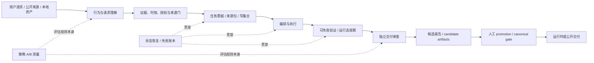

# 方法论原子图谱

## 为什么不直接把仓库当成 Skill

一个仓库往往把四种不同层级混在一起：行为准则、模型/CLI 适配、工作流、安装脚本。直接安装会让项目承接不必要的工具权限、隐私存储、模型绑定和许可证风险。这里将它们重构为**方法论原子**：每个原子只有一个明确作用、一组输入、一个可观察输出和一个可测试边界。

一个候选 Skill 可以组合多个原子；一个原子也可能只作为项目级 guardrail，而不应该被单独暴露给用户。

## 能力层次与当前 KB 的插入位置



当前 KB 已有 `source register → local distillation job → QA → manual promotion → canonical / runtime gate` 的主线。此次研究建议在主线前后补齐的是“来源/证据判断”和“交付 claim 校验”，而不是把外部模型或系统提示词放入运行时。

## 原子定义表

| ID | 原子 | 解决的问题 | 输入 → 机制 → 输出 | 主要来源 | 可观察验证 | KB 放置 |
|---|---|---|---|---|---|---|
| A01 | 行为基线与认识论标注 | 猜测被写成事实，语气自信掩盖不确定性 | 请求/证据 → 事实、推断、假设、限制分开 → 有置信边界的回答 | 05、09、11 | 抽查输出是否能定位每个高影响结论的证据状态 | agent / report layer |
| A02 | 请求形态路由 | 将诊断/规划/执行混为一谈，导致越权或错交付 | 请求、风险、可逆性 → classify → diagnosis / plan / task / clarify | 01、03、06 | 每个非小任务都有选择的交付形态和理由 | task intake |
| A03 | 完成定义与可失败验证 | “做完了”没有观察口径 | 目标 → named verification → 成果、命令、指标或可达页面 | 01、03、06、08、10 | 验收命令/检查可通过或失败，不是主观评语 | task ticket / QA |
| A04 | 证据、新鲜度与权威门 | 研究用旧知识、二手主张或无证据数字 | 查询/来源 → 主来源优先、日期/权威/独立性检查 → evidence map | 01、05、09、11 | 高影响结论有 URL/文件定位、检索日期、证据等级 | research intake |
| A05 | 许可、敏感性与授权门 | 未经允许外发、安装、发布或摄取 | 资产/操作 → source license + sensitivity + action authority → allowed / blocked / ask | 01、04、07、09、10、12 | 行为与 source metadata 对齐；不应执行的操作计数为零 | source register / promotion gate |
| A06 | 可评分任务票据与写集合 | 委派范围漂移、多人互改、验收失焦 | objective、范围、接口、约束、验证、write set → scoped work contract | 02、06、10 | 任务票据能标出每个 worker 的文件/数据/外部系统边界 | delegation layer |
| A07 | 能力、成本与同意路由 | 静默降级模型、默认触发付费 provider、用错工具 | 任务风险、数据分级、环境探测、预算 → capability seat + consent → lane choice | 02、06、07、10 | 实际 provider/model/权限与票据记录一致；没有隐性 fallback | future orchestration |
| A08 | 状态恢复、基线与失败账本 | 长会话丢失真实状态；反复叠补丁 | 当前事实、已试动作、失败、下一步 → checkpoint / baseline / ledger | 03、08、10 | 恢复时可从工件和真实状态继续；第三次失败触发审查 | `.kiro` / task state |
| A09 | 低成本判别测量与根因链 | 按常见原因拍脑袋修症状 | 症状/线索 → 竞争假设 → 最便宜区分测量 → 因果链与修复 | 08、11 | 每个建议修复前有可区分假设的观察或测试 | debugging / analysis |
| A10 | 有边界委派与冷验证 | 执行者自己评自己，确认偏误和虚假完成 | ticket / outputs → worker、只读 verifier 分离 → PASS / FAIL / UNVERIFIABLE | 01、02、06、10 | verifier 仅看规格、产物、命令输出；结论可复现 | delivery review |
| A11 | 独立证据面板 | 单一模型或单一方案漏掉冲突和盲区 | 同一原任务 → isolated fan-out → evidence-weighted judge | 07 | 面板构成、可外发范围、降级和冲突显式记录 | conditional / future |
| A12 | 运行态与渲染观察 | 静态检查通过但页面、脚本或 API 实际失效 | 可执行产物 → run / render / observe → behavior evidence | 08、12、13 | 浏览器/API/CLI 真实检查，且保留屏幕或机器可读摘要 | implementation QA |
| A13 | Claim judge 与交付分级 | 报告把计划、草稿或历史绿灯冒充当前完成 | requirements + diff + evidence → claim-by-claim verdict → verified / caveats / refuted | 01、06、08、10、11 | 每个“已完成”都能回指当轮验证；未验证项未被掩盖 | final handoff |
| A14 | Prompt—实现—演示资产包 | 原型与提示、代码、demo、授权信息分散 | brief + prompt + source + demo + build → catalog entry | 12、13 | 构建后入口/assets 可用；研究/审计素材不进入公开产物 | future UI lab |
| A15 | 领域适配器与 Skill 评测 | 一条好看的规则直接常驻，既无场景也无反例 | domain question + evidence + failure modes → adapter + trap + smoke eval | 01、08、11、13 | on/off 任务集、失败记录、停用条件；不只靠自评 | skill governance |

## 关键组合：从原子到可用闭环

### 1. 可信研究 / 外部资源萃取

```text
A02 请求形态路由
  → A04 证据、新鲜度与权威
  → A05 许可与授权
  → A03 研究完成定义
  → A13 claim judge
```

适用于用户给一组 GitHub、URL、报告或竞品材料，要求“深度理解、提炼方法、形成迁移建议”。本次 `enhance_ai` 研究本身就是该组合的验证性案例：每个仓库有快照、许可证/访问状态、能力/边界和未验证声明，404 来源被排除而非补写。

### 2. 多阶段本地 Candidate 交付

```text
A02 路由
  → A03 完成定义
  → A06 任务票据与写集合
  → A08 状态恢复/失败账本
  → A10 委派与冷验证
  → A13 claim judge
```

适用于当前 KB 的本地 distillation、卡片 QA、review workbench、代码/文档改造。它不会新增 provider 调用、live ingestion 或 runtime switch；只是把已有的“候选—检查—人工 promotion”关系写得更可复核。

### 3. 高不确定性、但可外发的信息性决策

```text
A02 路由 + A05 敏感性/同意
  → A11 独立证据面板
  → A10 / A13 独立审查与 claim judge
```

它适合重大架构选择、关键市场判断或多个可运行方案的比对，但只有在用户明确允许把材料发送到指定外部模型/服务、确认预算和数据范围后才可以运行。它不是默认“更聪明”的模式。

### 4. UI / 产品探索资产化

```text
A02 先判断是探索还是实现
  → A14 Prompt—实现—演示资产包
  → A12 实际渲染观察
  → A13 静态发布/交互边界的 claim judge
```

它适合未来把 KB 交互、仪表盘、研究报告页面的设计尝试留成可搜索资产，但需要单独审查参考素材、视频、字体、图像、第三方库和公开部署范围。

## 不应成为原子的东西

下列内容看似“有用”，但它们是运行时实现或风险来源，不能提升为通用方法原子：

- 特定厂商、模型名、价格、CLI 命令、账户登录态、路径与 transcript 格式；
- 把 Bash / 高权限 sandbox 视作隔离机制；
- 含外部系统提示词、疑似泄露文本或没有许可证的完整 prompt；
- “多模型达成共识”等同于事实；
- “字段不为空”或正则命中某个 `success` 词等同于验证通过；
- 全局 hook、自动 commit、worktree、云端写入、provider dispatch 等副作用实现。

这些可以在某个经过用户明确授权、且有真实工具权限边界的实现内重新设计，但不能从参考仓库带入为默认规则。

## 对 Skill 设计的约束

每个将来真正创建的 Skill 都应明确：

| 必要字段 | 含义 |
|---|---|
| `problem` | 用户为什么需要它，而不是“它模仿了谁” |
| `trigger / non-trigger` | 什么任务会调用，什么任务绝不调用 |
| `inputs` | 允许读什么，敏感信息如何处理 |
| `outputs` | 产生的报告、候选工件、计划或改动 |
| `method atoms` | 只列用到的 A01–A15，不加载无关仪式 |
| `verification` | 哪些检查会失败、何时必须标为未验证 |
| `authority boundary` | 哪些外部操作、写入、发布、provider 调用需要用户明确授权 |
| `source / license policy` | 原创重写、来源归因、不可复制内容的处理 |
| `evaluation` | 新规则如何对照既有基线，何时淘汰或缩小 |

候选 Skill 组合与优先级见 [03-skill-portfolio.md](03-skill-portfolio.md)。
