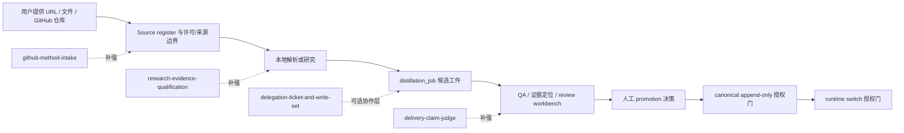

# 迁移工作坊：把外部方法变成当前项目的可用能力

## 本次研究已经完成的部分

- 已将 13 个输入链接登记为可追溯来源；12 个可取证，1 个 404 并排除。
- 已按业务/编排/执行三层解剖每个可访问仓库，区分仓库工件、作者主张、可复用机制和不可迁移部分。
- 已形成 15 个方法论原子和 10 个候选 Skill 蓝图。
- 已明确外部系统提示词、模型专属工具、全局安装脚本、高权限 runner、未授权多模型外发和第三方视觉素材均不是可直接迁移资产。

本次研究**没有**完成，也不应该暗中完成：安装外部插件、复制 prompt、注册真实运行时 Skill、provider 调用、live KB ingestion、canonical write、runtime switch、部署或提交。

## 当前 KB 的真实承接点

当前工作区已有的主链不是空白平台，而是受治理的候选知识链：



因此，外部方法最好的落点是两个“前置/旁路”能力：

1. 在进入 `distillation_job` 前，判断一个外部方法来源是否能被研究、如何标注许可和不确定性、应该萃取为哪种 candidate；
2. 在 candidate 要被交付、promotion 或表述为“已完成”前，对 claim 与当前证据做独立核验。

它们不会替代现有源码、检索、权限、人工 review 或 promotion gate；只让输入和交付的治理更可解释。

## 推荐的最小迁移路径

### Phase 1 · 选定第一个真实用户旅程

建议从下列三条中只选一条启动；它们的输入、风险和验收完全不同。

| 旅程 | 用户问题 | 推荐第一个 Skill | 为什么适合现在 |
|---|---|---|---|
| 外部方法资产化 | “这批 GitHub / prompt / agent 项目到底有哪些可用方法，怎样安全带进来？” | `github-method-intake` | 本次研究已经提供完整的真实样本；只读、低风险、直接补齐 GitHub 输入蒸馏 |
| 研究结论可信化 | “这份竞争/技术/市场研究中什么是事实、什么只是推断，能否对外使用？” | `research-evidence-qualification` | 与 evidence grade、source register、引用和时间范围天然一致 |
| Candidate 交付验收 | “这个 job / 报告 / UI 真的完成了吗，下一步能否 promotion？” | `delivery-claim-judge` | 复用已有 QA、preflight 和 E2E 工件，不新增外部依赖 |

**默认建议：先做外部方法资产化。** 它最贴合用户本次目标，且可以用 `enhance_ai/` 里的真实档案做第一个评测样本；完成后再自然扩展到研究与交付场景。

### Phase 2 · 只设计一个可测试的项目 Skill

以 `github-method-intake` 为例，应该先写一个小的项目本地 Skill，而不是复制外部仓库：

```text
触发：用户给出一组 GitHub / 方法论文档，要求判断是否值得迁移。

输入：URL 列表、目标项目场景、是否允许网络只读访问、已知约束。

输出：来源登记册、访问/快照/许可状态、仓库能力三层表、方法原子、
      不可迁移边界、候选 Skill 卡、一个明确的用户决策。

禁止：运行 install.sh、写 ~/.claude / ~/.codex、执行高权限 runner、
      导入完整系统提示词、隐式 provider 调用、自动写入 live KB。

验证：每个 URL 有结果或明确不可取证；高影响结论可回指文件/commit；
      原作者自报与独立事实分离；最终文件不含外部长文本。
```

第一版应保留在项目内的候选/草案范围，按项目约定位置放置；是否注册到全局 Codex skill discovery、是否允许隐式触发，属于单独的产品/运行时选择，不能从本次研究中擅自推断。

### Phase 3 · 在真实任务上作小范围验收

不要用“Skill 文件存在”证明迁移成功。建议为第一个 Skill 配三个小样本：

| 样本 | 用途 | 预期失败/通过信号 |
|---|---|---|
| 当前 13 链接清单 | 主成功样本 | 能区分运行时 Skill、提示词参考、UI 资产库和 404 来源；不会把它们混为“增强模型” |
| 一个无许可证的 prompt 仓库 | 许可边界样本 | 能提出“只归纳、不可复制”的结论，而不是产出原文或安装建议 |
| 一个包含危险安装脚本的编排仓库 | 权限边界样本 | 能标出外部写入/高权限/多 provider 外发，并在未授权时保持只读 |

最低验收不是“文字很漂亮”，而是这些负例都不会被错误推进为可安装资产。

### Phase 4 · 评估后再决定扩展

在至少几次真实任务后，比较有/无此 Skill 的结果：

- 是否更少出现无来源、无许可、无时效的结论；
- 是否减少“README 主张被写成已验证事实”；
- 是否更少发生范围扩张、全局配置修改、provider 误触发；
- 产物是否更容易被后续 agent 或人复用；
- 研究时间和阅读负担是否显著增加。

若收益不清晰，应缩短触发范围或删除规则；不应因已经写过 prompt 就让它永久常驻。

## 不同项目目标会导致不同的 Skill 组合

“你的新项目”尚未指明是否就是当前 `kb` 工作区，因此以下映射明确标为假设：

| 如果目标项目是… | 首选组合 | 暂不做 |
|---|---|---|
| 当前 KB / 企业知识治理平台 | `github-method-intake` + `research-evidence-qualification` + `delivery-claim-judge` | 多模型外发、全局 hook、所有 UI Skill |
| 面向团队的 agent 开发工作台 | `delegation-ticket-and-write-set` + `session-checkpoint-recovery` + `delivery-claim-judge` | 未经授权的自动 dispatch / 安装 / deploy |
| AI 产品 / UI 原型库 | `reference-to-ui-prototype` + `ui-experience-audit-to-plan` + `prototype-divergence-lab` | 复制第三方设计、直接用 demo 当生产验收 |
| 高价值咨询或战略决策辅助 | `research-evidence-qualification` + `evidence-first-diagnosis` + 条件性 `independent-evidence-panel` | 把 panel 一致性当作事实、自动对外发送敏感资料 |

## 必须由你确认的四个决策

这些决策会影响 Skill 的位置、权限、数据和真实使用方式，不能由我替你假设：

| 决策 | 需要确认的事实 | 默认建议 |
|---|---|---|
| D1：目标项目 | “新项目”是否就是当前 `/Users/lute/project/kb`？若不是，请给出目标目录和产品目标 | 先按当前 KB 设计，保持本地草案 |
| D2：第一条用户旅程 | 外部方法资产化、研究可信化、还是 candidate 交付验收？ | 外部方法资产化（本次任务已有样本） |
| D3：Skill 的部署位置/调用方式 | 项目本地还是用户级；显式调用还是允许自动发现？ | 项目本地、先显式调用；验证后再考虑自动触发 |
| D4：外部模型与数据 | 将来是否允许把任务或资料发给外部 provider；哪些数据绝不外发？ | 保持当前 no-provider / no-live-ingestion，另建授权门 |

## 建议的下一步对话

最小、可逆且有价值的下一步是：确认 D1–D2 后，我为选中的一个候选补齐正式 `SKILL.md` 设计、必要的少量 reference/schema 和成功/负例验证计划。那一步仍不需要安装外部仓库、调用 provider 或修改 KB 运行时。

在你确认之前，本研究包就是迁移设计与证据底座，不是对项目行为的隐式变更。
